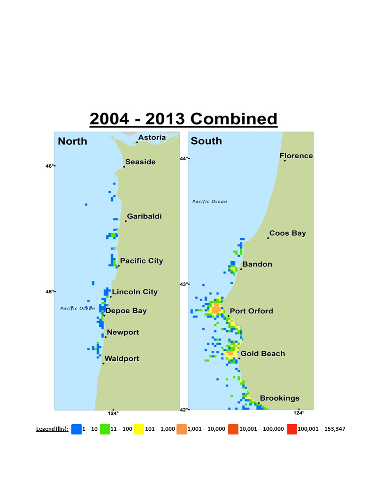

```{r, echo=FALSE, message=FALSE, warning=FALSE}
     ##read in necessary libraries
           library(r4ss)
           library(xtable)
             options(xtable.comment = FALSE)  #turns off xtable comments
##############################################################################################################
#### loads workspace image of the BASE MODEL from SS_output in r4ss    
     load("Aurora2013.RData")
   # mod = myreplist
     #check the structure of the data here to make sure it contains "mod," the SS_output variable
##############################################################################################################
```


\pagebreak
\pagenumbering{arabic}
\setcounter{page}{1}

#Executive summary{-}
adfadfaf

##Stock{-}

Blah blah Milton says China rockfish live to at least 79 years [@Love2002rockfishes].

##Catches{-}
Trends and current levels-include table for last ten years and graph with long term data

<!-- BEGIN: CREATE SPAWNING BIOMASS TABLE -->
```{r, eval=TRUE, echo=FALSE, message=FALSE, warning=FALSE, include=FALSE}
      
      SpawningB = mod$derived_quants[grep("SPB",mod$derived_quants$LABEL),]
      SpawningB = SpawningB[c(-1,-2),]
#########################################################################
#CHANGE ME
      FirstYR=2004  # minimum year for the Spawning biomass table
      LastYR=2013  # maximum year for the Spawning biomass table
#########################################################################

    #pull the spawning biomass and std.dev data, calculate lower and upper 95% CI                 
     SpawningByrs = SpawningB[SpawningB$LABEL>=paste("SPB_",FirstYR,sep='') &  
                           SpawningB$LABEL<=paste("SPB_",LastYR,sep=''),]     
     SpawningByrs$YEAR = seq(FirstYR,LastYR)
     SpawningByrs$lowerCI = round(SpawningByrs$Value +qnorm(0.025)*SpawningByrs$StdDev, digits=0)
     SpawningByrs$upperCI = round(SpawningByrs$Value -qnorm(0.025)*SpawningByrs$StdDev, digits=0)
     SpawningByrs$CI = paste("(",SpawningByrs$lowerCI,"-",SpawningByrs$upperCI,")",sep="")
     SpawningBtab=subset(SpawningByrs,select=c('YEAR','Value','CI'))
       colnames(SpawningBtab) = c('Year','Spawning Biomass (mt)','~ 95% confidence interval')
```

```{r, eval=TRUE, echo=FALSE, results='asis', message=FALSE}
  #create the Spawning biomass table
  SpawningB.table = xtable(SpawningBtab, caption=c("Recent trend in beginning of the year biomass and depletion"),
               label='SpawningB',digits=0)  #digits=0 rounds the numbers
    #xtable requires a placeholder for rownames, hence 4 values    
    align(SpawningB.table) = c('l','l','>{\\centering}p{1in}','>{\\centering}p{1.2in}')  
    print(SpawningB.table, include.rownames=FALSE, caption.placement="top",tabular.environment="tabularx",
          width="\\textwidth")
```
<!-- END: CREATE SPAWNING BIOMASS TABLE -->


##Data and assessment{-}
date of last assessment, type of assessment model, data available, new information, and information lacking

##Stock biomass{-}
trends and current levels relative to virgin or historic levels, description of uncertainty-include table for last 10 years and graph with long term estimates


This is a test to see if I can reference Figure \ref{spawningB}. 


##Recruitment{-}
trends and current levels relative to virgin or historic levels-include table for last 10 years and graph with long term estimates


##Exploitation status{-}
exploitation rates, i.e., total catch divided by exploitable biomass, or the annual SPR harvest rate - include a table with the last 10 years of data and a graph showing the trend in fishing mortality relative to the target (y-axis) plotted against the trend in biomass relative to the target (x-axis).

##Ecosystem considerations{-}

##Reference points{-}
management targets and definition of overfishing, including the harvest rate that brings the stock to equilibrium at B40% (the BMSY proxy) and the equilibrium stock size that results from fishing at the default harvest rate (the FMSY proxy). Include a summary table that compares estimated reference points for SSB, SPR, Exploitation Rate and Yield based on SSBproxy for MSY, SPRproxy for MSY, and estimated MSY values (table i. on page 35 of attached Canary rockfish executive summary).

##Management performance{-}
catches in comparison to OFL, ABC and OY/ACL values for the most recent 10 years (when available), overfishing levels, actual catch and discard. Include OFL(encountered), OFL(retained) and OFL(dead) if different due to discard and discard mortality.


##Unresolved problem and major uncertainties{-}
any special issues that complicate scientific assessment, questions about the best model scenario, etc.

##Decision table{-}
projected yields (OFL, ABC and ACL), spawning biomass, and stock depletion levels for each year.* (Not required in draft assessments undergoing review.)

##Research and data needs{-}
identify information gaps that seriously impede the stock assessment.

##Rebuilding projections{-}
reference to the principal results from rebuilding analysis if the stock is overfished.* This section should be included in the Final/SAFE version assessment document but is not required for draft assessments undergoing review. See Rebuilding Analysis terms of reference for detailed information on rebuilding analysis requirements.


#Introduction

##Basic Information
China rockfish \emph{Sebastes nebulosus} is a medium-sized, commercially (mainly in the live-fish
fishery) and recreationally prized deeper-dwelling nearshore rockfish ranging from southern
California, north to the Gulf of Alaska.  Core abundance is found from northern California to
southern British Columbia, Canada. Individuals tend to be solitary and usually found in rock
habitats. 

China rockfish have been aged to almost XX years old (Table xx?), one of the oldest aged
rockfishes with common occurrences deeper than 100 m. The oldest aged China rockfish from Alaska was 78 years old [@Munk2001].

China rockfish vulnerability to
overfishing is one of the highest recorded (V = 2.23) for west coast groundfishes [@Cope2011]. 

Juvenile China rockfish inhabit the kelp beds (per comm.?)

Site fidelity study in juveniles [@Lee2009]
China rockfish is not listed on the FSSI.

There is limited information available on stock structure or life history.  No genetic research has been conducted for China rockfish, and no published research indicates separate stocks along the West Coast of the U.S.   

China rockfish were historically encountered by the recreational fleet in the Southern California Bight [@Love1998].  Love [-@Love1998] examined the 1980=1996 MRFSS data from southern CA.  In the early years of the study China rockfish were occasioinally enountered, and by 1996 no China rockfish were observed.  


Lea [-@Lea1999] recaptured China rockfish in the same general location as where they were released.

In other rockfish movement studies, China rockfish were tagged but never recaptured, or there was a sample size of 1 [@Hannah2011].  

China rockfish can suffer from barotrauma.  Parker [-@Parker2006] found that China rockfish required 250 h to attain neutral buoyancy at 4 atmospheres absolute (ATA, depth equivalent of 30 m) when experiments began at the surface water pressure.

##Map
A map showing the scope of the assessment and depicting boundaries for fisheries or data collection strata is provided in \hl{Figure xxx.}

##Life History


Important features of life history that affect management (e.g., migration, sexual dimorphism, bathymetric demography).

##Ecosysem Considerations
Ecosystem considerations (e.g., ecosystem role and trophic relationships of the species, habitat requirements/preferences, relevant data on ecosystem processes that may affect stock or parameters used in the stock assessment, and/or cross-FMP interactions with other fisheries). This section should note if environmental correlations or food web interactions were incorporated into the assessment model. The length and depth of this section would depend on availability of data and reports from the IEA, expertise of the STAT, and whether ecosystem factors are informational to contribute quantitative information to the assessment.


##Fishery Information
Important features of current fishery and relevant history of fishery.

##Summary of Management History
Summary of management history (e.g., changes in mesh sizes, trip limits, or other management actions that may have significantly altered selection, catch rates, or discards).


##Managament Performance
Management performance, including a table or tables comparing Overfishing Limit (OFL), Annual Catch Limit (ACL), Harvest Guideline (HG) [CPS only], landings, and catch (i.e., landings plus discard) for each area and year


##Fisheries off Canada, Alaska, and/or Mexico
Description of fisheries for this species off Canada, Alaska and/or Mexico, including references to any recent assessments of those stocks.

#Assessment

##Data

###Fishery-Dependent Data: Commercial Landings

**Washington**
\hl{Theresa}

**Oregon**
\hl{Patrick}

**California Commercial Landings, 1969-2014**

The [CALCOM](http://128.114.3.187/) database was queried (February 20, 2015) for commercial landing estimates of China rockfish in California. Landings were stratified by year, quarter, live/dead, market category, gear group, port complex, and source of species composition data (actual port samples, borrowed samples, or assumed nominal market category). Total landings from the initial query span the years 1969-2014.

The majority of commercial China rockfish landings are made by vessels using hook-and-line gear (Figure \ref{EJD_CALCOM_1}). However, landings estimates also include a large fraction of trawl-caught China rockfish from 1969-1988, which is unlikely given the species’ preference for rocky habitat. The reported trawl catch was mainly from the Monterey port complex and was landed in the “China rockfish” market category (258).

An analysis of species composition data from port samples in market category 258, by gear type, revealed that the sampled trawl catch landed in the China rockfish market category contained mainly deeper-water species, including greenspotted rockfish (*Sebastes chlorostictus*), sometimes known as “chinafish.” Species landed by hook-and-line gears in the China rockfish market category, on the other hand, consisted of a mixture of nearshore species (e.g. china, quillback, gopher, black-and-yellow, and brown; Figure \ref{EJD_CALCOM_2}). When port samples are not available to estimate species composition in a stratum, and no samples are available to ‘borrow’ from an adjacent stratum, landings in a market category are assigned to the ‘nominal’ species category, in this case China rockfish.

Given the available species composition data from the trawl catch, and the fact that trawl gear is unlikely to be fished in China rockfish habitat, trawl-caught China rockfish were removed from the landings estimates in the current assessment. A similar analysis led to the removal of a small amount (about 5 mt) of landings by set-net and mid-water trawl gear groups.

In years prior to 1978, landing receipts are available for California but there are no associated port sample data. Typically, a ratio estimator (based on the expanded landings estimates in the earliest sampled years) is used to allocate catch to species in these early years. In the case of China rockfish, this procedure propagated the estimates of trawl-caught China backward in time to 1969 (Figure \ref{EJD_CALCOM_1}). These ratio estimates of trawl-caught China rockfish were also removed from the final time series of landed catch.

The previous assessment of China rockfish [@Cope2015_Data-Moderate_Assessment] modeled two China rockfish populations, north and south of $40^{\circ} 10'$ North latitude (roughly Cape Mendocino). The majority of landings occurred south of Cape Mendocino, and the revised estimates are substantially lower in early years, primarily due to the removal of trawl catch (Figure \ref{EJD_CALCOM_3}).

California’s commercial live-fish fishery began targeting nearshore rockfish species in the early 1990s [@CalCOFI2002]. Live annual landings of China rockfish surpassed landings of dead fish by the late 1990s, due to the increased value of fish landed live (Figure \ref{EJD_CALCOM_4}).


*Landings by year and fishery, historical catch estimates, discards (generally specified as a percentage of total catch in weight and in units of mt), catch-at-age, weight-at-age, abundance indices (typically survey and CPUE data), data used to estimate biological parameters (e.g., growth rates, maturity schedules, and natural mortality) with coefficients of variation (CVs) or variances if available.  Include complete tables and figures and date of extraction.*

###Fishery-Dependent Data: Recreational Landings

**Washington**
\hl{Theresa}

**Oregon**
\hl{Patrick}

**California**
\hl{EJ}

###Fishery-Dependent Data: Commercial Discards

**Washington**
\hl{Theresa}

**Oregon**
\hl{Ian and Patrick}

**California**
\hl{Ian}


###Fishery-Dependent Data: Recreational Discards

**Washington**
\hl{Theresa}

**Oregon**
\hl{Patrick}

**California**
\hl{EJ}

###Fishery-Dependent Data: Oregon Commercial Logbook
The Oregon Department of Fish and Wildlife (ODFW) have required nearshore commercial fishers (both nearshore permitted vessels and open access vessels) to submit fishing logbooks since 2004.  Fisher compliance is generally high, averaging around 80\%, but has varied through time ranging from 65\% in 2007 to 95\% in recent years.  Although required to provide all requested information in the logbook per fishing gear set, there has been substantial variation in the quantity and quality of information reported in logbooks.  Responses from submitted logbooks were entered into a central database and span the years 2004 through 2013.  At the time of this assessment, 2014 logbook submissions were not fully processed and thus were not available.  

Logbook information went through several data quality filters to attain as best as possible a consistent and representative data set through time to estimate a relative abundance trend.  Results from the filtration algorithm are summarized in Table \ref{tab:OR_Commlog_sample}.  Of note, only logbook submissions from black and blue rockfish permitted vessels with a nearshore endorsement were included in the analysis, because these vessels consistently fish in areas where China rockfish are encountered.  To minimize temporal variation in reporting errors (or nuances), only vessels that fished all 10 years (2004 – 2013) were deemed the most likely to provide consistent responses through time.  Operators of endorsed vessels may have changed through time.  Individual observations of catch (kg) and effort (hook hour) were at the trip level, where multi-set trips were aggregated to the trip level.  ODFW sets bimonthly trip landing limits for China rockfish and these have changed through time.  However, trip limits have not generally been breached in the subset of logbook data used for China rockfish, and thus there was no need to exclude subsequent trips.  The final subset of logbook data included 3,575 trips (14\% of the full set of logbook data) from 10 vessels. 

Preliminary data analyses identified levels or limits of filtering variables in order to preserve adequate sample sizes and representative trips for China rockfish.  For example, gear type was restricted to hook and line (excluding longline gear) because this method accounted for 85\% of all sets.  The three main southernmost Oregon ports (Port Orford, Gold Beach, and Brookings) were the only locations that included a sufficient number of sets throughout the time series for nearshore endorsed vessels.  Thus, this abundance index is most representative of the nearshore in southern Oregon waters. Fishing depth at the start of a set was restricted to within 30 fathoms (54.9 m), which included more than 99\% of all sets by nearshore endorsed vessels, to ensure only CPUE in areas where China rockfish are commonly encountered was evaluated.
Covariates considered in the full model included \emph{month, vessel, port, depth, and people}.  All covariates were specified as categorical variables, except depth was a continuous variable.  \emph{Depth} was included to account for general differences in bathymetry and fishing depth restrictions associated primarily with limiting catch of yelloweye rockfish.  \emph{People} were included in an attempt to control for the potential oversaturation of hooks at a given fishing location and the interaction that multi-crew trips (# fishers onboard) may have on fishing efficiency.  The selection of covariates included in final models were evaluated using standard information criterion for relative goodness of fit (AICc and BIC) in a backwards stepwise fashion, where a covariate remained in the model if model fit was improved relative to an otherwise identical model without the covariate.   

CPUE was modeled using a delta-GLM approach, where the catch occurrence (binomial) component was modeled using a logit link function and the positive catch component was modeled according to a gamma distribution with a log link function.  CPUE was calculated for each trip, where total catch was defined as the sum total of all reported retained catch (in weight) and released catch (numbers converted to weight by applying a median catch weight) and total effort was defined by hook-hours (number of hooks used multiplied by the number of hours fished).  A lognormal distribution for the positive catch component was also evaluated, but graphical summary diagnostics of model adequacy slightly favored the gamma distribution.   A delta-GLMM was also attempted to specify vessel-year interaction effects as stemming from a distribution (random effect) and to account for this added source of variation.  However, the estimation procedure was unstable for the delta-GLMM approach, resulting in overinflated CVs.    

Model selection procedures identified the covariates \emph{vessel, port, depth and people} as important, and along with the categorical \emph{year} factor of interest for the index were the variables included in both the catch occurrence and positive catch component models.  Extracted, back-transformed and bias corrected estimates of the \emph{year} effect were used for the abundance index (Table \ref{tab:OR_commlog}, Figure \ref{fig:OR_commlog}). A jackknife resampling routine was conducted to estimate the standard error (and CV) of the \emph{year} effects.  


###Fishery-Dependent Data: Recreational Dockside Surveys

**Washington**
\hl{Melissa H}

**Oregon**
\hl{EJ}

**California**
\hl{EJ}

###Fishery-Dependent Data: Recreational Onboard Observer Surveys
The goal of the Observer Programs in California and Oregon is to collect data including charter boat fishing locations, catch and discard of observed fish by species, and lengths of discarded fish.  Both states sample the commercial passenger fishing vessel (CPFV),i.e., charter boat or for-hire fleet.  The onboard observer programs collect drift-specific information at each fishing stop on an observed trip.  At each fishing stop recorded information includes start and end times, start and end location (latitude/longitude), start and end depth, number of observed anglers (a subset of the total anglers), and the catch (retained and discarded) by species of the observed anglers.  Data for the onboard observer indices for the recreational CPFV fleet are from four sampling programs.  

The California Department of Fisheries and Wildlife (CDFW) conducted an onboard observer program in central California from 1987-1998 (Reilly et al. 1998).  These data were previously used in the 2013 data moderate assessments [@Cope2015_Data-Moderate_Assessment], at the level of a fishing trip.  Since the 2013 assessments, the original data sheets were acquired and data were keypunched to the level of fishing stop.  One caveat of this data is that location data were recorded at a finer scale than the catch data.  We aggregated the relevant location information (time and number of observed anglers) to match the available catch information.  Between April 1987 and July 1992 the number of observed anglers was not recorded for each fishing stop, but the number of anglers aboard the vessel is available.  We imputed the number of observed anglers using the number of anglers aboard the vessel and the number of observed anglers at each fishing stop form the August 1998-December 1998 data (see Appendix E for details, pp.\pageref{sec:AppendixE}).  In 1987, trips were only observed in Monterey, CA and were therefore excluded from the analysis.

California implemented a coastwide sampling program in 1999 [@Monk2014].  Cal Poly has conducted an independent onboard sampling program as of 2003 for boats in Port San Luis and Morro Bay [@Stephens2006], but follows the protocols established in Reilly et al. (1998), and modified to reflect sampling changes that CDFW has also adopted, e.g., observing fish as they are landed instead of at the level of a fisher’s bag.  Therefore, the Cal Poly data area incorporated in the same index as the CDFW data from 1999-2014.

We generated separate relative indices of abundance in California for the 1987-1999 and 2000-2014 datasets due to the number of regulation changes occurring throughout the time period (see Appendix H, pp.\pageref{sec:AppendixH}).  CDFW implemented a regulation of three hooks in 2000, which was reduced to (and remains at) two hooks in 2001.

The Oregon Department of Fisheries and Wildlife (ODFW) initiated an onboard observer program in 2001, which became a yearly sampling program in 2003 [@Monk2013].  Both California and Oregon provided onboard sampling data through 2014.  


All indices were standardized using a delta-GLM modeling approach [@Lo1992].  Data were analyzed at the drift level and catch was taken to be the sum of observed retained and discarded fish, i.e., number of fish encountered per angler hour.  The onboard observer data from the CDFW 1999-2014 data between north of $40^{\circ} 10'$ and the Oregon border were too sparce to include in the index.  Therefore, indices used in the model with a break at $40^{\circ} 10'$ remain the same as the state-specific onboard observer indices.

*Data Filtering*
Prior to any analyses, a preliminary data filter was applied.  

Trips/drifts from the CDFW 1988-1998 meeting the following criteria were excluded from analyses:
1.  Drift associated with a fishing location code that was not assigned to a reef
2.	Drifts identified as having possible erroneous location, observed anglers, or time data
3.	Trips encountering <50% groundfish species

Trips/drifts from the ODFW, CDFW 1999-2014, and Cal Poly databases meeting the following criteria were excluded from analyses:
1.	ODFW halibut-targeted trips were excluded
2.	Trips encountering <50% groundfish species 
3.	Drifts within the current Stonewall Bank Yelloweye Rockfish Conservation 
4.	Drifts within Arcata Bay, Humboldt Bay, South Bay, or San Francisco Bay
5.	Drifts missing a starting location (latitude/longitude) 
6.	Drifts identified as having possible erroneous location or time data
7.	Drifts missing both starting and ending depths 
8.	Drifts within the habitat data occurring farther than 83 m from a reef in Oregon and 34 m in California (see Appendix F (\pageref{sec:AppendixF}) for details)
9.	Drifts outside the habitat data in California occurring farther than 141 m from reef (see Appendix F (\pageref{sec:AppendixF}) for details)
1.	Drifts occurring on a reef with <3 positive encounters of black rockfish
2.	Drifts occurring on a reef in which black rockfish was observed in <25\% of years the reef was visited.


**Index standardization: Oregon**
The filtered dataset included 6,038 drifts, of which 259 (4\%) drifts with positive encounters.  The majority of drifts sampled (75\%) were from north of Florence, although China rockfishw were present in 6\% of drifts in southern Oregon and 3\% of drifts in the north. To increase sample sizes data from waves 2 and 3 were aggregated as well as from 4 and 5 (ODFW does not sample in waves 1 and 6).  Depths greater than 20 m were also binned to 20-59 m.

The selected data contained categorical variables for \emph{year} (13 levels), WAVE (2 levels), \emph{region} (2 levels, north and south of Florence), and three depth bins (\emph{depth}: 0-19 m, and 20-59 m). A lognormal model was selected over a gamma for the positive encounters by a deltaAIC of 20.01. Model selection, using AIC, selected a lognormal model with \emph{year, wave, depth, region}, and a \emph{wave:depth} interaction, while a binomial with \emph{year, region}, and \emph{wave} was selected.  In the lognormal submodel, stepwise BIC retained the \emph{year}. In the binomial model, stepwise BIC retained \emph{region} and \emph{wave}. The final YEAR effects from the delta-GLM with main effects \emph{year, region}, and \emph{wave} are shown in Table \ref{tab:OR_onboard} and Figure \ref{fig:OR_onboard}). The final model suggests that relative abundance was slightly higher in southern Oregon, and in waves 4 and 5.

**Index standardization: California**

*Central California 1988-1998*
The filtered dataset included 5,557 drifts, of which 852 (15\%) drifts with positive encounters. To increase sample sizes, data from Regions 2 and 3 were aggregated as well as Regions 8 and 9.  Samples north of Ten Mile River were too sparse to reliably include in the index.

The selected data contained categorical variables for \emph{year} (13 levels), WAVE (6 levels), \emph{region} (5 levels), and four depth bins (\emph{depth}: 0-19 m, 20-39 m, 40-59 m, and 60-79 m). A lognormal model was selected over a gamma for the positive encounters by a deltaAIC of 125.06. Model selection, using AIC, selected a lognormal model with \emph{year, depth, and region}, while a binomial with \emph{year, region, depth, wave}, and a \emph{year:region} interaction was selected.  However, the standard errors of the binomial model with interactions were large, and suggested data were too sparse to explore the \emph{year:region} interaction.  For the lognormal submodel, stepwise BIC retained the \emph{depth} and \emph{region}. For the binomial submodel, stepwise BIC retained \emph{year, region}, and \emph{depth}. The final YEAR effects from the delta-GLM with main effects \emph{year, region}, and \emph{depth} are shown in Table \ref{tab:prehist_onboard} and Figure \ref{fig:prehist_onboard}).  The covariates in the final model suggest the relative abundance of China rockfish decreases with depth and increases north of Monterey, CA.


*California (north of Pt. Conception) 2000-2014*
The filtered dataset included 13,993 drifts, of which 1,403 (10\%) drifts with positive encounters.  CDFW began sampling Region 12 (Trinidad Head to the OR border) in 2008 and no trips from Region 11 (Cape Mendocino to the Eel River) were sampled from 2000-2014.  From 2008-2014, only 10 drifts encountering China rockfish were observed in Region 12.  Therefore, the following index only reflects the population south of Cape Mendocino.  Further, to increase sample sizes drifts from Regions 2 and 3 were aggregated as well as Regions 7 and 8, and Regions 9 and 10.


The selected data contained categorical variables for \emph{year} (15 levels), WAVE (6 levels), \emph{region} (6 levels), and four depth bins (\emph{depth}: 0-19 m, 20-39 m, 40-59 m, and 60-79 m). A lognormal model was selected over a gamma for the positive encounters by a deltaAIC of 115.91. Model selection, using AIC, selected a lognormal model with \emph{year, depth, and region}, while a binomial with \emph{year, region, depth}, and a \emph{year:region} interaction was selected.  However, the standard errors of the binomial model with interactions were large, and suggested data were too sparse to explore the \emph{year:region} interaction.  For the lognormal submodel, stepwise BIC retained the \emph{year} and \emph{region}. For the binomial submodel, stepwise BIC retained \emph{region}, and \emph{depth}. The final YEAR effects from the delta-GLM with main effects \emph{year, region}, and \emph{depth} are shown in Table \ref{tab:CA_onboard} and Figure \ref{fig:CA_onboard}).  The covariates in the final model suggest the relative abundance of China rockfish decreases with depth, specifically in depths greater than 59 m, and increases south to north.


###Title


###Fishery-Independent Data: sources considered, but not used in assessment
*Partnership for Interdisciplinary Studies of Coastal Oceans (PISCO)*
A total of 59 China rockfish were observed in 17,657 SCUBA transects conducted in the southern and central survey regions. Transects were conducted in Northern California and Oregon for two years (2010-2011), with a higher occurence of China rockfish (156 out of 956 transects).


###Biological Data: Weight-Length

###Biological Data: Maturity and Fecundity

###Biological Data: Natural Mortality

###Biological Data: Length at age

###Biological Data: Sex ratios

###Biological Data: Aging precision and bias
\hl{Melissa H}

###Biological Data: Research removals


###Biological Data: Ecosystem data


##History of Modeling Approaches Used for this Stock

###Previous assessments


##Model Description

###Transition from the 2013 to 2015 stock assessment


###Summary of data for fleets and areas

###Modeling software
We used Stock Synthesis 3 version 3.24V, compiled March 8, 2015 by Dr. Richard Methot at the NWFSC. The most recent version (SS-V3.24u) was used, since it included improvements and corrections to older versions.

###Data weighting

###Priors

###General model specifications


###Estimated and fixed parameters


##Model Selection and Evaluation

###Key assumptions and structural choices

###Alternate models explored

###Convergence


##Base-Model(s) Results

##Uncertaincty and Sensitivty Analyses
\label{sec:uncertainty}

\label{sec:uncertaintylast}
###Retrospective analysis


###Historical assessment analysis


###Likelihood profiles


#Reference Points
1.  Unfished spawning stock biomass, summary age biomass, and recruitment, along with unfished spawning stock output.
2. 	Reference points based on B\textsubscript{40\%} for rockfish and roundfish and on B\textsubscript{25\%} for flatfish (spawning biomass and/or output, SPR, exploitation rate, equilibrium yield).
3.	Reference points based on default SPR proxy (spawning biomass and/or output, SPR, exploitation rate, equilibrium yield).
4.	Reference points based on MSY (if estimated) (spawning biomass and/or output, SPR, exploitation rate, equilibrium yield).
5.	Equilibrium yield curve showing various BMSY proxies. 

#Harvest Projections and Decision Tables
*Not required in draft assessment undergoing review.

1.  Harvest projections and decision tables (i.e., a matrix of alternative models (states of nature) versus management actions) should cover the plausible range of uncertainty about current stock biomass and a set of candidate fishing mortality targets used for the stock.  See section “\textit{Uncertainty and Decision Tables in Groundfish Stock Assessment}” (this document, pp. \pageref{sec:uncertainty}\-\pageref{sec:uncertaintylast}) on how to define alternative states of nature.  Management decisions in most cases represent the sequence of catches including estimate of OFL based on FMSY (or its proxy) and those obtained by applying the Council 40\-10 harvest policy to each state of nature; however other alternatives may be suggested by the GMT as being more relevant to Council decision making.  OFL calculations should be based on the assumption that future catches equal ABCs and not OFLs.

2.  Information presented should include biomass, stock depletion, and yield projections of OFL, ABC and ACL for ten years into the future, beginning with the first year for which management action could be based upon the assessment.


#Regional Management Considerations
1. For stocks where current practice is to allocate harvests by management area, a recommended method of allocating harvests based on the distribution of biomass should be provided.  The MT advisor should be consulted on the appropriate management areas for each stock.

2. Discuss whether a regional management approach makes sense for the species from a biological perspective.

3. If there are insufficient data to analyze a regional management approach, what are the research and data needs to answer this question?

#Research Needs

#Acknowledgments
Include STAR panel members and affiliations as well as names and affiliations of persons who contributed data, advice or information but were not part of the assessment team. \textbf{* Not required in draft assessment undergoing review.}

\newpage
\FloatBarrier

#Tables
<!-- Introduction --> 


<!-- Commercial landings --> 


<!-- Recreational Landings --> 


<!-- Commercial Discards --> 


<!-- Recreational Discards --> 


<!-- Oregon commercial logbook --> 
```{r, eval=TRUE, echo=FALSE, message=FALSE, warning=FALSE, include=FALSE}
##read in CA MRFSS dataset
Or_commlog_ss = read.csv("./txt_files/OR_comm_samplesize.csv")
  Or_commlog = read.csv("./txt_files/OR_commlog.csv",header=T)
 
  Or_commlog1 = Or_commlog[,c(1,2,3)]
  colnames(Or_commlog1) = c('Year','Index','Log-scale SE')
```

```{r, eval=TRUE, echo=FALSE, results='asis', message=FALSE}
#OR commerical logbook sample size table
 Orcommlogss.table = xtable(Or_commlog_ss[1:10,],caption=c("Logbook filtering criteria and resulting sample sizes used for China rockfish.  Bold value indicates the final trip-level sample size used for delta-GLM analysis.  "),label='tab:OR_Commlog_sample')
# print(Orcommlogss.table, include.rownames=FALSE, caption.placement="top",tabular.environment="tabularx")
```

```{r, eval=TRUE, echo=FALSE, results='asis', message=FALSE}
#OR commerical logbook table
Orcommlog.table = xtable(Or_commlog1,caption=c("Abundance indices for China rockfish based on least square means from the delta-GLM model and associated standard errors from the final subset of Oregon commercial nearshore logbook submissions."),label='tab:OR_commlog',digits=4)

print(Orcommlog.table, include.rownames=FALSE, caption.placement="top",tabular.environment="tabularx",width="\\textwidth",table.placement='h')
```


<!-- Recreational discards --> 


<!-- Recreational dockside survey --> 
```{r, eval=TRUE, echo=FALSE, message=FALSE, warning=FALSE, include=FALSE}
##read in CA MRFSS dataset
  CA_MRFSS = read.csv("./txt_files/CA_MRFSSdock.csv")
 
  CA_MRFSS1 = read.csv("./txt_files/CA_MRFSSdock1.csv")
  CA_MRFSS1 = CA_MRFSS1[1:18,c(1,2,4)]
  colnames(CA_MRFSS1) = c('Year','Index','Log-scale SE')
```

```{r, eval=TRUE, echo=FALSE, results='asis', message=FALSE}
#CA MRFSS table
 CA_MRFSS.table = xtable(CA_MRFSS1,caption=c("Year effects for the California MRFSS 1980-2003 dockside index"),label='tab:CA_MRFSSdock',digits=4)
 print(CA_MRFSS.table, include.rownames=FALSE, caption.placement="top",tabular.environment="tabularx",width="\\textwidth")
```


<!-- Recreational onboard observer --> 
```{r, eval=TRUE, echo=FALSE, message=FALSE, warning=FALSE, include=FALSE}
##read in the 3 sets of files for OR, prehistoric, and CA
  OR_onboard = read.csv("./txt_files/OR_onboard.csv")
  prehist_onboard = read.csv("./txt_files/prehist_onboard.csv")
  CA_onboard = read.csv("./txt_files/CA_onboard.csv")
 
  OR_onboard1 = OR_onboard[-2,c(1,2,3)]
  colnames(OR_onboard1) = c('Year','Index','Log-scale SE')

 prehist_onboard1 = prehist_onboard[c(1,2,3)]
  colnames(prehist_onboard1) = c('Year','Index','Log-scale SE')

  CA_onboard1 = CA_onboard[c(1,2,3)]
  colnames(CA_onboard1) = c('Year','Index','Log-scale SE')
```
```{r, eval=TRUE, echo=FALSE, results='asis', message=FALSE}
#OR table
  OR.table = xtable(OR_onboard1,caption=c("Year effects for the Oregon onboard observer index"),label='tab:OR_onboard',digits=4)
  print(OR.table, include.rownames=FALSE, caption.placement="top",tabular.environment="tabularx",width="\\textwidth")

#prehistoric table
  prehist.table = xtable(prehist_onboard1,caption=c("Year effects for the California 1998-1999 onboard observer index"),label='tab:prehist_onboard',digits=4)
print(prehist.table, include.rownames=FALSE, caption.placement="top",tabular.environment="tabularx",width="\\textwidth")

#CA table
  CA.table = xtable(CA_onboard1,caption=c("Year effects for the California 2000-2014 onboard observer index"),label='tab:CA_onboard',digits=4)
  print(CA.table, include.rownames=FALSE, caption.placement="top",tabular.environment="tabularx",width="\\textwidth")
```

\newpage
\FloatBarrier

#Figures
<!-- Introduction --> 


<!-- Commercial landings --> 


<!-- Recreational Landings --> 

<!-- Commercial Discards --> 

<!-- Recreational Discards --> 

<!-- Oregon commercial logbook --> 



```{r,eval=TRUE, echo=FALSE, message=FALSE, warning=FALSE,fig.cap="Index for the Oregon commercial logbook, with 95% lognormal confidence intervals. \\label{fig:OR_commlog}"}
#OR
  plot(Or_commlog$Year, Or_commlog$Index, xlab="Year",ylab="Index",ylim=c(0,.07),xlim=c(2004,2013),type='b',xaxt='n',lwd=1.5,pch=19)
 arrows(Or_commlog$Year, Or_commlog$lowerCI, Or_commlog$Year, Or_commlog$upperCI, code=3, angle=90,length=0.01)
  axis(1, at=c(2004:2013), cex.axis=.6)
```


<!-- Recreational dockside survey --> 
```{r,eval=TRUE, echo=FALSE, message=FALSE, warning=FALSE,fig.cap="Index for the Califronia MRFSS dockside program, with 95% lognormal confidence intervals. \\label{fig:CA_MRFSS}"}
#OR
  plot(CA_MRFSS$Year, CA_MRFSS$Index, xlab="Year",ylab="Index",ylim=c(0,.25),xlim=c(1980,2003),type='b',xaxt='n',lwd=1.5,pch=19)
  arrows(CA_MRFSS$Year, CA_MRFSS$lowerCI, CA_MRFSS$Year, CA_MRFSS$upperCI, code=3, angle=90,length=0.01)
  axis(1, at=c(1980:2003), cex.axis=.6)
```


<!-- Recreational onboard observer --> 
```{r,eval=TRUE, echo=FALSE, message=FALSE, warning=FALSE,fig.cap="Index for the Oregon onboard observer program, with 95% lognormal confidence intervals. \\label{fig:OR_onboard}"}
#OR
  plot(OR_onboard$Year, OR_onboard$Index, xlab="Year",ylab="Index",ylim=c(0,.09),xlim=c(2001,2014),type='b',xaxt='n',lwd=1.5,pch=19)
  arrows(OR_onboard$Year, OR_onboard$Index-OR_onboard$lowerCI, OR_onboard$Year, OR_onboard$Index+OR_onboard$upperCI, code=3, angle=90,length=0.01)
  axis(1, at=c(2001:2014), cex.axis=.8)
```

```{r,eval=TRUE, echo=FALSE, message=FALSE, warning=FALSE,fig.cap="Index for the California 1998-1999 onboard observer program, with 95% lognormal confidence intervals.\\label{fig:prehist_onboard}"}
#prehist
  plot(prehist_onboard$Year, prehist_onboard$Index, xlab="Year",ylab="Index",ylim=c(0,.21),xlim=c(1988,1999),type='b',xaxt='n',lwd=1.5,pch=19)
  arrows(prehist_onboard$Year, prehist_onboard$Index-prehist_onboard$lowerCI, prehist_onboard$Year, prehist_onboard$Index+prehist_onboard$upperCI, code=3, angle=90,length=0.01)
  axis(1, at=c(1988:1999), cex.axis=.8)
```

```{r,eval=TRUE, echo=FALSE, message=FALSE, warning=FALSE,fig.cap="Index for the California 2000-2014 onboard observer program, with 95% lognormal confidence intervals.\\label{fig:CA_onboard}"}
#CA
  plot(CA_onboard$Year, CA_onboard$Index, xlab="Year",ylab="Index",ylim=c(0,.2),xlim=c(2000,2014),type='b',xaxt='n',lwd=1.5,pch=19)
  arrows(CA_onboard$Year, CA_onboard$Index-CA_onboard$lowerCI, CA_onboard$Year, CA_onboard$Index+CA_onboard$upperCI, code=3, angle=90, length=0.01)
  axis(1, at=c(2000:2014), cex.axis=.8)
```

\FloatBarrier
\newpage

#Appendix A. SS data file {-}
\renewcommand{\thepage}{A-\arabic{page}}
\renewcommand{\thefigure}{A\arabic{figure}}
\renewcommand{\thetable}{A\arabic{table}}
\setcounter{page}{1}
\setcounter{figure}{1}
\setcounter{table}{1}


\newpage 

##Appendix A1. Sub-headings in Appendix{-}
\renewcommand{\thepage}{A1-\arabic{page}}
\renewcommand{\thefigure}{A1.\arabic{figure}}
\renewcommand{\thetable}{A1.\arabic{table}}
\setcounter{page}{1}
\setcounter{figure}{1}
\setcounter{table}{1}


\newpage

#Appendix B. SS control file{-}
\renewcommand{\thepage}{B-\arabic{page}}
\renewcommand{\thefigure}{B\arabic{figure}}
\renewcommand{\thetable}{B\arabic{table}}
\setcounter{page}{1}
\setcounter{figure}{1}
\setcounter{table}{1}


\newpage


#Appendix C. SS starter file{-}
\renewcommand{\thepage}{C-\arabic{page}}
\renewcommand{\thefigure}{C\arabic{figure}}
\renewcommand{\thetable}{C\arabic{table}}
\setcounter{page}{1}
\setcounter{figure}{1}
\setcounter{table}{1}


\newpage

#Appendix D. SS forecast file{-}
\renewcommand{\thepage}{D-\arabic{page}}
\renewcommand{\thefigure}{D\arabic{figure}}
\renewcommand{\thetable}{D\arabic{table}}
\setcounter{page}{1}
\setcounter{figure}{1}
\setcounter{table}{1}


\newpage

#Appendix E. Observed Angler Prediction{-}
\label{sec:AppendixE}
\renewcommand{\thepage}{E-\arabic{page}}
\renewcommand{\thefigure}{E\arabic{figure}}
\renewcommand{\thetable}{E\arabic{table}}
\setcounter{page}{1}
\setcounter{figure}{0}
\setcounter{table}{0}


The 1987-1998 CDFW oboard observer program did not record the number of anglers at a fishing stop from 4/22/87 until 7/9/92. 
The goal of this analysis is to impute the number of observed anglers in the initial period of the sampling program from the number of observed anglers and onboard anglers from the later years of the program.

<!>
<!>

The number of observed anglers at a fishing stop is a subset of the number of total 
number of anglers; a quantity which is consistently recorded throughout the entire dataset. 
This suggests that a simple binomial regression model could be used to predict 
the mean number of observed anglers from the number of total anglers, in the 
initial period of the data. Binomial regression models of this general form were 
considered in this analysis, as well as a sensitivity analysis among the other 
potential covariates available in the dataset. Among the potential predictor 
variables in this study, effects related to the interviewer, and trip date 
were considered for inclusion in 
the final model by pairwise comparison of fitted model AIC values as well as 
analysis of parameter significance.

<!>
<!>

Effects related to interviewer were found to be very significant, although due 
to the high turn-over rate of the interviewers in these data, interviewer 
specific effects are not useful for prediction here. However, the total number 
of interviewers onboard the vessel (one or two interviewers) was found to be strongly 
significant and was included in the final models as a categorical effect.

<!>
<!>

For imputing the observed number of observed anglers for the early period of the 
dataset it is important to motivate an assumption of stationarity in the number 
of observed anglers through time. Thus trip date was considered for inclusion in 
the model to check for any possibility significance through time. Firstly, date 
was considered for inclusion in the model as a discrete time variable; secondly, 
a separate model was tested using only year as categorical variable to consider 
any temporal patterns. Given the number of total anglers, neither of the models 
considering temporal effects were able demonstrate that the number of observed 
anglers varied significantly through time. All models which included temporal 
effects produced higher overall AIC values, thus supporting the assumption of 
stationarity in time.


<!>
<!>

Log Model:
\begin{equation}
y_{ij} \sim \beta_{0j} + \beta_{1j} \log(x_{ij}) + \epsilon_{ij} ~~~ \epsilon_{ij} \sim N( 0, \sigma_j )
\end{equation}


<!>
<!>

Binomial Log Model:
\begin{equation}
y_{ij} \sim B\Big( ~N_{ij}, ~\text{logit}\big(\beta_{0j} + \beta_{1j} \log(x_{ij})\big)~ \Big)
\end{equation}


\newpage


|       | \verb|totAng| | \verb|totAng + intNum| | \verb|log(totAng) + intNum| | 
|:-----:|:-------------:|:----------------------:|:---------------------------:|
Normal  |  67387.29     |  65317.02              |  64636.72 		       |
Binomial|  66099.40     |  63753.06              |  62498.83  		       |

<!>
<!>

The log model considers a typical normal linear model for each interviewer 
level, except it uses the log of the number of total anglers as a predictor 
rather than the raw numbers of total anglers. The log model has several nice 
features for prediction in this case. Firstly by regressing on the log of the 
total anglers it improves the correlation and relative homoscedasticity of the 
joint data and improves the accuracy of sensitivity analysis by improving the 
standard error estimates for each parameter. Secondly the log transformation 
introduces the expected mean prediction shape, by emphasizing order of magnitude 
differences in the total number of anglers. The binomial log model considers the 
observed angler counts as independent draws from a binomial given the know 
number of total anglers. The log transformation in the binomial case is 
justified over the traditional binomial glm for similar reasons as the normal 
log model, as well as simple AIC support of the transformation. All models and 
model selection criterion were computed using the standard \verb|glm| function 
in the R software environment for statistical computing [@rBase].

<!>
<!>

The binomial log model was chosen for its low AIC value and reasonable mean 
predictions. Untransformed binomial models were considered, however they produce 
unreasonable observed angler predictions associated with the high numbers of 
total anglers. The log transformed Normal model provides mostly reasonable 
predictions, but is not supported by AIC when compared to the binomial models. 
Additionally transforms of Normal likelihood models have no distributional way 
of producing observed angler predictions which do not exceed the total number of 
anglers. If a Normal likelihood model were to gather AIC support, predictions 
may require truncation. These data contain considerable noise, likely due to the 
high interviewer turnover rate, which would most effectively be modeled by 
including appropriate additional predictors to control for these effects. At 
this point no additional predictors from this dataset were considered to be 
both sensitive and appropriate for use with prediction in this case.

\newpage

#Appendix F. Reef Delineation and Drift Selection Methodologies{-}
\label{sec:AppendixF}
\renewcommand{\thepage}{F-\arabic{page}}
\renewcommand\thesection{F-\arabic{section}}
\renewcommand{\thefigure}{F\arabic{figure}}
\renewcommand{\thetable}{F\arabic{table}}
\setcounter{page}{1}
\setcounter{figure}{0}
\setcounter{table}{0}
\setcounter{section}{1}

**Reef Delineation**
We identified reefs as potential habitat for China Rockfish in California, Oregon and Washington using a variety of newly available spatial data sources, including 2, 3 and 5 m bathymetry, substrate, lithology and Habitat Suitability geodatabases.  Available data sources varied by latitude. To delineate reefs from Point Conception to the Oregon border we used a 2 m binary raster layer (3 m for Cordell Bank) for substrate, where 1 = rough, and 0 = smooth habitat (California Seafloor Mapping Project, data available from: http://seafloor.otterlabs.org/index.html).  Rough and smooth substrate was identified by CSMP using 2 rugosity indices based upon bathymetric data, surface:planar area (SA:PA), and vector ruggedness measure (VRM).  We considered areas identified as ‘rough’ as reef habitat.  For reefs named Asilomar, Cypress Point, Portuguese Ledge, and Point Joe only a portion of the reefs were mapped at the 2 m resolution, therefore to identify the remaining reef, we used either a 5 m resolution VRM dataset, where the VRM cutoff was greater than 0.001 [@Young2010].  For all reefs derived from either 2 m, 3 m or 5 m resolution, we applied a 5 m buffer around each reef habitat for potential error in positional accuracy and all reefs with an area greater than or equal to 100 m\textsuperscript{2} were included. We identified seven reefs outside of the 2 m layer that contained a significant number of CPFV points, which we decided to include in the indices.  Big Reef, Blunts Reef, Isle of St. James, Point Sur Deep, Sandhill Ledge,   portions of San Gregario  and Soap Bank reefs were located just outside of 2 m, 3 m and 5 m ‘footprint’, therefore for these reefs we used the 2005 Habitat Suitability Probability (HSP) geodatabase for China Rockfish [@NMFS2005]. The HSP is a modeled output from Essential Fish Habitat geodatabase and is based upon habitat data, depth, and location, where input data are NMFS trawl datasets. In order to identify reef habitats from the Oregon border to Washington, we used a lithology shapefile [@Goldfinger2014] that was based upon multiple seafloor mapping surveys including multibeam and sidescan sonar, sediment grab and core samples, and images. Seafloor types were classified according to established classification schemes [@Greene1999].  We considered the following lithology types as ‘reef habitat:’ Boulder, cobble, cobble mix, hard, rock, and rock mix.  All spatial data was projected to NAD 1983 UTM Zone 10.


Reef systems were grouped and stratified by depth at a spatial scale biologically meaningful to China rockfish.  China rockfish are typically sedentary and have high site fidelity, therefore we grouped reefs in consideration of how a China rockfish would experience its surroundings.  Lea [-@Lea1999] recaptured China rockfish in the same general location as where they were released, however a few individuals of other rockfish species (copper (\textit{Sebastes caurinus}), gopher (\textit{Sebastes carnatus}), olive (\textit{Sebastes serranoides}) and yellowtail (\textit{Sebastes flavidus})) demonstrated movement up to 1.5 nautical miles (about 2,700 m), but all were captured within the same reef system.  In the Puget Sound copper, brown and quillback were found to have a home range less than 30m\textsuperscript{2} in high relief rocky areas [@Matthews1990].  In other rockfish movement studies, China rockfish were tagged but never recaptured, or there was a sample size of 1 [@Hannah2011], Hannah 2012).  Using this limited information, we considered that China rockfish would swim no more than 200 m over smooth, sand, or muddy habitat to a neighboring reef, therefore if a reef was greater than ~200 m from rocky reef habitat it was considered a different reef system.  If a reef system has contiguous habitat (no channels greater than 200 m) it remained intact, no matter how large the reef (Fig. \cite{MHM_careefs]},\cite{MHM_oreefs}).  A small number of reefs were merged into ‘super reefs’ to accommodate 1980s-1990s CDFW location codes that overlapped multiple reefs [.  Reef areas were calculated using the zonal stats tool in ArcGIS, stratified by the depth bins 0-19 m, 20-39 m, 40-59 m, 60-79 m, 80-99 m and greater than 100 m using the CSMP depth raster (2 m, 3 m or 5 m resolution).  To get depths for those reefs outside the CSMP ‘footprint’ we used the NOAA Coastal Relief Model raster dataset (90 m) for California, and 100 m digital elevation model (DEM) bathymetry from the Active Tectonics and Seafloor Mapping Lab for Oregon.


\newpage
Regions were designated to gain appropriate sample sizes needed for modelling.  For Oregon, region differences north and south of Florence were explored.  In California, 12 regions north of Pt. Conception were defined as follows:

Region 1: Pt. Conception to Pt. Arguello  
Region 2: Purisima Point to Pt. Sal  
Region 3: San Luis Obispo Bay to Mill Creek ($39.959^{\circ}$ N)  
Region 4: Lopez Point to Monterey Peninsula  
Region 5: Moss Landing to San Francisco Bay  
Region 6: Farallon Islands  
Region 7: Point Bonita to Drakes Bay  
Region 8: Point Reyes to Point Arena  
Region 9: Point Arena to south of Ten Mile River  
Region 10: north of Ten Mile River to Cape Mendocino ($40.16667^{\circ}$ N)   
Region 11: Cape Mendocino to Eel River  
Region 12: Trinidad Head to CA/OR border  


**CPFV drift selection**
During the 1987-1998 CDFW onboard observer program, fishing location was recorded as one of 459 location codes.  When available, the observer also recorded coordinates, either latitude/longitude or Loran.  The SWFSC converted all Loran coordinates to latitude/longitude.  Using the fishing stops with available coordinates, we assigned a fishing location code to a reef.  A handful of fishing location codes were obviously not associated with a reef, or a reef as identified in the above methods, and were not selected in the final dataset.  If the coordinates spanned two reefs and we were unable to tell which reef was consistently fished for a given location code, we created aggregated the reefs.  This most commonly occurred around the Monterey Bay peninsula.  This was necessary as two-thirds of the fishing stops encountering China rockfish had no recorded coordinates and allowed us to retain all fishing location data.  Therefore, for the 1987-1998 CDFW data,  any fishing location that was assigned to a reef was included in the analyses as one of the filters applied to the data.


For each CPFV location in the California 1999-2014 and Oregon 2001-2014 data we calculated depth, nearest reef, distance from reef, nearest MPA, distance from MPA using ArcGIS.  Geoprocessing steps used were ‘near’ and ‘extract values to points.’ For consistency across databases, we used the starting location of the drift to determine if the drift was targeting fish associated with a reef.  Drifts that had a distance of 0 m, i.e., were fishing directly on the reef, were included in analyses.  Recognizing that some drifts begin adjacent to a reef with the intention of drifting on to the reef, as well as the fact that the starting location may not be recorded at the very start of a drift, we devised a method for including drifts within a certain distance of a reef.  
We compiled a list of rockfish species that are strictly reef associated (black and yellow rockfish (\textit{Sebastes chrysomelas}), canary rockfish  (\textit{Sebastes pinniger}), China rockfish (\textit{Sebastes nebulosus}), cowcod (\textit{Sebastes levis}), flag rockfish  (\textit{Sebastes rubrivinctus}), gopher rockfish (\textit{Sebastes carnatus}), grass rockfish (\textit{Sebastes rastrelliger}), greenblotched rockfish (\textit{Sebastes rosenblatti}), kelp rockfish (\textit{Sebastes atrovirens}), quillback rockfish (\textit{Sebastes maliger}), rosy rockfish (\textit{Sebastes rosaceus}), starry rockfish (\textit{Sebastes constellatus}), Treefish (\textit{Sebastes serriceps}), vermilion rockfish (\textit{Sebastes miniatus}), yelloweye rockfish (\textit{Sebastes ruberrimus})) (personal communication John Field and Tom Laidig, NMFS SWFSC).  Using drifts that were greater than 0m from a reef and encountered one at least one of the fifteen species listed above, we calculated the depth for which 75% of the drifts were included.  For Oregon this was 83 m, and for California it was 34 m for drifts within the ‘footprint’ and 141 m for drifts outside the ‘footprint.’  Any drift (with or without catch) greater than 83 m from a reef was excluded from the analyses.


\newpage

#Appendix G. Commercial Regulations Histories{-}
\label{sec:AppendixG}
\renewcommand{\thepage}{G-\arabic{page}}
\renewcommand\thesection{G-\arabic{section}}
\renewcommand{\thefigure}{G\arabic{figure}}
\renewcommand{\thetable}{G\arabic{table}}
\setcounter{page}{1}
\setcounter{figure}{0}
\setcounter{table}{0}
\setcounter{section}{1}


**Federal waters**

For a list of the commercial regulations in federal waters see the [Commercial Regulations Home Page](http://calcomfish.ucsc.edu/Regulation_Main.asp), which is housed in the CALCOM database.

**Washington**

The following commercial regulations pertain to China rockfish species in washington and were provided by the Washington Department of Fish and Wildlife.

\begin{description}
    \item[2008] \hfill\\
        The groundfish trawl fishery was closed in Washington from the seaward RCA boundary to the shore north of $48^{\circ} 10' N$ latitude to address increased encounters with yelloweye and canary rockfish
        
    \item[2002] \hfill\\
        Non-Trawl RCA closed from shore to 100 fm north of $46^{\circ} 16 N$ latitude
        
    \item[1995] \hfill\\
         Commercial hook and line fishing in state waters (0-3 miles) was closed to preserve recreational fishing opportunities and avoid localized depletion; trawlers included in 1999
         
    \item[1992] \hfill\\
        Commercial hook and line limits reduced to 100 lbs north of Cape Alava and from Destruction Island to Leadbetter Pt. 

   \end{description}


**Oregon**

The following commercial regulations pertain to China rockfish in Oregon and were provided by the Oregon Department of Fish and Wildlife.

China rockfish are managed in teh Other Nearshore Rockfish complex

\textbf{Harvest cap}: Total amount in regulation allowed to be impacted in a fishery (for a given season) including both discard mortality and landed catch mortality.  Prior to 2007 this term was synonymous with “landing cap.”

\textbf{Landing cap}: Total amount in regulation allowed to be landed in a fishery (for a given season).  Includes only landed catch mortality (known as a harvest cap before 2007).  

**Incidental Catch Limits in Other Fisheries (established in 2004)**

\textbf{Non-permitted vessels}: 15 lbs per day of black rockfish, blue rockfish, and nearshore fish, combined, for no more than one landing per day.  These species must make-up 25% or less of landed poundage, and must be taken with gear legal in the permitted fishery.

\textbf{Groundfish trawl fishery}: Vessels may land no more than 1,000 lbs of dead black rockfish, blue rockfish, and nearshore fish combined per calendar year if these species make-up 25% or less of landing.

\textbf{Non-profit aquaria or vessels contracted by non-profit aquaria} may land black rockfish, blue rockfish, and nearshore fish for purposes of display or for conducting research on these species.

**Regulations History**

A minimum size limit of 12 inches (measured from the tip of the snout to the extreme end of the tail) was implemented for China rockfish in 2000.  A sorting requirement for China rockfish was implemented in 2003.

\begin{description}
  \item[2014] \hfill\\
          Other Nearshore Rockfish landing cap: 14.3 mt
        
          Other Nearshore Rockfish Period Limits:All Periods 700 lbs
        
          Rockfish Conservation Area: fishing restricted to inside 30 fm

  
  \item[2013] \hfill\\ 
          Other Nearshore Rockfish landing cap: 14.3 mt (excluding tiger and vermillion rockfishes)
        
        Other Nearshore Rockfish Period Limits:All Periods 700 lbs
        
        
        Legal Gear Types: Hook and line (including pole and line, troll, longline, and stick gear) and pot gear (max 35 pots) if a Developmental Fisheries permit for Nearshore species using pot gear was issued in 2003
        
        Rockfish Conservation Area: fishing restricted to inside 30 fm 

  \item[2012] \hfill\\
          Other Nearshore Rockfish landing cap: 14.3 mt (excluding tiger and vermillion rockfishes)
          
          Other Nearshore Rockfish Period Limits: All Periods 700 lbs
          
          Rockfish Conservation Area: fishing restricted to inside 30 fm north of $43^{\circ} N$, restricted to inside 20 fm from $42^{\circ} - 43^{\circ} N$
  
  \item[2011] \hfill\\
         Other Nearshore Rockfish landing cap: 14.3 mt (excluding tiger and vermillion rockfishes)

         Other Nearshore Rockfish Period Limits: All Periods 700 lbs
 
         Rockfish Conservation Area: fishing restricted to inside 30 fm north of $43^{\circ} N$, restricted to inside 20 fm from $42^{\circ} - 43^{\circ} N$
  \item[2010] \hfill\\
        Other Nearshore Rockfish landing cap: 14.3 mt (excluding tiger and vermillion rockfishes)
      
        Other Nearshore Rockfish Period Limits: All Periods 700 lbs
      
        Rockfish Conservation Area: fishing restricted to inside 30 fm north of $43^{\circ} N$, restricted to inside 20 fm from $42^{\circ} - 43^{\circ} N$

  \item[2009] \hfill\\
        Other Nearshore Rockfish landing cap: 14.3 mt (excluding tiger and vermillion rockfishes)
        
        Other Nearshore Rockfish Period Limits: All Periods 700 lbs
        
        Legal Gear Types: Hook and line (including pole and line, troll, longline, and stick gear) and pot gear (max 35 pots) if a Developmental Fisheries permit for Nearshore species using pot gear was issued in 2003
        
        Rockfish Conservation Area: fishing restricted to inside 30 fm north of $43^{\circ} N$, restricted to inside 20 fm from $42^{\circ} - 43^{\circ} N$

  
  \item[2008] \hfill\\
        Other Nearshore Rockfish landing cap: 12.0 mt (excluding tiger and vermillion rockfishes)
      
       Other Nearshore Rockfish Period Limits:All Periods 700 lbs
      
       Sorting Requirement for All Nearshore Rockfish to Species: first year of all nearshore rockfish recorded to species on commercial fish tickets
            
       Rockfish Conservation Area: fishing restricted to inside 30 fm 

  \item[2007] \hfill\\
      First year of commercial landing caps (formerly known as harvest caps)
    
      Other Nearshore Rockfish landing cap: 12.0 mt (excluding tiger and vermillion rockfishes)
    
     Other Nearshore Rockfish Period Limits: All Periods 600 lbs
      
     Rockfish Conservation Area: fishing restricted to inside 30 fm
      
    9/1: Other Nearshore Rockfish changes: Period 5 increase to 700 lbs; Period 6 increase to 700 lbs
    
    11/28: Other Nearshore Rockfish change: Period 6 closed

  
  \item[2006] \hfill\\
        First and only year with 1-month trip limits
      
        Other Nearshore Rockfish harvest cap: 13.5 mt (including tiger and vermillion rockfishes)
      
       Other Nearshore Rockfish 1-month Period Limits: All Periods 200 lbs per month
      
       Rockfish Conservation Area: fishing restricted to inside 30 fm
      
      7/1: Other Nearshore Rockfish change: July increase to 300 lbs
      
      8/11: Other Nearshore Rockfish changes: increase to 350 lbs per month for all remaining months

  
  \item[2005] \hfill\\
      Other Nearshore Rockfish harvest cap: 12.0 mt 16.0 mt (excluding tiger and vermillion Rockfishes, 13.5 mt including these fish) 
    
      Other Nearshore Rockfish Period Limits (Sub-limit from Black and blue Rockfish trip limits):
     (includes tiger and vermillion Rockfishes, sublimit of Black and blue Rockfish limit): All Periods: 450 lbs
      
      Rockfish Conservation Area: fishing restricted to inside 30 fm

     5/1: Other Nearshore Rockfish changes: Periods 3 thru 5 decrease to 325 lbs

    10/11: Other Nearshore Rockfish changes: Period 5 and 6 increase to 400 lbs

  \item[2004] \hfill\\
        Permit required for vessels to land Black and blue Rockfishes and other nearshore fish identified in House Bill 3108
       
       Nearshore logbook required for all vessels participating in the fishery

        ODFW allowed to prescribe legal gear under this permit except:
            1.  Diving gear may not be used
            2.	Pots may not be used unless a vessel was previously issued a pot endorsement in the Interim Nearshore Fisheries Plan through the Developmental Fisheries Program during 2003

      Other Nearshore Rockfish harvest cap: 16.0  mt (including tiger and vermillion Rockfishes) 

      Other Nearshore Rockfish 1-month Period Limits (Sub-limit from Black and blue Rockfish trip limits): (includes tiger and vermillion Rockfish), All Periods: 450 lbs

      Rockfish Conservation Area: fishing restricted to inside 30 fm

      9/28: Other Nearshore Rockfish change: Period 5 decrease to 100 lbs
      
      11/1: Other Nearshore Rockfish change: Period 6 closed

  \item[2003] \hfill\\
        Commercial Nearshore Fishery (21 nearshore species) placed in the Developmental Fisheries Program

        House Bill 3108 establishes formal management of the commercial nearshore fishery, comprised of landings of species on the ‘nearshore fish’ list beginning, January 1, 2004
        
        Oregon Fish and Wildlife Commission first establishes harvest caps for nearshore species: Other Nearshore Rockfish harvest cap: 21.3 mt

         Bi-monthly trip limits first put into place mid-season (July 16th) in 2003
      
         Other Nearshore Rockfish (Sub-limit from Black and blue Rockfish): All periods 300 lbs 

      Rockfish Conservation Area: fishing restricted to inside 27 fm from January – October
  \item[2002] \hfill\\
      In October, the Pacfic Fishery Management Council adopted conservative harvest limits for 2003 equal to landings from 2000
        
      Oregon Fish and Wildlife Commission directs the Marine Resources Program to evaluate a harvest reduction equal to or greater than 20% of 2000 harvest 
       
      Interim commercial harvest management plan implemented place a cap on fishery participants and reduced the nearshore fleet by 50%
             
      National Marine Fishery Service begins collecting fishery-dependent data at-sea from vessels participating in the fishery
       
      


  \item[2000] \hfill\\
          Pacific City Open Access Minor Nearshore Rockfish Limit (including Black and blue Rockfish here): May 1 - September 30 limit 2,200 lbs per month of which no more than 700 lbs         can be rockfish other than Black and blue Rockfishes
  \item[1997] \hfill\\
        New live fish markets in California accelerate growth of the Commercial Nearshore Fishery
  \item[1994] \hfill\\
  \item[Early to mid 1990s] \hfill\\
       Commercial Nearshore Fishery develops as an open access fishery  
  \end{description}

\vspace{1cm}

**California**

The following commercial regulations pertain to China rockfish species in California and were provided by the California Department of Fish and Wildlife.  There has been a 12 inch minimum size limit on China rockfish since 2001.

**Gear Restrictions** 

\begin{description}
    \item[2001] \hfill\\
        Hook and line limited to 150 hooks with 15 hooks per line within 1 mile of shore
        
    \item[1996] \hfill\\
        Finfish trap permit required
        
    \item[1994] \hfill\\
         Proposition 132 implemented to prohibit gill nets within state waters
         
    \item[1953] \hfill\\
        Legislation prohibits trawl within 3 miles of shore
   \end{description}

**Trip Limits and Depth Restrictions**

 Trips limits now vary according to constraints from bycatch of canary adn yelloweye rockfishes
\begin{description}
    \item[2003] \hfill\\
        A shallow nearshore is needed with permits in 4 managemante regions
        
        Trip limits for restricted access fishery, with differential trip limits north and south of $40^{\circ} 10' N$ 
        
        Subject to depth restrictions consistent with the shoreward non-trawl RCA
    
    \item[2002] \hfill\\
        Closed all waters January and February south of $34^{\circ} 27' N$ 
   
        Closed all waters March and April between $40^{\circ} 10' N$ and $34^{\circ} 27' N$ March-April
    \item[2001] \hfill\\
          Closed January and February outside of 20 fm south of $34^{\circ} 27' N$ 
        
          Closed March and April all waters between $40^{\circ} 10' N$ and $34^{\circ} 27' N$
    \item[2000] \hfill\\
          Closed January and February south of $36^{\circ} N$
          
          Closed March and April between $40^{\circ} 10' N$ and $36^{\circ} N$°
    \item[1999] \hfill\\
        Nearshore fishery permit requied
        
    \item[1994] \hfill\\
         Limited entry permits and open access fishery established for Sebastes complex
         
         Limited entry and open access trip limits on the Sebastes complex
        
   \end{description}


\newpage

#Appendix H. Recreational Regulations Histories{-}
\label{sec:AppendixH}
\renewcommand{\thepage}{H-\arabic{page}}
\renewcommand{\thefigure}{H\arabic{figure}}
\renewcommand{\thetable}{H\arabic{table}}
\setcounter{page}{1}
\setcounter{figure}{1}
\setcounter{table}{1}

\vspace{1cm}

**Washington**

The following recreational regulations pertain to nearshore rockfish species in washington and were provided by the Washington Department of Fish and Wildlife.

**North Coast (MCA 3 and 4)**
  This area has a 20 fm depth restriction.
 \begin{description}
    \item[2014-2013] \hfill\\
        May 1 - Sept 30: No groundfish except, lingcod, Pacific cod and sablefish on days open to halibut fishing
        
    \item[2012-2011] \hfill\\
        June 1 - Sept 30: No roundfish except on days open to halibut fishing
        
    \item[2010-2009] \hfill\\
         May 21 - Sept 30: No groundfish except on days open to halibut fishing

    \item[2008-2007] \hfill\\
         May 21 - Sep 30: No grounfish

    \item[2006] \hfill\\
        May 21 - Setp 30: No rockfish or lingcod
   \end{description}
   
**South Coast (MCA 2)**
  This area has a 30 fm depth restriction.
  \begin{description}
    \item[2014-2013] \hfill\\
        March 18 - June 15: No groundfish except rockfish; Pacific cod and sablefish allowed May 1 June 15; lingcod allowed on days open to halibut
        
    \item[2012-2011] \hfill\\
        March 18 - June 15: No groundfish except rockfish; Pacific cod and sablefish allowed May 1 June 15; lingcod allowed on days open to halibut

        
    \item[2010-2009] \hfill\\
         March 18 - June 15: No groundfish; Pacific cod and sablefish allowed May 1 June 15

    \item[2008-2007] \hfill\\
        March 18 - June 15: No groundfish; Pacific cod and sablefish allowed May 1 June 15

    \item[2006] \hfill\\
        March 18 - June 15: No rockfish or lingcod
   \end{description}
  
**Columbia River (MCA 1)**
  This area has no depth restriction.
  \begin{description}
    \item[2014-2006] \hfill\\
        Year-round: No groundfish except Pacific cod and sablefish allowed with halibut on board
   \end{description}

**Daily Groundfish and Rockfish Limits**
Groundfish includes: rockfish, Pacific cod, flatfish (except halibut), lingcod, ratfish, sablefish, cabezon, greenling, sculpins, sharks, skates, and surfperch excluding shiner perch.  There are sub-bag limits for lingcod (2) coastwide  and cabezon (1) in Marine Area 4.  The groundfish daily bag limit in Marine Area 4B was reduced to 10 in 2011.

\textbf{2015-2011}: 20 lbs/day
        
\textbf{2010-1961}: 15 fish
   
\textbf{1960-1938}: 12 fish

   
   
There is no minimum size limit for rockfish.  Marine Area 4B bag limit allows retention of 6 blue and black rockfish only (2010-2015).
   
\textbf{2015-1995}: 20 lbs/day
        
\textbf{1994-1992}: 15 fish
   
\textbf{1991-1961}: 12 fish
         
\textbf{1960-1954}: 10 fish


\vspace{1cm}

**Oregon**

The following regulations pertain to nearshore rockfish species in Oregon and were provided by the Oregon Department of Fish and Wildlife. There were no bag limits prior to 1976.  Gear restrictions have remained the same for all years, i.e., three hooks.

\begin{description}
  \item[2015] \hfill\\
  All rockfish, greenlings, Cabezon, skates, and other marine fish species not listed in the 2015 Oregon Sport Fishing Regulations in the Marine Zone: 7-fish daily bag limit in aggregate, of which no more than three may be blue Rockfish and no more than one may be a Cabezon (when Cabezon is open), and no more than one may be a canary rockfish. \\
  
  Retention of Yelloweye, Canary, China, Copper and Quillback rockfish is prohibited.
  
  \item[2014 - 2013] \hfill\\ 
   Same a 2012
  
  \item[2012] \hfill\\
  Rockfish, Cabezon, greenlings (10" min.), and other marine species not listed under Marine Zone in the Oregon Sport Fishing Regulations: 7 daily in aggregate of which no more than 1 may be a Cabezon April 1 – Sept. 30. 
  
  30-fathom curve:  Seaward closed April 1-Sept. 30 [for groundfish group].
  
  \item[2011] \hfill\\
  Rockfish, Cabezon, greenling (10" min.), and other marine species not listed under Marine Zone in the Oregon Sport Fishing Regulations:  7 daily in aggregate of which no more than 1 may be a Cabezon April 1 – Sept. 30
  
  40-fm curve:  Seaward closed April 1-Sept. 30
  
  7/21:   Offshore of 20-fm line closed due to Yelloweye Rockfish impacts
  
  8/13:   Groundfish retention with nearshore halibut (central coast) prohibited
  
  10/1: All depths reopened for groundfish (Yelloweye Rockfish impacts sufficiently slowed); Groundfish retention with nearshore halibut allowed again
  
  \item[2010] \hfill\\
  Same as 2009 including "rockfish" et al bag limit: 7 (misprinted in regulations booklet as 6)
  
  Definition of "groundfish group" added
  
  7/24: Offshore of 20-fm line closed through Dec. 31 due to Yelloweye Rockfish impacts
  
  \item[2009] \hfill\\
  Same as 2008 through April 30 (adopted late), then increase in "marine fish" bag limit
  
  Rockfish, Cabezon, greenling (10" min.), and other marine species not listed: 6
  
  40-fm curve:  Seaward closed April 1-Sept. 30
  
  5/1: "Rockfish" et al bag limit increased to 7 (in permanent rule)
  
  \item[2008] \hfill\\
  Same as 2007
  
  7/7:   "Rockfish" et al bag limit reduced from 6 to 5 and closed outside 20-fm line through Dec. 31 [sic – see 9/7 change] and flatfish closed outside 40-fm line through Dec. 31 [sic]
  
  9/7: 	Return to preseason regs., i.e., "rockfish" et al  bag limit back to 6 and waters closed offshore of 40-fm line only through Sept. 30 (open offshore Oct-Dec)
  
  \item[2007] \hfill\\
  Rockfish, Cabezon, greenling (10" min.), and other marine species not listed: 6 
  
  40-fm curve:  Seaward closed April 1-Sept. 30
  
  \item[2006] \hfill\\
  Rockfish, Cabezon, greenling (10" min.), flounder, sole and other marine species not listed:  6 
  
  40-fm curve:  Seaward closed June 1-Sept. 30
  
  \item[2005] \hfill\\
  Rockfish, Cabezon, greenling (10" min.), flounder, sole and other marine species not listed:  8 
  
  40-fm curve:  Seaward closed June 1-Sept. 30
  
  7/16: Rockfish et al bag limit reduced to 5
  
  10/18: Black RF prohibited for boats, Grounfish closed seaward of 40 fm
  
  \item[2004] \hfill\\
  Rockfish, Cabezon, greenling (10" min.), flounder, sole and other marine species not listed:  10, no more than 1 P. Halibut 
  
  Retention of yelloweye rockfish and canary rockfish prohibite
  
  40-fm curve:  Seaward closed June 1-Sept. 30
  
  9/3: Rockfish, lingcod and greenling prohibited
  
  \item[2003] \hfill\\
  Rockfish, Cabezon, greenling, flounder, sole and other marine species not listed:  10, no more than 1 Canary RF, 1 Yelloweye RF and 1 P. Halibut 
  
  11/21: ocean closed to GF outside 27-fm line
  
  \item[2002] \hfill\\
  Rockfish:  10, no more than 1 Canary RF and 1 Yelloweye RF
  
  \item[2001] \hfill\\
  Rockfish:  10, no more than 1 Canary RF 
  
  \item[2000] \hfill\\
  Rockfish:  10, no more than 3 Canary RF 
  
  \item[1999-1994] \hfill\\
  Rockfish:  15, no more than 10 Black Rockfish 
  
  \item[1993-1986] \hfill\\
  Rockfish, Cabezon and greenling:  15 
  
  \item[1985-1979] \hfill\\
  Other fish:  25, no more than 3 lingcod, 2 halibut and 15 rockfish/Cabezon/greenling
  
  \item[1978] \hfill\\
  Other fish:  10
  Then effective 4/1 = - other fish:  25, no more than  3 lingcod, 2 halibut and 15 rockfish/Cabezon/greenling
  
  \item[1977] \hfill\\
  Other fish:  25, no more than 5 lingcod and 2 halibut
  
  \item[1976] \hfill\\
  Other fish:  25
\end{description}


\newpage

#Appendix I. {-}
\renewcommand{\thepage}{I-\arabic{page}}
\renewcommand{\thefigure}{I\arabic{figure}}
\renewcommand{\thetable}{I\arabic{table}}
\setcounter{page}{1}
\setcounter{figure}{1}
\setcounter{table}{1}

blah blah blah if needed
\newpage

#Appendix F. {-}
\renewcommand{\thepage}{I-\arabic{page}}
\renewcommand{\thefigure}{I\arabic{figure}}
\renewcommand{\thetable}{I\arabic{table}}
\setcounter{page}{1}
\setcounter{figure}{1}
\setcounter{table}{1}


blah blah blah if needed


\thispagestyle{empty}

#References{-}
