```{r, echo=FALSE, message=FALSE, warning=FALSE}
     ##read in necessary libraries
          # library(r4ss)
           library(xtable)
           library(ggplot2)
           library(reshape2)
             options(xtable.comment = FALSE)  #turns off xtable comments
             options(scipen=999) # turn off scientific notation
#########################################################################
#CHANGE ME
      FirstYR=2005  # minimum year for tables
      LastYR=2014  # maximum year for tables
#########################################################################
    
##############################################################################################################
#### loads workspace image of the BASE MODEL from SS_output in r4ss    
     #load("Aurora2013.RData")
      load("Chinanorth2015.RData")
      load("Chinasouth2015.RData")
     #check the structure of the data here to make sure it contains "mod," the SS_output variable
##############################################################################################################
```


\pagebreak

\pagenumbering{arabic}
\setcounter{page}{1}
\renewcommand{\thefigure}{\alph{figure}}
\renewcommand{\thetable}{\alph{table}}


#Executive summary{-}
\hl{Before turning in  check references again and italicize}

##Stock{-}

This assessment reports the states of the China rockfish \emph{Sebastes nebulosus} resource off the coast of the California (north of Pt. Conception $34^\circ 27^\prime$ N latitude), Oregon, and Washington using data through 2014.  China rockfish are modeled as........

##Catches{-}
Trends and current levels-include table for last ten years and graph with long term data

Figures \ref{fig:Exec_wa_catch}-\ref{fig:Exec_ca_catch}
Table \ref{tab:Exec_catch}

<!-- *******************START Executive summary catches figures**************************************--!>
```{r, eval=TRUE, echo=FALSE, message=FALSE, warning=FALSE, include=FALSE}
   #read in executive summary catches figure file
    Exec_catch_all =  read.csv("./txt_files/Exec_catch_for_figs.csv")
    colnames(Exec_catch_all) = c('Year','WA rec','OR rec.','OR comm.','CA rec.','CA comm.')
    Exec_wa_catch = Exec_catch_all[,c(1:2)]
    Exec_or_catch = Exec_catch_all[,c(1,3,4)]
    Exec_ca_catch = Exec_catch_all[,c(1,5,6)]
    
    Exec_wa_catch = melt(Exec_wa_catch, id="Year")
    Exec_or_catch = melt(Exec_or_catch, id="Year")
    Exec_ca_catch = melt(Exec_ca_catch, id="Year")
    colnames(Exec_wa_catch) = c('Year','Fleet','Removals')
    colnames(Exec_or_catch) = c('Year','Fleet','Removals')
    colnames(Exec_ca_catch) = c('Year','Fleet','Removals')
```

```{r,eval=TRUE, echo=FALSE, message=FALSE, warning=FALSE,fig.cap="China rockfish landings for Washington. Washington has does not have a commercial nearshore fishery. \\label{fig:Exec_wa_catch}"}
      ggplot(Exec_wa_catch, aes(x=Year, y=Removals,fill=Fleet)) +geom_area(poistion='stack')+ scale_fill_manual(values = c( 'lightsteelblue3','coral'))+scale_x_continuous(breaks=seq(1900,2014,20))+ ylab("Landings (mt)")

```

```{r,eval=TRUE, echo=FALSE, message=FALSE, warning=FALSE,fig.cap="Stacked line plot of China rockfish landings history for Oregon by fleet (recreational and commercial). \\label{fig:Exec_or_catch}"}
ggplot(Exec_or_catch, aes(x=Year, y=Removals,fill=Fleet)) +geom_area(poistion='stack')+ scale_fill_manual(values = c( 'lightsteelblue3','coral'))+scale_x_continuous(breaks=seq(1900,2014,20))+ ylab("Landings (mt)")

```

```{r,eval=TRUE, echo=FALSE, message=FALSE, warning=FALSE,fig.cap="Stacked line plot of China rockfish landings history for California by fleet (recreational and commercial).  \\label{fig:Exec_ca_catch}"}
ggplot(Exec_ca_catch, aes(x=Year, y=Removals,fill=Fleet)) +geom_area(poistion='stack')+ scale_fill_manual(values = c( 'lightsteelblue3','coral'))+scale_x_continuous(breaks=seq(1900,2014,20))+ ylab("Landings (mt)")

```

<!-- END Executive summary catches figures--!>

<!-- ***********************START Executive summary catches table*********************************** --!>
```{r, eval=TRUE, echo=FALSE, message=FALSE, warning=FALSE, include=FALSE}
   #read in executive summary catches table
      Exec_catch = read.csv("./txt_files/Exec_catch_summary.csv")
      colnames(Exec_catch) =c('Year', 'Washington recreational','Oregon commercial','Oregon recreational','California commercial','California recreational','Total')
```

```{r, eval=TRUE, echo=FALSE, results='asis', message=FALSE}
    #make executive summary catch table
     Exec_catch.table = xtable(Exec_catch, caption=c("Recent China rockfish landings (mt) by fleet."),label='tab:Exec_catch')
     align(Exec_catch.table ) = c('l','l','>{\\centering}p{1in}','>{\\centering}p{1in}','>{\\centering}p{1in}',
                                 '>{\\centering}p{.9in}','>{\\centering}p{.9in}','>{\\centering}p{.6in}')  
    print(Exec_catch.table , include.rownames=FALSE, caption.placement="top",tabular.environment="tabularx",width="\\textwidth")

```
<!-- END Executive summary catches table --!>


##Data and assessment{-}
China rockfish was assessed as a data moderate stock in 2013 using the XDB-SRA modeling framework [@Cope2015].  This assessment uses the newest version of Stock Synthesis (3.24u).  

The data used in the assessments includes, landings, length and age compositions of the retained

The assessment model begins in 1900, and assumes the stock was at an unfished equilibrium in 19xx. 

##Stock biomass{-}
trends and current levels relative to virgin or historic levels, description of uncertainty-include table for last 10 years and graph with long term estimates


<!-- *************BEGIN: CREATE SPAWNING BIOMASS AND DEPLETION TABLE NORTH ***************************-->
```{r, eval=TRUE, echo=FALSE, message=FALSE, warning=FALSE, include=FALSE}
      
      SpawningB = modN$derived_quants[grep("SPB",modN$derived_quants$LABEL),]
      SpawningB = SpawningB[c(-1,-2),]
      
      Depletion = modN$derived_quants[grep("Bratio",modN$derived_quants$LABEL),]
      Depletion = Depletion[c(-1,-2),]
#########################################################################
#CHANGE ME
      FirstYR=2005  # minimum year for the Spawning biomass table
      LastYR=2014  # maximum year for the Spawning biomass table
#########################################################################

    #pull the spawning biomass and std.dev data, calculate lower and upper 95% CI                 
     SpawningByrs = SpawningB[SpawningB$LABEL>=paste("SPB_",FirstYR,sep='') &  
                           SpawningB$LABEL<=paste("SPB_",LastYR,sep=''),]     
     SpawningByrs$YEAR = seq(FirstYR,LastYR)
     SpawningByrs$lowerCI = round(SpawningByrs$Value +qnorm(0.025)*SpawningByrs$StdDev, digits=0)
     SpawningByrs$upperCI = round(SpawningByrs$Value -qnorm(0.025)*SpawningByrs$StdDev, digits=0)
     SpawningByrs$CI = paste("(",SpawningByrs$lowerCI,"-",SpawningByrs$upperCI,")",sep="")
     SpawningBtab=subset(SpawningByrs,select=c('YEAR','Value','CI'))
       colnames(SpawningBtab) = c('Year','Spawning Biomass (mt)','~ 95% confidence interval')


    #pull the estimated depletion and 
     Depletionyrs = Depletion[Depletion$LABEL>=paste("Bratio_",FirstYR,sep='') &  
                           Depletion$LABEL<=paste("Bratio_",LastYR,sep=''),]     
     Depletionyrs$YEAR = seq(FirstYR,LastYR)
     Depletionyrs$lowerCI = round(Depletionyrs$Value +qnorm(0.025)*Depletionyrs$StdDev, digits=2)
     Depletionyrs$upperCI = round(Depletionyrs$Value -qnorm(0.025)*Depletionyrs$StdDev, digits=2)
     Depletionyrs$CI = paste("(",Depletionyrs$lowerCI,"-",Depletionyrs$upperCI,")",sep="")
     Depletiontab=subset(Depletionyrs,select=c('Value','CI'))
       colnames(Depletiontab) = c('Estimated depletion','~ 95% confidence interval')

     Spawn_Deplete = cbind(SpawningBtab,Depletiontab)

```

```{r, eval=TRUE, echo=FALSE, results='asis', message=FALSE}
  #create the Spawning biomass table
  SpawningDeplete.table = xtable(Spawn_Deplete, caption=c("Recent trend in beginning of the year biomass and depletion for the northern China rockfish model."),
               label='tab:SpawningDeplete')  #digits=0 rounds the numbers
    #xtable requires a placeholder for rownames, hence 6 values    
    align(SpawningDeplete.table) = c('l','l','>{\\centering}p{1in}','>{\\centering}p{1.2in}','>{\\centering}p{1in}','>{\\centering}p{1.2in}')  
    print(SpawningDeplete.table, include.rownames=FALSE, caption.placement="top",tabular.environment="tabularx",
          width="\\textwidth")
```


<!--****************************BEGIN SPAWNING DEPLETE TABLE SOUTH****************************************** -->

```{r, eval=TRUE, echo=FALSE, message=FALSE, warning=FALSE, include=FALSE}
      
      SpawningB = modS$derived_quants[grep("SPB",modS$derived_quants$LABEL),]
      SpawningB = SpawningB[c(-1,-2),]
      
      Depletion = modS$derived_quants[grep("Bratio",modS$derived_quants$LABEL),]
      Depletion = Depletion[c(-1,-2),]
#########################################################################
#CHANGE ME
      FirstYR=2005  # minimum year for the Spawning biomass table
      LastYR=2014  # maximum year for the Spawning biomass table
#########################################################################

    #pull the spawning biomass and std.dev data, calculate lower and upper 95% CI                 
     SpawningByrs = SpawningB[SpawningB$LABEL>=paste("SPB_",FirstYR,sep='') &  
                           SpawningB$LABEL<=paste("SPB_",LastYR,sep=''),]     
     SpawningByrs$YEAR = seq(FirstYR,LastYR)
     SpawningByrs$lowerCI = round(SpawningByrs$Value +qnorm(0.025)*SpawningByrs$StdDev, digits=0)
     SpawningByrs$upperCI = round(SpawningByrs$Value -qnorm(0.025)*SpawningByrs$StdDev, digits=0)
     SpawningByrs$CI = paste("(",SpawningByrs$lowerCI,"-",SpawningByrs$upperCI,")",sep="")
     SpawningBtab=subset(SpawningByrs,select=c('YEAR','Value','CI'))
       colnames(SpawningBtab) = c('Year','Spawning Biomass (mt)','~ 95% confidence interval')


    #pull the estimated depletion and 
     Depletionyrs = Depletion[Depletion$LABEL>=paste("Bratio_",FirstYR,sep='') &  
                           Depletion$LABEL<=paste("Bratio_",LastYR,sep=''),]     
     Depletionyrs$YEAR = seq(FirstYR,LastYR)
     Depletionyrs$lowerCI = round(Depletionyrs$Value +qnorm(0.025)*Depletionyrs$StdDev, digits=2)
     Depletionyrs$upperCI = round(Depletionyrs$Value -qnorm(0.025)*Depletionyrs$StdDev, digits=2)
     Depletionyrs$CI = paste("(",Depletionyrs$lowerCI,"-",Depletionyrs$upperCI,")",sep="")
     Depletiontab=subset(Depletionyrs,select=c('Value','CI'))
       colnames(Depletiontab) = c('Estimated depletion','~ 95% confidence interval')

     Spawn_Deplete = cbind(SpawningBtab,Depletiontab)

```

```{r, eval=TRUE, echo=FALSE, results='asis', message=FALSE}
  #create the Spawning biomass table
  SpawningDeplete.table = xtable(Spawn_Deplete, caption=c("Recent trend in beginning of the year biomass and depletion for the southern China rockfish model."),
               label='tab:SpawningDeplete')  #digits=0 rounds the numbers
    #xtable requires a placeholder for rownames, hence 6 values    
    align(SpawningDeplete.table) = c('l','l','>{\\centering}p{1in}','>{\\centering}p{1.2in}','>{\\centering}p{1in}','>{\\centering}p{1.2in}')  
    print(SpawningDeplete.table, include.rownames=FALSE, caption.placement="top",tabular.environment="tabularx",
          width="\\textwidth")
```
<!-- END: CREATE SPAWNING BIOMASS AND DEPLETION TABLES -->


_with_95_asymptotic_intervals_intervals.png)


_with_95_asymptotic_intervals_intervals.png)

 \FloatBarrier


##Recruitment{-}
trends and current levels relative to virgin or historic levels-include table for last 10 years and graph with long term estimates

<!--*************************BEGIN: CREATE RECRUITMENT TABLE ********************************-->
<!-- BEGIN: CREATE RECRUITMENT TABLE NORTH -->
```{r, eval=TRUE, echo=FALSE, message=FALSE, warning=FALSE, include=FALSE}
      
      Recruit = modN$derived_quants[grep("Recr",modN$derived_quants$LABEL),]
      Recruit = Recruit[c(-1,-2),]
#########################################################################
#CHANGE ME
      FirstYR=2005  # minimum year for the Spawning biomass table
      LastYR=2014  # maximum year for the Spawning biomass table
#########################################################################

    #pull the spawning biomass and std.dev data, calculate lower and upper 95% CI                 
     Recruityrs = Recruit[Recruit$LABEL>=paste("Recr_",FirstYR,sep='') &  
                           Recruit$LABEL<=paste("Recr_",LastYR,sep=''),]     
     Recruityrs$YEAR = seq(FirstYR,LastYR)
     Recruityrs$lowerCI = round(Recruityrs$Value +qnorm(0.025)*Recruityrs$StdDev, digits=0)
     Recruityrs$upperCI = round(Recruityrs$Value -qnorm(0.025)*Recruityrs$StdDev, digits=0)
     Recruityrs$CI = paste("(",Recruityrs$lowerCI,"-",Recruityrs$upperCI,")",sep="")
     Recruittab=subset(Recruityrs,select=c('YEAR','Value','CI'))
       colnames(Recruittab) = c('Year','Estimated Recruitment (1,000s)','~ 95% confidence interval')

```

```{r, eval=TRUE, echo=FALSE, results='asis', message=FALSE}
  #create the Spawning biomass table
  Recruit.table = xtable(Recruittab, caption=c("Recent recruitment."),
               label='Recruit',digits=0)  #digits=0 rounds the numbers
    #xtable requires a placeholder for rownames, hence 4 values    
    align(Recruit.table) = c('l','l','>{\\centering}p{1in}','>{\\centering}p{1.2in}')  
    print(Recruit.table, include.rownames=FALSE, caption.placement="top",tabular.environment="tabularx",
          width="\\textwidth")
```

<!--************************** BEGIN: CREATE RECRUITMENT TABLE SOUTH********************************* -->
```{r, eval=TRUE, echo=FALSE, message=FALSE, warning=FALSE, include=FALSE}
      
      Recruit = modS$derived_quants[grep("Recr",modS$derived_quants$LABEL),]
      Recruit = Recruit[c(-1,-2),]
#########################################################################
#CHANGE ME
      FirstYR=2005  # minimum year for the Spawning biomass table
      LastYR=2014  # maximum year for the Spawning biomass table
#########################################################################

    #pull the spawning biomass and std.dev data, calculate lower and upper 95% CI                 
     Recruityrs = Recruit[Recruit$LABEL>=paste("Recr_",FirstYR,sep='') &  
                           Recruit$LABEL<=paste("Recr_",LastYR,sep=''),]     
     Recruityrs$YEAR = seq(FirstYR,LastYR)
     Recruityrs$lowerCI = round(Recruityrs$Value +qnorm(0.025)*Recruityrs$StdDev, digits=0)
     Recruityrs$upperCI = round(Recruityrs$Value -qnorm(0.025)*Recruityrs$StdDev, digits=0)
     Recruityrs$CI = paste("(",Recruityrs$lowerCI,"-",Recruityrs$upperCI,")",sep="")
     Recruittab=subset(Recruityrs,select=c('YEAR','Value','CI'))
       colnames(Recruittab) = c('Year','Estimated Recruitment (1,000s)','~ 95% confidence interval')

```

```{r, eval=TRUE, echo=FALSE, results='asis', message=FALSE}
  #create the Spawning biomass table
  Recruit.table = xtable(Recruittab, caption=c("Recent recruitment."),
               label='Recruit',digits=0)  #digits=0 rounds the numbers
    #xtable requires a placeholder for rownames, hence 4 values    
    align(Recruit.table) = c('l','l','>{\\centering}p{1in}','>{\\centering}p{1.2in}')  
    print(Recruit.table, include.rownames=FALSE, caption.placement="top",tabular.environment="tabularx",
          width="\\textwidth")
```
<!-- END: CREATE RECRUITMENT TABLE -->


_with_95_asymptotic_intervals.png)


_with_95_asymptotic_intervals.png)

 \FloatBarrier


##Exploitation status{-}
exploitation rates, i.e., total catch divided by exploitable biomass, or the annual SPR harvest rate - include a table with the last 10 years of data and a graph showing the trend in fishing mortality relative to the target (y-axis) plotted against the trend in biomass relative to the target (x-axis).

<!-- BEGIN: CREATE EXPLOITATION AND 1-SPR TABLE -->
<!-- ***************BEGIN: CREATE EXPLOITATION AND 1-SPR TABLE NORTH**********************************-->
```{r, eval=TRUE, echo=FALSE, message=FALSE, warning=FALSE, include=FALSE}
      
      Exploit = modN$derived_quants[grep("F",modN$derived_quants$LABEL),]
      Exploit = Exploit[c(-1,-2),]
      
      negSPR = subset(modN$sprseries, select=c('Year','SPR','SPR_std'))
#########################################################################
#CHANGE ME
      FirstYR=2005  # minimum year for the Spawning biomass table
      LastYR=2014  # maximum year for the Spawning biomass table
#########################################################################

    #pull the spawning biomass and std.dev data, calculate lower and upper 95% CI                 
     Exploityrs = Exploit[Exploit$LABEL>=paste("F_",FirstYR,sep='') &  
                           Exploit$LABEL<=paste("F_",LastYR,sep=''),]     
     Exploityrs$YEAR = seq(FirstYR,LastYR)
     Exploityrs$lowerCI = round(Exploityrs$Value +qnorm(0.025)*Exploityrs$StdDev, digits=2)
     Exploityrs$upperCI = round(Exploityrs$Value -qnorm(0.025)*Exploityrs$StdDev, digits=2)
     Exploityrs$CI = paste("(",Exploityrs$lowerCI,"-",Exploityrs$upperCI,")",sep="")
     Exploittab=subset(Exploityrs,select=c('Value','CI'))
       colnames(Exploittab) = c('Exploitation rate','~ 95% confidence interval')


    #pull the estimated depletion and 
     negSPRyrs = subset(negSPR, Year>=FirstYR & Year<=LastYR)
     negSPRyrs$SPR = 1 - negSPRyrs$SPR
     negSPRyrs$lowerCI = round(negSPRyrs$SPR +qnorm(0.025)*negSPRyrs$SPR_std, digits=2)
     negSPRyrs$upperCI = round(negSPRyrs$SPR -qnorm(0.025)*negSPRyrs$SPR_std, digits=2)
     negSPRyrs$lowerCI = abs(negSPRyrs$lowerCI)
     negSPRyrs$upperCI = 0
     negSPRyrs$CI = paste("(",negSPRyrs$upperCI,"-",negSPRyrs$lowerCI,")",sep="")
     negSPRtab=subset(negSPRyrs,select=c('Year','SPR','CI'))
     negSPRtab$Year = as.factor(negSPRtab$Year)
     colnames(negSPRtab) = c('Year','Estimated 1-SPR (%)','~ 95% confidence interval')
     
     negSPR_Exploit = cbind(negSPRtab,Exploittab)

```

```{r, eval=TRUE, echo=FALSE, results='asis', message=FALSE}
  #create the Spawning biomass table
  negSPR_Exploit.table = xtable(negSPR_Exploit, caption=c("Recent trend in beginning of the year biomass and depletion for the northern China rockfish model."),
               label='SpawningDeplete')  #digits=0 rounds the numbers
    #xtable requires a placeholder for rownames, hence 6 values    
    align(negSPR_Exploit.table) = c('l','l','>{\\centering}p{1in}','>{\\centering}p{1.2in}','>{\\centering}p{1in}','>{\\centering}p{1.2in}')  
    print(negSPR_Exploit.table, include.rownames=FALSE, caption.placement="top",tabular.environment="tabularx",
          width="\\textwidth")
```

\FloatBarrier

<!-- **********************BEGIN: CREATE EXPLOITATION AND 1-SPR TABLE SOUTH***************************-->
```{r, eval=TRUE, echo=FALSE, message=FALSE, warning=FALSE, include=FALSE}
      
      Exploit = modS$derived_quants[grep("F",modS$derived_quants$LABEL),]
      Exploit = Exploit[c(-1,-2),]
      
      negSPR = subset(modS$sprseries, select=c('Year','SPR','SPR_std'))
#########################################################################
#CHANGE ME
      FirstYR=2005  # minimum year for the Spawning biomass table
      LastYR=2014  # maximum year for the Spawning biomass table
#########################################################################

    #pull the spawning biomass and std.dev data, calculate lower and upper 95% CI                 
     Exploityrs = Exploit[Exploit$LABEL>=paste("F_",FirstYR,sep='') &  
                           Exploit$LABEL<=paste("F_",LastYR,sep=''),]     
     Exploityrs$YEAR = seq(FirstYR,LastYR)
     Exploityrs$lowerCI = round(Exploityrs$Value +qnorm(0.025)*Exploityrs$StdDev, digits=2)
     Exploityrs$upperCI = round(Exploityrs$Value -qnorm(0.025)*Exploityrs$StdDev, digits=2)
     Exploityrs$CI = paste("(",Exploityrs$lowerCI,"-",Exploityrs$upperCI,")",sep="")
     Exploittab=subset(Exploityrs,select=c('Value','CI'))
       colnames(Exploittab) = c('Exploitation rate','~ 95% confidence interval')


    #pull the estimated depletion and 
     negSPRyrs = subset(negSPR, Year>=FirstYR & Year<=LastYR)
     negSPRyrs$SPR = 1 - negSPRyrs$SPR
     negSPRyrs$lowerCI = round(negSPRyrs$SPR +qnorm(0.025)*negSPRyrs$SPR_std, digits=2)
     negSPRyrs$upperCI = round(negSPRyrs$SPR -qnorm(0.025)*negSPRyrs$SPR_std, digits=2)
     negSPRyrs$lowerCI = abs(negSPRyrs$lowerCI)
     negSPRyrs$upperCI = 0
     negSPRyrs$CI = paste("(",negSPRyrs$upperCI,"-",negSPRyrs$lowerCI,")",sep="")
     negSPRtab=subset(negSPRyrs,select=c('Year','SPR','CI'))
     negSPRtab$Year = as.factor(negSPRtab$Year)
     colnames(negSPRtab) = c('Year','Estimated 1-SPR (%)','~ 95% confidence interval')
     
     negSPR_Exploit = cbind(negSPRtab,Exploittab)

```

```{r, eval=TRUE, echo=FALSE, results='asis', message=FALSE}
  #create the Spawning biomass table
  negSPR_Exploit.table = xtable(negSPR_Exploit, caption=c("Recent trend in beginning of the year biomass and depletion for the southern China rockfish model."),
               label='SpawningDeplete')  #digits=0 rounds the numbers
    #xtable requires a placeholder for rownames, hence 6 values    
    align(negSPR_Exploit.table) = c('l','l','>{\\centering}p{1in}','>{\\centering}p{1.2in}','>{\\centering}p{1in}','>{\\centering}p{1.2in}')  
    print(negSPR_Exploit.table, include.rownames=FALSE, caption.placement="top",tabular.environment="tabularx",
          width="\\textwidth")
```
<!-- END: CREATE EXPLOITATION AND 1-SPR TABLE -->
\FloatBarrier

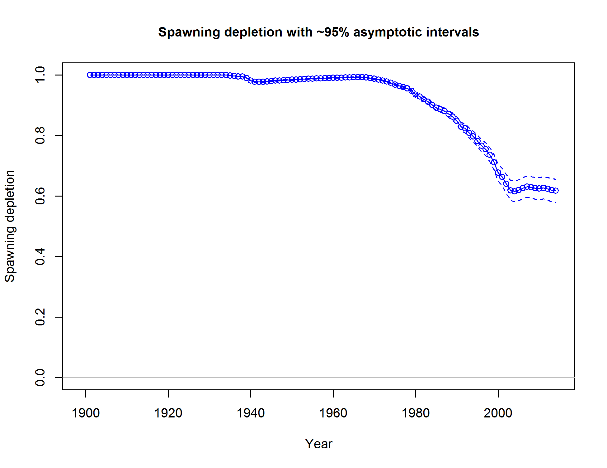


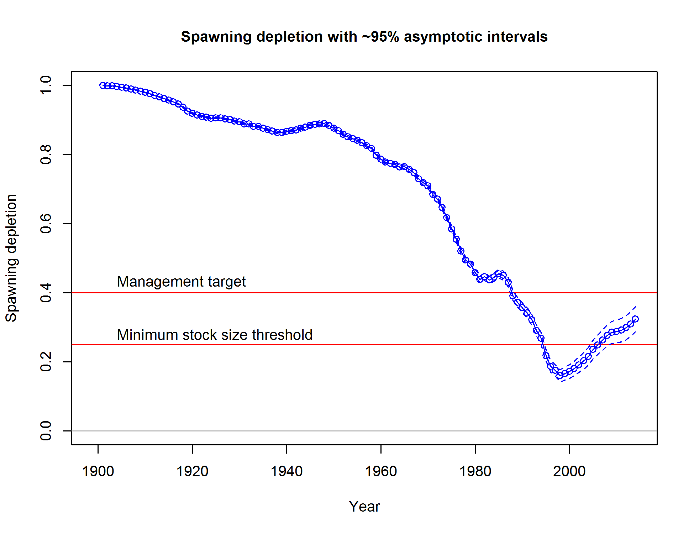


\FloatBarrier

##Ecosystem considerations{-}
In this assessment, ecosystem considerations were not explicitly included in the analysis.  This is primarily due to a lack of relevant data and results of analyses (conducted elsewhere) that could contribute ecosystem-related quantitative information for the assessment.

We did use recently available habitat information to select the data used in the onboard observer indices (see Appendix F, p.\ref{sec:AppendixF}).

##Reference points{-}
The management line for China rockfish is at $40^\circ 10^\prime$ N. latitude, with differing management guidelines north and south.  From 2005-2010, the Minor Nearshore Rockfish Complex was managed by a total catch Optimum Yield (OY).  As of the PFMC 2011-12 management cycle, China rockfish has a component OFL and ACL within the Minor Nearshore Rockfish Complex, based on the work by Dick and MacCall [-@Dick2010] and the previous assessment by Cope et al. [-@Cope2015].

\FloatBarrier

<!-- BEGIN: REFERENCE POINTS TABLE -->
<!-- BEGIN: REFERENCE POINTS TABLE NORTH--> 
```{r, eval=TRUE, echo=FALSE, message=FALSE, warning=FALSE, include=FALSE}
Ref_pts = rbind(
SSB_Unfished    = modN$derived_quants[grep("SSB_U",modN$derived_quants$LABEL),],
TotBio_Unfished = modN$derived_quants[grep("TotBio",modN$derived_quants$LABEL),],
Recr_Unfished   = modN$derived_quants[grep("Recr_Un",modN$derived_quants$LABEL),],
SPB_2013        = modN$derived_quants[grep("SPB_2013",modN$derived_quants$LABEL),],
Depletion_2013  = modN$derived_quants[grep("Bratio_2013",modN$derived_quants$LABEL),],
Refpt_sB        = c(NA,NA,NA),
SSB_Btgt        = modN$derived_quants[grep("SSB_Btgt",modN$derived_quants$LABEL),],
SPR_Btgt        = modN$derived_quants[grep("SPR_Btgt",modN$derived_quants$LABEL),],
Fstd_Btgt       = modN$derived_quants[grep("Fstd_Btgt",modN$derived_quants$LABEL),],
TotYield_Btgt   = modN$derived_quants[grep("TotYield_Btgt",modN$derived_quants$LABEL),],
Refpt_SPR       = c(NA,NA,NA),
SSB_SPRtgt      = modN$derived_quants[grep("SSB_SPRtgt",modN$derived_quants$LABEL),],
SPR_proxy       = c('SPF_proxy',.5,NA),
Fstd_SPRtgt     = modN$derived_quants[grep("Fstd_SPRtgt",modN$derived_quants$LABEL),],
TotYield_SPRtgt = modN$derived_quants[grep("TotYield_SPRtgt",modN$derived_quants$LABEL),],
Refpts_MSY      = c(NA,NA,NA),
SSB_MSY         = modN$derived_quants[grep("SSB_MSY",modN$derived_quants$LABEL),],
SPR_MSY         = modN$derived_quants[grep("SPR_MSY",modN$derived_quants$LABEL),],
Fstd_MSY        = modN$derived_quants[grep("Fstd_MSY",modN$derived_quants$LABEL),],
TotYield_MSY    = modN$derived_quants[grep("TotYield_MSY",modN$derived_quants$LABEL),] )

Ref_pts$Value = as.numeric(Ref_pts$Value)
Ref_pts$StdDev = as.numeric(Ref_pts$StdDev)
Ref_pts$Value1 = ifelse(Ref_pts$Value>=1,as.character(round(Ref_pts$Value,0)),as.character(round(Ref_pts$Value,4)))   

Ref_pts$lowerCI = round(Ref_pts$Value +qnorm(0.025)*Ref_pts$StdDev, digits=4)
Ref_pts$upperCI = round(Ref_pts$Value -qnorm(0.025)*Ref_pts$StdDev, digits=4)
Ref_pts$lowerCI1 = ifelse(Ref_pts$lowerCI>=1,as.character(round(Ref_pts$lowerCI,0)),as.character(round(Ref_pts$lowerCI,4))) 
Ref_pts$upperCI1 = ifelse(Ref_pts$upperCI>=1,as.character(round(Ref_pts$upperCI,0)),as.character(round(Ref_pts$upperCI,4))) 
Ref_pts$CI1 = paste("(",Ref_pts$lowerCI1,"-",Ref_pts$upperCI1,")",sep="")

Quantity= c('Unfished Spawning biomass (mt)',
'Unfished age 0+ biomass (mt)',
'Unfished recruitment (R0)',
'Spawning Biomass (2013)',
'Depletion (2013)',
'\\textbf{$\\text{Reference points based on } \\mathbf{SB_{40\\%}}$}',
'Proxy spawning biomass ($B_{40\\%}$)',
'SPR resulting in $B_{40\\%}$ ($SPR_{B40\\%}$)',
'Exploitation rate resulting in $B_{40\\%}$',
'Yield with $SPR_{B40\\%}$ at $B_{40\\%}$ (mt)',
'\\textbf{\\textit{Reference points based on SPR proxy for MSY}}',
'Spawning biomass ',
'$SPR_{proxy}$',
'Exploitation rate corresponding to $SPR_{proxy}$',
'Yield with $SPR_{proxy}$ at $SB_{SPR}$ (mt)',
'\\textbf{\\textit{Reference points based on estimated MSY values}}',
'Spawning biomass at $MSY$ ($SB_{MSY}$)',
'$SPR_{MSY}$',
'Exploitation rate corresponding to $SPR_{MSY}$',
'$MSY$ (mt) '
)
Ref_pts = cbind(Quantity,Ref_pts[,c(4,9)])
Ref_pts[c(6,11,13,16),3]=''
Ref_pts[c(6,11,16),2]=''
colnames(Ref_pts) = c('\\textbf{Quantity}','\\textbf{Estimate}','\\textbf{\\~95\\%  Confidence Interval}')
```


```{r, eval=TRUE, echo=FALSE, results='asis', message=FALSE}
 #create the Reference points
 Ref_pts.table = xtable(Ref_pts, caption=c("Summary of reference points and management quantities for the northern base case model."), label='Ref_pts')  #digits=0 rounds the numbers
    #xtable requires a placeholder for rownames, hence 6 values    
  align(Ref_pts.table) = c('l','>{\\raggedright}p{4.1in}','>{\\centering}p{.65in}','>{\\centering}p{1.4in}')  
    print(Ref_pts.table, include.rownames=FALSE, caption.placement="top",sanitize.text.function = function(x){x})
```

\FloatBarrier
<!-- BEGIN: REFERENCE POINTS TABLE SOUTH--> 
```{r, eval=TRUE, echo=FALSE, message=FALSE, warning=FALSE, include=FALSE}
Ref_pts = rbind(
SSB_Unfished    = modS$derived_quants[grep("SSB_U",modS$derived_quants$LABEL),],
TotBio_Unfished = modS$derived_quants[grep("TotBio",modS$derived_quants$LABEL),],
Recr_Unfished   = modS$derived_quants[grep("Recr_Un",modS$derived_quants$LABEL),],
SPB_2013        = modS$derived_quants[grep("SPB_2013",modS$derived_quants$LABEL),],
Depletion_2013  = modS$derived_quants[grep("Bratio_2013",modS$derived_quants$LABEL),],
Refpt_sB        = c(NA,NA,NA),
SSB_Btgt        = modS$derived_quants[grep("SSB_Btgt",modS$derived_quants$LABEL),],
SPR_Btgt        = modS$derived_quants[grep("SPR_Btgt",modS$derived_quants$LABEL),],
Fstd_Btgt       = modS$derived_quants[grep("Fstd_Btgt",modS$derived_quants$LABEL),],
TotYield_Btgt   = modS$derived_quants[grep("TotYield_Btgt",modS$derived_quants$LABEL),],
Refpt_SPR       = c(NA,NA,NA),
SSB_SPRtgt      = modS$derived_quants[grep("SSB_SPRtgt",modS$derived_quants$LABEL),],
SPR_proxy       = c('SPF_proxy',.5,NA),
Fstd_SPRtgt     = modS$derived_quants[grep("Fstd_SPRtgt",modS$derived_quants$LABEL),],
TotYield_SPRtgt = modS$derived_quants[grep("TotYield_SPRtgt",modS$derived_quants$LABEL),],
Refpts_MSY      = c(NA,NA,NA),
SSB_MSY         = modS$derived_quants[grep("SSB_MSY",modS$derived_quants$LABEL),],
SPR_MSY         = modS$derived_quants[grep("SPR_MSY",modS$derived_quants$LABEL),],
Fstd_MSY        = modS$derived_quants[grep("Fstd_MSY",modS$derived_quants$LABEL),],
TotYield_MSY    = modS$derived_quants[grep("TotYield_MSY",modS$derived_quants$LABEL),] )

Ref_pts$Value = as.numeric(Ref_pts$Value)
Ref_pts$StdDev = as.numeric(Ref_pts$StdDev)
Ref_pts$Value1 = ifelse(Ref_pts$Value>=1,as.character(round(Ref_pts$Value,0)),as.character(round(Ref_pts$Value,4)))   

Ref_pts$lowerCI = round(Ref_pts$Value +qnorm(0.025)*Ref_pts$StdDev, digits=4)
Ref_pts$upperCI = round(Ref_pts$Value -qnorm(0.025)*Ref_pts$StdDev, digits=4)
Ref_pts$lowerCI1 = ifelse(Ref_pts$lowerCI>=1,as.character(round(Ref_pts$lowerCI,0)),as.character(round(Ref_pts$lowerCI,4))) 
Ref_pts$upperCI1 = ifelse(Ref_pts$upperCI>=1,as.character(round(Ref_pts$upperCI,0)),as.character(round(Ref_pts$upperCI,4))) 
Ref_pts$CI1 = paste("(",Ref_pts$lowerCI1,"-",Ref_pts$upperCI1,")",sep="")

Quantity= c('Unfished Spawning biomass (mt)',
'Unfished age 0+ biomass (mt)',
'Unfished recruitment (R0)',
'Spawning Biomass (2013)',
'Depletion (2013)',
'\\textbf{$\\text{Reference points based on } \\mathbf{SB_{40\\%}}$}',
'Proxy spawning biomass ($B_{40\\%}$)',
'SPR resulting in $B_{40\\%}$ ($SPR_{B40\\%}$)',
'Exploitation rate resulting in $B_{40\\%}$',
'Yield with $SPR_{B40\\%}$ at $B_{40\\%}$ (mt)',
'\\textbf{\\textit{Reference points based on SPR proxy for MSY}}',
'Spawning biomass ',
'$SPR_{proxy}$',
'Exploitation rate corresponding to $SPR_{proxy}$',
'Yield with $SPR_{proxy}$ at $SB_{SPR}$ (mt)',
'\\textbf{\\textit{Reference points based on estimated MSY values}}',
'Spawning biomass at $MSY$ ($SB_{MSY}$)',
'$SPR_{MSY}$',
'Exploitation rate corresponding to $SPR_{MSY}$',
'$MSY$ (mt) '
)
Ref_pts = cbind(Quantity,Ref_pts[,c(4,9)])
Ref_pts[c(6,11,13,16),3]=''
Ref_pts[c(6,11,16),2]=''
colnames(Ref_pts) = c('\\textbf{Quantity}','\\textbf{Estimate}','\\textbf{\\~95\\%  Confidence Interval}')
```


```{r, eval=TRUE, echo=FALSE, results='asis', message=FALSE}
 #create the Reference points
 Ref_pts.table = xtable(Ref_pts, caption=c("Summary of reference points and management quantities for the southern base case model."), label='Ref_pts')  #digits=0 rounds the numbers
    #xtable requires a placeholder for rownames, hence 6 values    
  align(Ref_pts.table) = c('l','>{\\raggedright}p{4.1in}','>{\\centering}p{.65in}','>{\\centering}p{1.4in}')  
    print(Ref_pts.table, include.rownames=FALSE, caption.placement="top",sanitize.text.function = function(x){x})
```
<!-- END: REFERENCE POINTS TABLE --> 
\FloatBarrier


##Management performance{-}


<!-- BEGIN: CREATE MANAGEMENT PERFORMANCE TABLE - WILL PROBABLY NEED TO BE TWO TABLES--> 
```{r, eval=TRUE, echo=FALSE, message=FALSE, warning=FALSE, include=FALSE}

mngmnt = read.csv("./txt_files/mngmt_performance.csv")

colnames(mngmnt) = c('Year','Management guideline',	'Nearshore rockfish north', 'China contrib. north',	
                     'Estimated catch north',	'Nearshore rockfish south',	'China contrib. south',	
                     'Estimated catch south')

```


```{r, eval=TRUE, echo=FALSE, results='asis', message=FALSE}
  #create the Spawning biomass table
 mngmnt.table = xtable(mngmnt, caption=c("Recent trend in total catch and commercial landings (mt) relative to the management guidelines. Estimated total catch reflect the commercial landings plus the model estimated discarded biomass. Note: 2015 and 2016 ACLs are proposed and not yet in regulations "), label='mnmgt_perform')  #digits=0 rounds the numbers
 
#   xtable requires a placeholder for rownames, hence 6 values    
    align(mngmnt.table) = c('l','>{\\raggedleft}p{.4in}','>{\\raggedleft}p{1.3in}','>{\\centering}p{.8in}','>{\\centering}p{.7in}',
                            '>{\\centering}p{.8in}','>{\\centering}p{.8in}','>{\\centering}p{.7in}',
                            '>{\\centering}p{.8in}')  
    print(mngmnt.table, include.rownames=FALSE, caption.placement="top",sanitize.text.function = function(x){x},scalebox=.9)
```
<!-- END: CREATE MANAGEMENT PERFORMANCE TABLE -->


##Unresolved problem and major uncertainties{-}
any special issues that complicate scientific assessment, questions about the best model scenario, etc.

##Decision table{-}
TBD


<!-- BEGIN: CREATE RESULTS SUMMARY TABLE --> 
```{r, eval=TRUE, echo=FALSE, message=FALSE, warning=FALSE, include=FALSE}

###collect the data from all the tables
# read in the management table
mngmt_N = read.csv("./txt_files/mngmt_performance_base.csv")
mngmt_N = mngmt_N[,c(2:7)]
negSPR_Exploit = negSPR_Exploit[,c(2,4)]
negSPR_Exploit[,c(1,2)] = round(negSPR_Exploit[,c(1,2)],2)
AgexB = seq(FirstYR,LastYR)
Spawn_Deplete = Spawn_Deplete[,c(2:5)]
Spawn_Deplete[,1] = round(Spawn_Deplete[,1],0)
Spawn_Deplete[,3] = round(Spawn_Deplete[,3],2)
Recruittab = Recruittab[,c(2,3)]
base_summary = cbind(mngmt_N,negSPR_Exploit,AgexB,Spawn_Deplete ,Recruittab)


 base_summary = as.data.frame(t(base_summary))
 base_summary$names=c('Comm. landings (mt)','Total Est. Catch (mt)','Nearshore RF ABC/OFL','China contrib. ABC/OFL',
                      'Nearshore RF OY/ACL','China contrib. OY/ACL'
                      ,'1-SPR','Exploitation rate','Age 0+ biomass (mt)','Spawning Biomass','~95% CI','Depletion',
                      '~95% CI','Recruits','~95% CI')
 
 base_summary = base_summary[,c(11,1:10)]
 colnames(base_summary) = c("Quantity",seq(FirstYR,LastYR))

```


```{r, eval=TRUE, echo=FALSE, results='asis', message=FALSE}
#  create the Spawning biomass table
  base_summary.table = xtable(base_summary, caption=c("China rockfish North? base case results summary."), 
                              label='base_summary',digits=0) 
   
    align(base_summary.table) = c("crcccccccccc")  
    print(base_summary.table, include.rownames=FALSE, caption.placement="top",floating.environment="sidewaystable",
           scalebox=.8,align=TRUE, hline.after=c(-1,0,4,5,7,9,11,nrow(base_summary.table)) )
```
<!-- END: CREATE RESULTS SUMMARY TABLE -->


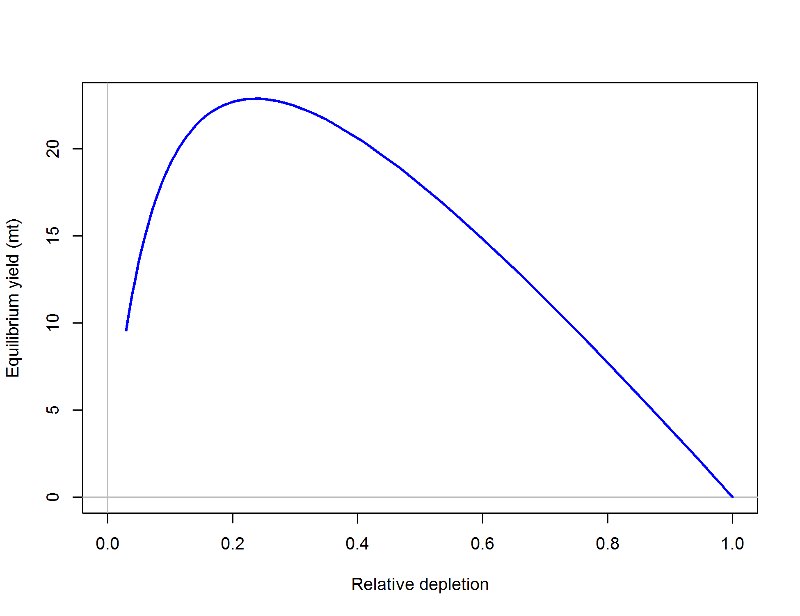

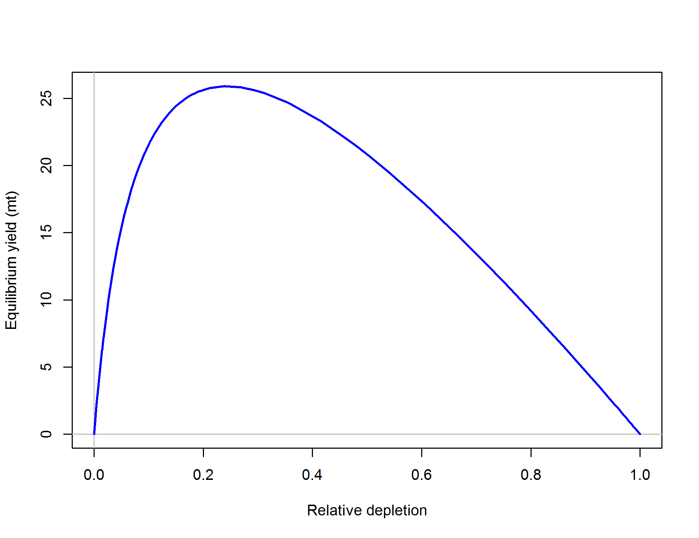

\FloatBarrier
\newpage

##Research and data needs{-}
identify information gaps that seriously impede the stock assessment.

##Rebuilding projections{-}
reference to the principal results from rebuilding analysis if the stock is overfished.* This section should be included in the Final/SAFE version assessment document but is not required for draft assessments undergoing review. See Rebuilding Analysis terms of reference for detailed information on rebuilding analysis requirements.


\FloatBarrier

\newpage
\renewcommand{\thefigure}{\arabic{figure}}
\renewcommand{\thetable}{\arabic{table}}
\setcounter{figure}{0}
\setcounter{table}{0}

#Introduction

##Basic Information and Life History

China rockfish \emph{Sebastes nebulosus} is a medium-sized, commercially (mainly in the live-fish
fishery) and recreationally prized deeper-dwelling nearshore rockfish ranging from southern
California, north to the Gulf of Alaska [@Love2002].  Core abundance is found from northern California to
southern British Columbia, Canada. China rockfish were historically encountered by the recreational fleet in the Southern California Bight [@Love1998].  Love et al. [-@Love1998] examined the 1980-1996 MRFSS data from southern CA.  In the early years of the study China rockfish were occasionally encountered, and by 1996 no China rockfish were observed.  However, a coding error in RecFIN was later discovered that included San Luis Obispo as part of southern CA in the 1980s, when it should have been coded as central CA.  Although rockfish are occasionally encountered south of Pt. Conception, the majority of China rockfish from Love et al. [-@Love1998] were likely from San Luis Obispo county.

There is limited information available on stock structure or life history.  No genetic research has been conducted for China rockfish, and no published research indicates separate stocks along the West Coast.  China rockfish do not appear to exhibit sexual dimorphism [@Lenarz1991], although the data are limited.  Fits to a von Bertalanffy growth curve from age-length data from Washington, Oregon and California used in this assessment indicate regional differences in growth and estimates of $L_\infty$ [@vonB1938].  These data represent fish collected from the recreational and commercial sectors as well as for research.

China rockfish are among the longer-lived rockfish.  Love [-@Love2002] reports China rockfish live to at least 79 year, which is corroborated by the available age data used in this assessment. The oldest aged China rockfish from Alaska was 78 years old [@Munk2001].  Recently aged China rockfish from the West coast had a maximum age of 83 years from California (recreational or research) in 1973.  The oldest aged fish from Oregon was 79 from the commercial fisher in 2003 and in Washington, 77 years from the recreational fleet.  

Little is known about the maturity schedule and fecundity of China rockfish.  Echeveria [-@Echeverria1987] collected 69 China rockfish, of which the age at first maturity was 3 years for males and females (26 cm).  Both males and females exhibited 50% maturity at 4 years (27 cm) and 100% maturity at 6 years (30 cm).  A study by Lea et al. [-@Lea1999] captured females releasing larvae in April and May, and spent females in April, June and October off the coast of California.   Echeveria [-@Echeverria1987] identified January - June as the months of parturition for China rockfish in north-central California, with the peak of reproductive activity in January.

One diet study indicated that China rockfish in central California predominantly feed on crustaceans and ophiuroids, while the diets of China rockfish in northern California was dominated by crustaceans and mollusks [@Lea1999]. This is similar to the diet described by Love [-@Love2002] of benthic organisms, including brittle stars, crabs, and shrimps.

Both juvenile and adult rockfish tend to be solitary and exhibit high site fidelity within rocky habitats. Surveys of rockfishes in \emph{Nereocystis} and \emph{Macrocystis} kelp forests observed China rockfish in only the \emph{Macrocystis} kelp forests and sightings within the kelp forests were rare [@Bodkin1986].  Juvenile China rockfish inhabit shallow, subtidal waters [@Love2002].  An experimental study with captive China rockfish found that juveniles exhibit both site fidelity and territoriality. [@Lee2009].  A tag and recapture study by Lea et al. [-@Lea1999] indicated China rockfish have high site fidelity.  While the did not report the exact distance from all China rockfish from the study were recaptured in the same "general locality at which they were released."  In other rockfish movement studies, China rockfish were tagged but never recaptured [@Hanan2012], or there was a sample size of one fish [@Hannah2011].  An ongoing study in Oregon has tagged and tracked seven China rockfish (personal communication Tom Calvanese, Oregon State University).  The maximum distance traveled by any of these China rockfish is xxxx.

Little is known about the mixing of juvenile China rockfish at the pelagic stage as they are not captured in the SWFSC juvenile rockfish cruise.  The 2013 assessment model treated the species as two stocks, one from Pt. Conception, CA to Cape Mendocino, CA ($40^\circ 10^\prime$ N lat.), which is also the management boundary for China rockfish.  For this assessment we explore assessment models north and south of $40^\circ 10^\prime$, as well as separate northern California/Oregon and Washington models in the north.

China rockfish vulnerability to overfishing is one of the highest recorded (V = 2.23) for west coast groundfishes [@Cope2011] and is not listed on the FSSI.


Include?

China rockfish can suffer from barotrauma.  Parker [-@Parker2006] found that China rockfish required 250 h to attain neutral buoyancy at 4 atmospheres absolute (ATA, depth equivalent of 30 m) when experiments began at the surface water pressure.


##Map
A map showing the scope of the assessment and depicting boundaries for fisheries or data collection strata is provided in Figure \ref{fig:boundary_map}.


##Ecosysem Considerations

In this assessment, ecosystem considerations were not explicitly included in the analysis.  However, we did use information on the distribution of rocky habitat to inform the onboard observer program indices of relative abundance from California and Oregon.  The onboard observer program collects location-specific encounters of China rockfish.  We overlaid the locations of China rockfish encounters with high-resolution bathymetry data to obtain a proxy of the extent of China rockfish habitat (see Appendix F for details, pp.\ref{sec:AppendixF}).

Much research is needed to elucidate the role of China rockfish in the ecosystem, including predator/prey interactions.  


##Fishery Information and Summary of Management History

The rockfish fishery off the U.S. Pacific coast first developed off California in the late
19th century

The rockfish fishery was established in the early 1940s, when the United States became
involved in World War II and wartime shortage of red meat created an increased demand
for other sources of protein [@Alverson1964; @Harry1961]. 

China rockfish are most commonly captured by hook and line or traps.  They are rarely encountered in the trawl fishery due to the elusive behavior and affinity for rocky crevices.  Their high site fidelity and territoriality lend to the evasiveness of the species.  


Summary of management history (e.g., changes in mesh sizes, trip limits, or other management actions that may have significantly altered selection, catch rates, or discards).


China rockfish are managed within the Minor nearshore Rockfish Complex


##Managament Performance
Management performance, including a table or tables comparing Overfishing Limit (OFL), Annual Catch Limit (ACL), Harvest Guideline (HG) [CPS only], landings, and catch (i.e., landings plus discard) for each area and year


#Assessment

##Data
Data used in the China rockfish assessment are summarized in Figures \ref{fig:data_sources_N} - \ref{fig:data_sources_S}.  A description of each data source is below.


###Fishery-Dependent Data: Commercial Landings

**Washington**

There are no records of China rockfish being landed by any commercial gears in Washington.  

**Oregon**

China rockfish landings from Oregon commercial fisheries were minor until twenty years ago (Table \ref{tab:OR_comm_removal}, Figure \ref{fig:OR_comm_removal}).    Prior to the mid-1990’s, there were only trace landings of China rockfish from longline fisheries (i.e., less than one metric ton per year), and no landings from the trawl fisheries (based on species composition samples  obtained since the 1960s; [@Douglas1998]).  However, landings of China rockfish rapidly increased from 1995-2000 due to the emergence of a live-fish market that paid high prices for ornate rockfish, such as China rockfish (especially in Southern Oregon).  Following a peak in catch from 1998-2000, decreased landings of China rockfish during the early 2000’s coincided with new regulations designed to limit harvests from the live fish fishery, such as landings limits, permit limits, and minimum size limits [@Rodomsky2014]. 


There is a relatively high degree of confidence in the accuracy of historic China rockfish landings because comprehensive sampling of commercial landings began before the fishery for China rockfish developed.  Specifically, since 1992, the Oregon Department of Fish and Wildlife has obtained robust species composition samples from landings categories containing China rockfish at fine levels of stratification (i.e., year, quarter, gear, disposition, area caught, and market category).  China rockfish landed into improper market categories, has been practically non-existent, presumably due to the high price differential for China rockfish (as opposed to other rockfish).  China rockfish landings since 1992 were obtained from PacFIN, which estimates species specific landings of rockfish by the above mentioned strata.


However, China rockfish landings could not be obtained from PacFIN prior to 1992 since China rockfish were not included in species composition samples (of rockfish category landings) from the longline and rod-and-reel fisheries (and thus China rockfish landings incorrectly appear as zeros in PacFIN).  Accordingly, landings of China rockfish were obtained from the commercial catch reconstruction developed by Karnowski et al. [-@Karnowski2014], whom borrowed species compositions (from earliest complete years) and applied them to market category landings from years before species compositions were obtained. 


All China rockfish landings from the Karnowski et al. [-@Karnowski2014] reconstruction were used except for those occurring from the salmon troll fishery, which were reported as 1-2 metric tons per year from the mid-1960’s to the early 1990’s.  Since a species composition had never been obtained from the market categories containing China rockfish for the salmon troll fishery, Karnowski et al. [-@Karnowski2014] borrowed species compositions from the recreational salmon fishery and applied them the commercial salmon troll fishery landings.  Although China rockfish appeared in the recreational salmon fishery landings, it was concluded at the Nearshore Stock Assessment Workshop ([Agenda Item D.8 Attachment 10](http://tinyurl.com/ndrrx9r), June 2015) that the China rockfish caught during recreational salmon trips were not caught by troll gear, but rather by jig gear from anglers who also targeted benthic rockfish species before or after trolling for salmon.  Since China rockfish are associated with rock reef habitat [@Love1998] and salmon trollers fish the surface waters for coho salmon and avoid rocky reefs when fishing for Chinook salmon (to prevent entanglement of expensive downrigger gear on rocks), it was deemed improbable that China rockfish be caught by salmon troll gear.   


**California**

The [CALCOM](http://128.114.3.187/) database was queried (May 15, 2015) for commercial landing estimates of China rockfish in California, 1969-2014. Landings were stratified by year, quarter, live/dead, market category, gear group, port complex, and source of species composition data (actual port samples, borrowed samples, or assumed nominal market category).

The majority of commercial China rockfish landings are made by vessels using hook-and-line gear (Figure \ref{fig:EJD_CALCOM_1}). However, CALCOM landings estimates also include a large fraction of trawl-caught China rockfish from 1969-1988, which is unlikely given the species’ preference for rocky habitat. The reported trawl catch was mainly from the Monterey port complex and was landed in the “China rockfish” market category (258).

An analysis of species composition data from port samples in market category 258, by gear type, revealed that the sampled trawl-caught landings contained mainly deeper-water species, including greenspotted rockfish (*Sebastes chlorostictus*), sometimes known as “chinafish.” Species landed by hook-and-line gears in the China rockfish market category, on the other hand, consisted of a mixture of nearshore species (e.g., China, quillback, gopher, black-and-yellow, and brown; Figure \ref{fig:EJD_CALCOM_2}). When port samples are not available to estimate species composition in a stratum, and no samples are available to ‘borrow’ from an adjacent stratum, landings in a market category are assigned to the ‘nominal’ species category, in this case China rockfish.

Given the available species composition data from the trawl catch, and the fact that trawl gear is unlikely to be fished in China rockfish habitat, estimates of trawl-caught China rockfish were removed from the landings estimates in the current assessment. A similar analysis led to the removal of a small amount (about 5 mt) of landings by set-net and mid-water trawl gear groups.

In years prior to 1978, landing receipts are available for California but there are no associated port sample data. In CALCOM, a ratio estimator (based on the expanded landings estimates in the earliest sampled years) is used to allocate catch to species in unsampled years. In the case of China rockfish, this procedure propagated the estimates of trawl-caught China backward in time to 1969 (Figure \ref{fig:EJD_CALCOM_1}). These ratio estimates of trawl-caught China rockfish were also removed from the final time series of landed catch.

The previous assessment of China rockfish [@Cope2015] modeled two China rockfish populations, north and south of $40^\circ 10^\prime$ North latitude (roughly Cape Mendocino). The majority of landings occurred south of Cape Mendocino, and the revised estimates are substantially lower in early years, primarily due to the removal of trawl catch (Figure \ref{fig:EJD_CALCOM_3}).

California’s commercial live-fish fishery began targeting nearshore rockfish species in the mid-1980s in southern California, and condition codes (live or dead) were required on landing receipts starting in 1993 [@CalCOFI2002]. However, fish landed live are not always recorded as live landings on the landing receipts, so estimates of live landings should be viewed as a minimum estimate [@CalCOFI2002]. Live annual landings of China rockfish surpassed landings of dead fish by the late 1990s, due to the increased value of fish landed live (Table \ref{tab:OR_comm_removal}, Figure \ref{fig:EJD_CALCOM_4}).

Commercial landings of China rockfish in California from 1916-1968 were obtained from the historical reconstruction of Ralston et al. [-@Ralston2010], and also available from the CALCOM website. Their analysis differentiates between trawl-caught landings and “other” gears. In the case of China rockfish, less than 2 mt of landings from 1916-1968 were attributed to trawl gears, and these were excluded from the assessment. The remaining “other” gear types (cumulative removals of 197 mt from 1916-1968) landed China rockfish mainly south of Cape Mendocino, with a short pulse of landings between Cape Mendocino and the California-Oregon border in the 1930s and early 1940s (Figure \ref{fig:CA_reconstruct_landings}). Due to the relatively large landing estimates south of Cape Mendocino in the early years, catches from 1900 to 1916 were interpolated with a linear ramp from 0 mt in 1900 to 6.1 mt in 1916 (the first year of commercial landings estimated by  Ralston et al. [-@Ralston2010]).


###Fishery-Dependent Data: Commercial Discards

**Washington**

Discard of China rockfish likely occurred before the closure of nearshore commercial fisheries in 1995 for non-trawl gears and in 1999 for trawl gears.  However, there is no information on historical discards.  For this assessment, we assume no retention or discard of China in any commercial fisheries.       

**Oregon and California**

Estimates of discarded China rockfish in commercial fisheries were provided by the West Coast Groundfish Observer Program (WCGOP). These were available for the years 2003-2013 north of $40^\circ 10^\prime$ N lat., and 2004-2013 to the south. WCGOP provided estimates with and without the depth-specific discard mortality rates applied \hl{(thus far, this is just true for the southern area)}. These estimates indicate that the Nearshore Fixed-gear fishery was the only sector with observed discards of China rockfish and there were strong differences in rates of discarding north and south of $40^\circ 10^\prime$, (Figure \ref{fig:discard_comm_est}). 

Discard rates were consistently low north of $40^\circ 10^\prime$, where no year had estimated mortality from discards greater than either 0.5 mt or 5\% of the landings. A linear regression relating discards to retained (with intercept fixed at the origin) had a slope of  0.0269, indicating that discards on average represent 2.69\% of the landings in this sector (Figure \ref{fig:discard_comm_relN}). This value is similar to a simple average of the discard fractions, which was 2.75\%.

South of $40^\circ 10^\prime$, commercial landings were lower and estimated discards higher. The maximum discard mortality estimate was 1.8 mt for 2012 which was 126\% of the 1.4 mt nearshore fixed gear landings in that area in that year. The total discard amount for that year, including fish estimated as surviving, was 2.7 mt, almost double the landed amount.  There is also an increasing trend over the observed period (2004-2013) with an average for the first three years of 30\% of all China rockfish catch discarded and an average over the final three years of 63\% discarded.

Discards patterns in the area of Northern California between $40^\circ 10^\prime$, and $42^\circ$ appears to be more similar to Oregon than the rest of California (Table \ref{tab:discard_comm_bylat}). Although expanded fleet-wide discard estimates were not available on this smaller spatial-scale, only 9\% of observed trips between $40^\circ 10^\prime – 42^\circ$ that were associated with any catch of China rockfish had any observed discards of China rockfish. South of $40^\circ 10^\prime$, 82\%-100\% of such trips had observed discards of China rockfish.

The patterns of the discards in commercial fisheries suggest that north of $40^\circ 10^\prime$ discard mortality of China rockfish is small enough that it is more parsimonious to account for this mortality increasing the landed catch estimates by 2.69\%. South of $40^\circ 10^\prime$, total discards are greater than landings in some years and discard mortality represents a large fraction of the total mortality of China rockfish. The discards are primarily fish below the minimum legal size of 12 inches \hl{(REFERENCE FUTURE FIGURE OF DISCARD COMP DATA)}. These factors support modeling the discard process explicitly through a retention function. This will allows the model to apply the mortality from discards to the appropriate subset of the population. Furthermore, the increasing trend in discard rates may be an indication of changes in population size structure that should be accounted for in the assessment.


###Fishery-Dependent Data: Recreational Landings and Discards

**Washington**

Historically, Washington's coastal recreational anglers have been salmon orientated.  Most groundfish were considered “scrap fish” by anglers [@Buckley1967].  Beginning in the mid-1970s, and particularly in the wake of the 1974 Boldt Decision, salmon fishing opportunities became increasingly restrictive; seasons were shortened and daily limits were reduced.  The trend continued into the 1980s and 1990s.  In 1994, and for the first time in the state's history, a one year moratorium on all ocean salmon fishing was implemented in response to dwindling salmon runs.  As salmon fishing opportunities waned over time, recreational and commercial fishers began shifting their interests to other species.  Many recreational coastal anglers shifted their efforts to rockfish.  Prior to declines in salmon fishing opportunities, rockfish, though rarely discarded, were generally not targeted.  The increased interest in rockfish and other groundfish can be linked directly to the decline in salmon fishing opportunities.    

The coastal recreational fleet is composed of two sectors; privately owned vessels and charter vessels.  Throughout the history of coastal charter boat fishing, Westport has remained the center of charter boat activity; however, as the salmon fishing industry declined, the charter fleet dispersed in search of more lucrative opportunities.  Many of the vessels left the state, and some moved north where rockfish fishing was perceived as being more reliable.  Even though, there are still more charter vessels operating at Westport than at Neah Bay and La Push. 

The primary focus of coastal rockfish anglers is black rockfish.  Black rockfish occur in greater abundance and closer to shore than other coastal rockfish species, and while generally regarded as a “bottom fish”, they tend not to occupy crack and crevice habitat, thus making them more susceptible to hook and line fishing.  As rockfish daily limits decreased, the likelihood of recreational anglers retaining smaller rockfish species, such as China, as part of their daily bag limit likely also decreased.

China rockfish are more common in northern Washington coast (Marine Catch Areas 3 and 4) from south of Tatoosh Island to Pt. Grenville inside of 15 fathoms and is rarely encountered south of the Point Grenville.  Makah Bay and the Umatilla reef areas seem to have the largest populations in the area (Tom Burlingame, Excel Fishing Charters, pers comm).  China rockfish are rare off of the central Washington coast (Marine Catch Area 2) from the mouth of the Queets River to Leadbetter Point.  Some chartered vessels from Westport have gone multiple seasons without encountering any China rockfish in Marine Catch Area (MCA) 2 (Mark Cedergreen, Westport Charterboat Association, pers comm).  Suitable habitat is limited in MCA 1, from the mouth of the Leadbetter Point to the mouth of Columbia River. 

Historical estimates of China rockfish catch during 1967 and 1975-1989 were based on historical sport catch report series published by Washington Department of Fisheries (Table \ref{tab:WA_rec_removal}, Figure \ref{fig:WA_rec_removal}).  Catches for 1968-1974 period were based on a linear interpolation between 1967 and 1975.  From 1990 to current, catch estimates were produced by WDFW Ocean Sampling Program based on a catch expansion procedure that includes a complete count of vessels leaving or entering a port and dockside angler interviews.  Dockside interview collects information on number of anglers fished, catch area, and target species.  Shorebased fishing, other than major jetties, is not sampled and is considered negligible.  Sampling and effort count occur mainly from April to October.  Winter fishing is also considered negligible. 

We assumed an average weight of 0.88 kg/fish to convert the estimates from number of fish to metric ton for all years.  The split between charter and private vessels prior to 1990 was based on a ratio estimator using 1990-1994 data.  

More than 90% of China rockfish were caught of the northern Washington coast on an annual basis (Table \ref{tab:WA_rec_removal}) and the catch by private vessels accounted for 70%-95% of the northern catches.  In the southern area, harvest of China has been under 0.5 mt annually; and most of them were caught by charter vessels (Table \ref{tab:WA_rec_removal}, Figure \ref{fig:WA_rec_removal}). 

Release information was not available until 2002.  Number of releases by species and the depth of release were added to OSP dockside questionnaire in 2002 and 2005, respectively.  Release-by-depth are estimated using the same catch expansion algorithm for retained catch.  Surface release mortalities adopted by the Groundfish Management Team (GMT) were then applied to the number of release estimates for total mortality calculation.  The average weight of 0.88 kg/fish was also used for releases.  For pre-2002 release, we applied proportions of releases based on a ratio estimator using 2003-2007 data.  For the split between charter and private vessels, the same algorithm used for splitting retained catch was applied.

Discard rates are higher in the northern area than that in the southern area.  Since 2011, more than 50% of the China rockfish caught were released by anglers.  The release rates are lower in the southern area between 14% and 26% in recent years.  This may due to the rare encountering of China off southern Washington coast. 


**Oregon Sport Fishery Removals 1973-2014**

China rockfish have been a relatively minor contributor to historic Oregon sport groundfish landings (i.e., typically less than one percent of total catch), and have primarily been from   incidental catches of anglers targeting intermixed schools of suspended rockfish species (e.g., black rockfish, blue rockfish, and yellowtail rockfish).  China rockfish removals from the Oregon sport fishery ramped up relatively quickly during the 1970’s (Table \ref{tab:OR_rec_removal}, Figure \ref{fig:OR_rec_removal}), and have since ranged between two and seven metric tons every year, with considerable inter-annual variation. 

Total removals of China rockfish from the Oregon sport fisheries were obtained from estimates produced by the Oregon Recreational Boat Survey (ORBS).  To produce total catch estimates, ORBS applies catch rates from a subsample of vessels (from dockside interviews) to total effort counts at fine levels of stratification (i.e., by week, port, fishery, and type of boat).  For estimates of landings, catch rates are verified by biologists; however, estimates of discarded mortality are based on angler-reported discards, and are further stratified by depth-dependent mortality rates associated with barotrauma.  Since nearly all mortality of China rockfish has been from landed catch (i.e., typically less than 0.1 mt of discard mortality per year), there is relatively high degree of certainty in sport fishery removals.     

Since 2001, ORBS has produced comprehensive year-round estimates of catch and effort for all developed Oregon ports (and are available from RecFIN).  However, prior to 2001, ORBS sampling was typically only conducted at major ports during the peak months of sport fishing activity, and no estimates of catch were made for unsampled ports and times.  Accordingly, the Oregon Department of Fish and Wildlife (ODFW) reconstructed historic ORBS estimates of China rockfish to include catches from all ports and times (not yet available on RecFIN), as is done in recent years.  


The sport reconstruction addressed four spatial and temporal coverage biases identified during an external review of ORBS by the RecFIN Statistical Subcommittee [@VanVoorhees2000]: (1) “major ports” that were sampled each year were not sampled during the winter months; (2) “minor ports” were not sampled at all during some years; (3) effort counts for private boats excluded afternoon and night trips; and (4) undeveloped launch sites were never sampled (e.g., beaches).  A fifth coverage bias, shoreline and estuary boat removals, was not relevant to China rockfish since landings were typically non-existent during years when sampling occurred.  
The sport reconstruction utilized ratio estimators, based on years with complete sampling, to expand catches from years with partial sampling.  For instance, the contribution of winter catch to total catch during years with complete sampling was used to the expand catches for years with missing winter catch.  Similarly, the contribution of catch from a minor port to that of the major ports during years with complete sampling was used to expand catches of years that the minor port was not sampled.  


**California**

In California, recreational fishing has accounted for over 70\% of cumulative China rockfish removals statewide (1900-2014, landings and discard), and over 84\% of statewide removals since 2005 (Table \ref{tab:CA_rec_removal}).  Almost all the removals are attributed to boat fishing modes (party/charter and private/rental fleets), with only a negligible contribution from shore-based fishing modes (RecFIN, 2015).

Estimates from the California Recreational Fisheries Survey (CRFS) were downloaded from the Recreational Fisheries Information Network ([RecFIN] (www.recfin.org)). This survey covers the years 2004-2014, and estimates of retained plus discarded catch (catch types A and B1) were downloaded in numbers of fish as well as metric tons by year, boat mode (“PC” = party/charter, “PR”=private/rental), month, and CRFS district. In some strata, estimates of catch in numbers had no corresponding catch in weight due to missing average weight values in RecFIN. For these strata, catch in weight was estimated using the product of catch in numbers and average weight in the same year. Catches in weight (mt) were aggregated by year, boat mode, and CRFS district (cite catch table here). As an approximation, removals in CRFS District 6 were assigned to the management area north of Cape Mendocino.

From 1980-2003, sampling of recreational fisheries in California was conducted as part of the Marine Recreational Fisheries Statistics Survey (MRFSS). Estimates of retained and discarded catch (A+B1) in numbers of fish and weight in metric tons were downloaded from the RecFIN website. Strata with estimates of catch in numbers, but no corresponding weight, were imputed using the same approach described above for the CRFS estimates. MRFSS sampling was not conducted from 1990-1992 due to lack of funding. Also, sampling of the PC boat mode north of Point Conception did not resume until 1996. Estimates for these missing years were calculated using linear interpolation, by region and boat mode.

The MRFSS program did not provide estimates of removals stratified north and south of Cape Mendocino. However, CDFW has maintained logbook records since 1957 of total rockfish catch by CDFW statistical block (Table \ref{tab:CA_rec_removal}) from the PC mode (aka the Commercial Passenger Fishing Vessel or “CPFV” fleet). Following the approach used in the last China rockfish assessment [@Cope2015], we calculated the ratio of total rockfish catch (all species combined) for statistical blocks less than 233 (blocks north of Cape Mendocino) to total rockfish catch in the area north of Point Conception ($34^\circ 27^\prime$ N. latitude) by year. The ratios were then scaled such that the percentage of catch north of Mendocino in 2003 matched the observed ratio of catch in District 6 to Districts 3-6 from 2004-2011. These adjusted ratios were applied to annual MRFSS estimates for the area north of Point Conception in order to estimate landings north and south of Cape Mendocino in the years 1980-2003.

Estimates of recreational removals (catch and discard) from 1928-1979 were reconstructed by Ralston et al. ([-@Ralston2010]; Table \ref{tab:CA_rec_removal}). Similar to the MRFSS data, the estimates produced by Ralston et al. did not partition catch to areas north and south of Cape Mendocino, so CPFV logbook data was used to determine the fraction of removals north and south of Cape Mendocino. Adjusted annual percentages (Table \ref{tab:CA_rec_removal_NS}) were applied to the reconstructed recreational catches back to 1957, and the average percentage in 1957-58 (0.74\%) was applied to all previous years and assumed constant back to 1928.


###Fishery-Dependent Data: Oregon Commercial Logbook

The Oregon Department of Fish and Wildlife (ODFW) has required nearshore commercial fishers (both nearshore permitted vessels and open access vessels) to submit fishing logbooks since 2004.  Fisher compliance is generally high, averaging around 80\%, but has varied through time ranging from 65\% in 2007 to 95\% in recent years.  Although required to provide all requested information in the logbook per fishing gear set, there has been substantial variation in the quantity and quality of information reported in logbooks.  Responses from submitted logbooks were entered into a central database and span the years 2004 through 2013.  At the time of this assessment, 2014 logbook submissions were not fully processed and thus were not available.  A map showing positive reports of China rockfish can be found in Figure \ref{fig:OR_commlog_map}.

Logbook information went through several data quality filters to attain as best as possible a consistent and representative data set through time to estimate a relative abundance trend.  Results from the filtration algorithm are summarized in Table \ref{tab:OR_commlog_sample}.  Of note, only logbook submissions from black and blue rockfish permitted vessels with a nearshore endorsement were included in the analysis, because these vessels consistently fish in areas where China rockfish are encountered.  To minimize temporal variation in reporting errors (or nuances), only vessels that fished all 10 years (2004 – 2013) were deemed the most likely to provide consistent responses through time.  Operators of endorsed vessels may have changed through time.  Individual observations of catch (kg) and effort (hook hour) were at the trip level, where multi-set trips were aggregated to the trip level.  ODFW sets bimonthly trip landing limits for China rockfish and these have changed through time.  However, trip limits have not generally been breached in the subset of logbook data used for China rockfish, and thus there was no need to exclude subsequent trips.  The final subset of logbook data included 3,575 trips (14\% of the full set of logbook data) from 10 vessels (Figure \ref{fig:OR_commlog_sample}). 

Preliminary data analyses identified levels or limits of filtering variables in order to preserve adequate sample sizes and representative trips for China rockfish.  For example, gear type was restricted to hook and line (excluding longline gear) because this method accounted for 85\% of all sets.  The three main southernmost Oregon ports (Port Orford, Gold Beach, and Brookings) were the only locations that included a sufficient number of sets throughout the time series for nearshore endorsed vessels.  Thus, this abundance index is most representative of the nearshore in southern Oregon waters. Fishing depth at the start of a set was restricted to within 30 fathoms (54.9 m), which included more than 99\% of all sets by nearshore endorsed vessels, to ensure only CPUE in areas where China rockfish are commonly encountered was evaluated.

Covariates considered in the full model included \emph{month, vessel, port, depth, and people} (Figure \ref{fig:OR_commlog_pos}).  All covariates were specified as categorical variables, except depth was a continuous variable.  \emph{Depth} was included to account for general differences in bathymetry and fishing depth restrictions associated primarily with limiting catch of yelloweye rockfish.  \emph{People} were included in an attempt to control for the potential oversaturation of hooks at a given fishing location and the interaction that multi-crew trips (# fishers onboard) may have on fishing efficiency.  The selection of covariates included in final models were evaluated using standard information criterion for relative goodness of fit (AICc and BIC) in a backwards stepwise fashion, where a covariate remained in the model if model fit was improved relative to an otherwise identical model without the covariate.   

CPUE was modeled using a delta-GLM approach, where the catch occurrence (binomial) component was modeled using a logit link function and the positive catch component was modeled according to a gamma distribution with a log link function.  CPUE was calculated for each trip, where total catch was defined as the sum total of all reported retained catch (in weight) and released catch (numbers converted to weight by applying a median catch weight) and total effort was defined by hook-hours (number of hooks used multiplied by the number of hours fished).  A lognormal distribution for the positive catch component was also evaluated, but graphical summary diagnostics of model adequacy slightly favored the gamma distribution.   A delta-GLMM was also attempted to specify vessel-year interaction effects as stemming from a distribution (random effect) and to account for this added source of variation.  However, the estimation procedure was unstable for the delta-GLMM approach, resulting in overinflated CVs.    

Model selection procedures identified the covariates \emph{vessel, port, depth and people} as important, and along with the categorical \emph{year} factor of interest for the index were the variables included in both the catch occurrence and positive catch component models.  Extracted, back-transformed and bias corrected estimates of the \emph{year} effect were used for the abundance index (Table \ref{tab:OR_commlog}, Figure \ref{fig:OR_commlog}).  A jackknife resampling routine was conducted to estimate the standard error (and CV) of the year effects.  The relative effects of each covariate are shown in Figure \ref{fig:OR_commlog_covall} for the catch occurrence component and Figure \ref{fig:OR_commlog_covpos} for the positive catch component.  Standard model diagnostics show adequate fit and general consistency with GLM model assumptions for the positive catch component (Figure \ref{fig:OR_commlog_diag}).


###Fishery-Dependent Data: Recreational Dockside Surveys

**Washington**

The Washington Department of Fish and Wildlife (WDFW) provided recreational dockside fisheries data from 1981 to 2014. These data went through several data quality filters to identify the best subset of the available data that are likely to be consistent over the time series and provide a representative relative index of abundance once standardized. Sample sizes from data filtering steps prior to implementing a delta-GLM CPUE standardization resulted in 10,248 records applying the Stephens-MacCall data filter [@Stephens2004], 16,193 records applying the Stephens-MacCall data filter to the full data set and then retaining all of the positive records, and 54.285 without applying the Stephens-MacCall data filter (Table \ref{tab:WAdock_filter}). The Stephens-MacCall method is an objective approach for identifying trip records of catch and effort data when fishing locations are unknown, based inference regarding the species composition of the catch identifying habitats where the target species is likely to occur [@Stephens2004]. 

Covariates considered in the full model included \emph{year, month, boat type, daily bag limits, and depth restrictions} (Figure \ref{fig:WA_dock_summarySM}).  All covariates were specified as categorical variables. The stepwise selection of covariates included in the final model was evaluated using standard information criterion for relative goodness of fit (AIC). \emph{depth} was not included in the analysis because it was not uniformly recorded through time, depth data collection began during 2003. The covariates for \emph{daily bag limits} and \emph{depth restrictions} represent management changes. Summer fishing restrictions based on depth limitations were implemented during 2006 in WDFW areas 2,3, an 4.  The daily rockfish limit was 15 fish from 1961-1991, 12 fish from 1992-1994, and reduced to 10 fish in 1995 (see Appendix H for the history of recreational regulations, p.\ref{sec:AppendixH}).

CPUE was modeled using a delta-GLM approach, where the catch occurrence (binomial) component was modeled using a logit link function and the positive catch component was modeled after log-transformation of the response variable, according to a normal distribution with an identity link function. Data are collected at the trip level, with the number of fish landed and the number of anglers on each vessel being recorded. The amount of time fished by each angler is not recorded. Therefore, the units for CPUE are fish landed/angler-trip. A gamma distribution for the positive catch component was also explored, but model selection favored the lognormal model, although both models provided similar results. 

Model selection procedures selected the covariates \emph{month} and \emph{boat type} as important for both the catch occurrence and positive catch component models fro all data sets, along with the categorical year factor used for the index of abundance (Tables \ref{tab:WAdock_aic}, \ref{tab:WAdock_aic1} and \ref{tab:WAdock_aic2}).  A bootstrap analysis (N=500) was used to estimate the standard errors (and CVs) of the year effects (Table \ref{tab:WAdock}). Standard model diagnostics show adequate fit and general consistency with GLM model assumptions for the positive catch component Figures \ref{fig:WA_dock_diagSM}, \ref{fig:WA_dock_diagSM_retain0} and \ref{fig:WA_dock_gamma}).

Due to the large number of records filtered out by the Stephens-MacCall method three sets of models were run: 1) applying the Stephens-MacCall data filter, which eliminates both zero and positive observations, 2) applying the Stephens-MacCall data filter but retaining all of the positive records, and 3) without applying the Stephens-MacCall data filter (Table \ref{tab:WAdock_filter}). The resulting indices of China rockfish abundance using either data set subject to the Stephens-MacCall filter are similar (Figure \ref{fig:WA_dock_allindex}). However, the index resulting from the dataset not subject to the Stephens-MacCall filter produces similar trends compared to the Stephens-MacCall filter through the mid-2000s then declines compared to the indices using the Stephens-MacCall filter from the late 2000s to present (Table \ref{tab:WAdock}).  The model with the Stephens-MacCall filter that retained all positive encounters was index selected for use in the assessment model (Figure \ref{fig:WA_dock_final}).

Additional model sensitivities that did not impact the standardized index were:  

1.The use of only area 4 data versus using all of the data with an area covariate. A strong majority of the positive data are from area 4, only these data are used in the standardized indices. 

2.Splitting the time series in 2002 to model CPUE from 2002 to 2014 as total catch (discarded fish were recorded beginning in 2002) rather than landed catch.

Producing a model for just southern areas (1 and 2) was not successful due to a lack of positive data over the time series. 


**California MRFSS Dockside Charter Boat Index, South of \boldmath{$40^\circ 10^\prime$} N. latitude** 

From 1980 to 2003 the Marine Recreational Fisheries Statistical Survey (MRFSS) program sampled landings at dockside (called an “intercept”) upon termination of recreational fishing trips. The program was temporarily suspended from 1990‐1992 due to lack of funding, and sampling of California charter boats north of San Luis Obispo County did not resume until 1995. For purposes of this assessment, the MRFSS time series is truncated at 2003 due to regulatory changes and an increasing fraction of trips sampled by onboard observers (see “Recreational Onboard Observer Surveys”). Although the program sampled various fishing modes, only the California party and charter boat (a.k.a. “PC mode,” commercial passenger fishing vessel, or CPFV) samples are used in the present analysis due to availability of catch and effort data aggregated at the trip level.
Each entry in the RecFIN Type 3 database corresponds to a single fish examined by a sampler at a particular survey site. Since only a subset of the catch may be sampled, each record also identifies the total number of that species possessed by the group of anglers being interviewed. The number of anglers and the hours fished are also recorded. Unfortunately the Type 3 data do not indicate which records belong to the same boating trip. Because our aim is to obtain a measure of catch per unit effort (fish per angler hour), it is necessary to separate the records into individual trips. For this reason trips must be inferred from the RecFIN data. This is a lengthy process, and is outlined in Supplemental Materials (“Identifying Trips in RecFIN”).

Since recreational fishing trips target a wide variety of species, standardization of the catch rates requires selecting trips that are likely to have fished in habitats containing China rockfish. The method of Stephens and MacCall [-@Stephens2004] was used to identify trips with a high probability of catching China rockfish, based on the species composition of the catch in a given trip. Prior to applying the Stephens-MacCall filter, we identified potentially informative “predictor” species, i.e. those with sufficient sample sizes and temporal coverage (at least 30 positive trips total, distributed across at least 10 years of the index) to inform the binomial model. Coefficients from the Stephens-MacCall analysis (a binomial GLM) are positive for species which co-occur with China rockfish, and negative for species that are not caught with China rockfish. As expected, positive indicators of China rockfish trips include several species of nearshore rockfish, and counter-indicators include several species of flatfish, salmon, and deep-water rockfish (Figure \ref{fig:MRFSS_S_SM}). One species (albacore, \emph{Thunnus alalunga}) that met the requirement of 30 positive trips over at least 10 years never co-occurred with China rockfish. All trips catching albacore were excluded from the data set used to model CPUE. Records from 1993 and 1994 were also dropped from the index, due to poor spatial coverage (all trips were in San Luis Obispo county).

The percentage of trips that caught China Rockfish was 13.6\% prior to filtering, and 70.8\% in the final, filtered data set (n=431; Table \ref{tab:MRFSS_S_filter}).  The number of sampler-examined trips varies by year and county, and counties with small sample sizes were aggregated with adjacent counties into four \emph{regions}. (Table \ref{tab:MRFSS_S_sample_size}). Samples from Humboldt and Del Norte counties were included with the Oregon MRFSS index.

CPUE (number of fish per angler hour) was modelled using a “delta-GLM” model [@Lo1992; @Stefansson1996]. Model selection using AIC supported inclusion of \emph{year} and \emph{region} effects in both the binomial and lognormal components of the index (Table \ref{tab:MRFSS_S_aic}). The addition of two-month \emph{wave} effects (to allow for seasonal changes in CPUE) did not improve model fit. Data in the binomial component also supported inclusion of a distance from shore variable (\emph{AREA\_X}). Residual-based model diagnostics for the positive component of the index suggest the data generally met the assumptions of the GLM (Figure \ref{fig:MRFSS_S_diag}). The resulting index  is highly variable, but suggests a decline in catch rates after 1995 relative to preceding years (Table \ref{tab:MRFSS_S_index}; Figure \ref{fig:MRFSS_S_index}).

**California North of \bodlmath{$40^\circ 10^\prime$} and Oregon Dockside Charter Boat Indices (MRFSS and ORBS)**

For the Oregon sport fisheries, three indices of abundance were used in the assessment: (1) catch rates from the onboard observer program, (2) catch rates from the dockside survey component of the ORBS (Oregon Recreational Boat Survey), and (3) catch rates from the dockside Marine Recreational Fisheries Statistical Survey (MRFSS, see description of California MRFSS index, above).  For the onboard observer index, all data elements were verified by a biologist, and thus there was a high degree of certainty in the catch, effort, and locations fished; however, there was limited spatial-temporal coverage and only charter boats were included (not private boats).  In contrast, the ORBS dockside survey has more comprehensive coverage and much greater samples sizes (i.e., 50-70 times more trips than onboard observer program), but there was less confidence in the data elements, as only catch and the number of anglers were verified by biologists (all other trip details were angler-reported).  The two dockside programs (ORBS and MRFSS) differ in terms of the measure of fishing effort (details below). A single fishing trip can be sampled in both by the onboard observer program and also dockside within ORBS. Because the onboard observer program data is at a much finer scale than the trip-based dockside data; we removed trips from the ORBS database that were double-sampled and chose to retain all onboard observer trips.

**Index Standardization: MRFSS Dockside Charter Boat CPUE for California North of \bodlmath{$40^\circ 10^\prime$} and Oregon**

Trip-based catch and effort data from MRFSS dockside samplers in Oregon, 1980-2003, was obtained from ODFW (P. Mirick, pers. comm.). The data include trips from private boats as well as charter vessels. Development of an index based on private boats was initiated by the STAT, but later abandoned. A very small percentage of private boat trips in Oregon catch China rockfish (295 / 11725 trips, or 2.5\%) in the unfiltered data set, and charter boat trips had a larger percentage of positive trips in the unfiltered data set (649 / 6750, or 9.6\%) over the same time period.

As with the California MRFSS data, precise location of fishing is unknown for the Oregon MRFSS trip-based data set (only the interview site and a course measure of distance from shore are known). Therefore, the Stephens-MacCall approach to trip selection was again used, along with a set of preliminary filters applied to the data to make catch rates more comparable over time (Table \ref{tab:MRFSS_N_filter}). Out of 6801 trips from Northern California and Oregon, 5937 trips were included in the Stephens-MacCall analysis. We identified potentially informative “predictor” species, i.e. those with sufficient sample sizes and temporal coverage (at least 30 positive trips total, distributed across at least 10 years of the index) to include in the Stephens-MacCall analysis (binomial GLM). Three of species met the “predictor species” criterion, but were never caught with China rockfish (Coho salmon, silvergray rockfish, and sablefish). Trips catching these strong “counter-indicator” species were excluded from the data set, thereby avoiding extremely large negative regression coefficients in the binomial GLM. Species with positive coefficients from the binomial GLM included several nearshore rockfish such as vermilion, tiger, yelloweye, and black, as well as other nearshore species (cabezon, kelp greenling, lingcod) (Figure \ref{fig:MRFSS_N_SM}). Counter-indicators (in addition to those listed above) included salmonids, deep-water and pelagic rockfishes, and Pacific halibut. The threshold probability recommended by Stephens and MacCall (equal rates of false positives and false negatives) was used to identify trips that did not catch a China rockfish, but had a high-probability of doing so (considered effective effort for China). These “false positives” and all trips catching a China rockfish were retained for estimation of the relative abundance index.

The Stephens-MacCall analysis identified 1099 trips as effective effort for China rockfish. An additional 76 trips were deleted (>3 miles from shore) due to poor temporal and spatial sampling coverage, resulting in a final sample size of 1023 trips fit it the delta-GLM (Table \ref{tab:MRFSS_N_sample_size}). Trips were grouped into two regions (Southern Oregon and Northern Oregon) with Florence, OR being the southernmost port in the northern region. The small number of trips from northern California was grouped with the southern Oregon region in the delta-GLM.

A gamma model for positive observations in the delta-GLM was selected over a lognormal model based on visual inspection of residuals (Figure \ref{fig:MRFSS_N_diag}) and the appropriately defined model likelihoods. The AIC for the gamma GLM was smallest (most negative) for models with only a year effect or a year and region effect (Table \ref{tab:MRFSS_N_aic}). Fit to the binomial model was greatly improved with a seasonal effect (\emph{wave}), so this was retained in the final delta-GLM. The data did not support interaction terms with the year effect.

The final MRFSS index for northern California and Oregon shows larger catch rates in early years with considerable inter-annual variability (Table \ref{tab:MRFSS_N_index}, Figure \ref{fig:MRFSS_N_index}). Catch rates after 1995 are lower and less variable among years, except for the last year (2003) which is significantly lower but estimated with lower precision than other years in the index (log-scale standard error of 0.53).


**Index Standardization: Oregon Recreational Boat Survey (ORBS) Dockside Charter Boat CPUE**

In order to provide estimates of total catch and effort for the Oregon sport fisheries, ORBS obtains catch rates from a portion of vessels via a dockside survey, and applies them to total effort counts.  During the dockside survey, biologists intercept vessels returning from fishing trips and record catch, effort, and other trip-related details (e.g., grid area fished, target species, depth, port, etc.).  Since catch and effort per sampled trip are both obtained, the dockside survey of ORBS was also used to develop an index of abundance for China rockfish.

Modifications had to be made to trip hours from the original ORBS dataset to create a standardized unit of effort.  Since trip hours in ORBS are not hours fished, as in MRFSS, but rather the total duration of the trip (as measured from the time the boat crossed into the ocean until the time they were interviewed at the dock), travel times had to be determined and subtracted from trip hours in order to get a standardized measure of fishing effort per trip.  Accordingly, a total distance function was created for each trip based on the river miles (distance along the navigable channel from the port to the bar (river mouth)) and ocean miles (i.e., straight distance from the river bar to the ocean grid fished, wrapping around obstructions if needed).  Total distance was then converted to travel time based on generalized vessel speeds for private (i.e., 18 mph) and charter boats (i.e., 13 mph) provided by Wayne Butler (Oregon charter captain; personal communication).  It is important to note that the original trips hours minus travel hours still does not equal hours fished because it does account for time needed to move from drift to drift; however, since the number of resets between drifts would be expected to be related to fish abundance (as with catch rates), the modified trips hours was deemed a viable effort unit for the assessment.
Some trips had erroneous trips hours (discrepancies between values entered on paper and then entered electronically later). These were the steps taken to correct the issue:

1. Trip hours is computed automatically by the data logger based on the time the interview is entered electronically 
2. If samplers write their interviews on paper and enter them electronically later when they have time (as believed to have happened despite being instructed not to), then the trip hours are inflated.
3. To potentially remove these errors, we computed time intervals between interviews.  Pulses of interviews a minute or two apart are very likely to have been from bunches of paper interviews entered at electronically in one sitting, as normal interviews are somewhat sporadic and take more than a minute to complete.

The ORBS dockside charter boat records (years 2001-2014) include 36,752 trips in the unfiltered data set, of which 4,080 caught China rockfish (11\%). As with the other trip-based CPUE data sets, the Stephens-MacCall method was used to identify trips with a high probability of catching China rockfish. Prior to using the Stephens-MacCall approach to select relevant trips, a number of other filters were applied to the data to minimize variability in CPUE estimates. Criteria for valid trips included vessels with 20+ sampled trips (13\% of vessels accounted for 89\% of trips) and trip hours <12. Trips targeting tuna and dive trips were excluded from the analysis (see Table  \ref{tab:ORBS_filter} for other filters).

As with the MRFSS indices, potentially informative species for the Stephens-MacCall analysis were defined as those occurring in at least 30 unique trips, in 10 different years (Figure \ref{fig:ORBS_SM}). Some of these never occurred with China rockfish (strong ‘counter-indicators’) and records with these species were removed from the data prior to estimation of the index. Strong counter-indicators for the ORBS data set included blue shark, white sturgeon, steelhead, and albacore. Trips in which at least 99\% of the catch consisted of pelagic rockfish were also excluded, as anglers were likely targeting semi-pelagic rockfish (Table \ref{tab:ORBS_filter}).

Coefficients from the Stephens-MacCall analysis identified several rockfish species (black, rosy, tiger, bocaccio, vermilion, yelloweye, copper, etc.) as indicators of positive China rockfish catch, along with lingcod, kelp greenling, and cabezon. Counter-indicators included deep-water rockfish, salmonids, and Pacific Halibut. Brown rockfish, another nearshore rockfish species, was among the counter-indicator species, reasons for which are unclear to the STAT at this time.

A total of 6232 trips were retained following the Stephens-MacCall filter (Table \ref{tab:ORBS_sample_size}). Model selection with AIC proceeded as with the other dockside indices, but the ORBS data supported an interaction term in the lognormal component of the delta-GLM (Table \ref{tab:ORBS_aic}). The interaction was not supported by the binomial model (although AIC retained a region effect), but the keeping the year-region interaction term in the positive model reduced the AIC by 38 points over a model with year and region alone (Table \ref{tab:ORBS_aic}).

To account for this interaction, separate delta-GLM models (each with a year and wave effect) were fit to the regional data (Southern OR and Northern OR, split at Florence). The regional indices show little change in the northern region, but a decline in catch rates in the south (Figure \ref{fig:ORBS_index_compare}). Residual diagnostics for the regional models did not show strong deviations from model assumptions in either area (Figures \ref{fig:ORBS_diag_lognormal}  and \ref{fig:ORBS_diag_gamma}). Estimated area of rocky reefs off Oregon was generated using GIS (see description of onboard observer indices), and we calculated an area-weighted index based on the relative proportion of reef habitat in each region (total reef habitat distributed as 35.4\% north, 64.6\% south).

The final, area-weighted index (Table \ref{tab:ORBS_index}, Figure \ref{fig:ORBS_index}) shows a declining stock (on average, statewide), but the STAT emphasizes that this does not capture regional patterns in CPUE, and may underestimate the fishing impacts in the southern region, and overestimate impacts in the north.


###Fishery-Dependent Data: Recreational Onboard Observer Surveys 
The goal of the Observer Programs in California and Oregon is to collect data including charter boat fishing locations, catch and discard of observed fish by species, and lengths of discarded fish.  Both states sample the commercial passenger fishing vessel (CPFV),i.e., charter boat or for-hire fleet.  The onboard observer programs collect drift-specific information at each fishing stop on an observed trip.  At each fishing stop recorded information includes start and end times, start and end location (latitude/longitude), start and end depth, number of observed anglers (a subset of the total anglers), and the catch (retained and discarded) by species of the observed anglers.  Data for the onboard observer indices for the recreational CPFV fleet are from four sampling programs.  

The California Department of Fisheries and Wildlife (CDFW) conducted an onboard observer program in central California from 1987-1998 (Reilly et al. 1998).  These data were previously used in the 2013 data moderate assessments [@Cope2015], at the level of a fishing trip.  Since the 2013 assessments, the original data sheets were acquired and data were keypunched to the level of fishing stop.  One caveat of this data is that location data were recorded at a finer scale than the catch data.  We aggregated the relevant location information (time and number of observed anglers) to match the available catch information.  Between April 1987 and July 1992 the number of observed anglers was not recorded for each fishing stop, but the number of anglers aboard the vessel is available.  We imputed the number of observed anglers using the number of anglers aboard the vessel and the number of observed anglers at each fishing stop form the August 1998-December 1998 data (see Appendix E for details, pp.\pageref{sec:AppendixE}).  In 1987, trips were only observed in Monterey, CA and were therefore excluded from the analysis.

California implemented a statewide sampling program in 1999 [@Monk2014].  California Polytechnic State University (Cal Poly) has conducted an independent onboard sampling program as of 2003 for boats in Port San Luis and Morro Bay [@Stephens2006], but follows the protocols established in Reilly et al. (1998), and modified to reflect sampling changes that CDFW has also adopted, e.g., observing fish as they are landed instead of at the level of a fisher’s bag.  Therefore, the Cal Poly data area incorporated in the same index as the CDFW data from 1999-2014.

We generated separate relative indices of abundance in California for the 1987-1999 and 2000-2014 datasets due to the number of regulation changes occurring throughout the time period (see Appendix H, pp.\pageref{sec:AppendixH}).  CDFW implemented a regulation of three hooks in 2000, which was reduced to (and remains at) two hooks in 2001.

The Oregon Department of Fisheries and Wildlife (ODFW) initiated an onboard observer program in 2001, which became a yearly sampling program in 2003 [@Monk2013].  Both California and Oregon provided onboard sampling data through 2014.  


All indices were standardized using a delta-GLM modeling approach [@Lo1992].  Data were analyzed at the drift level and catch was taken to be the sum of observed retained and discarded fish, i.e., number of fish encountered per angler hour.  The onboard observer data from the CDFW 1999-2014 data between north of $40^\circ 10^\prime$ and the Oregon border were too sparse to include in the index.  Therefore, indices used in the model with a break at $40^\circ 10^\prime$ remain the same as the state-specific onboard observer indices.


*Data Filtering*
\label{sec:onboard_datafilter}

Prior to any analyses, a preliminary data filter was applied.  

Trips/drifts from the CDFW 1988-1998 meeting the following criteria were excluded from analyses:    
1. Drift associated with a fishing location code that was not assigned to a reef    
2. Drifts identified as having possible erroneous location, observed anglers, or time data    
3. Trips encountering <50% groundfish species    

Trips/drifts from the ODFW, CDFW 1999-2014, and Cal Poly databases meeting the following criteria were excluded from analyses:    
1. ODFW halibut-targeted trips were excluded  
2. Drifts south of Pt. Conception (only 2 China rockfish observed south of Pt. Conception)
3. Trips encountering <50% groundfish species     
4. Drifts within the current Stonewall Bank Yelloweye Rockfish Conservation      
5. Drifts within Arcata Bay, Humboldt Bay, South Bay, or San Francisco Bay      
6. Drifts missing a starting location (latitude/longitude)      
7. Drifts identified as having possible erroneous location or time data     
8. Drifts missing both starting and ending depths       
9. Drifts within the habitat data occurring farther than 83 m from a reef in Oregon and 34 m in California (see Appendix F (\pageref{sec:AppendixF}) for details)      
10.	Drifts outside the habitat data in California occurring farther than 141 m from reef (see Appendix F (\pageref{sec:AppendixF}) for details)     
11.	Drifts occurring on a reef with <3 positive encounters of black rockfish      
12.	Drifts occurring on a reef in which black rockfish was observed in <25\% of years the reef was visited.     


**Index standardization: Oregon**

At the March 2015 Nearshore Stock Assessments Workshop the issue of hook saturation by black rockfish \emph{Sebastes melanops} in Oregon was raised ([Agenda Item D.8 Attachment 10](http://tinyurl.com/ndrrx9r), June 2015).  The recreational fishery in Oregon specifically targets black rockfish.  While black rockfish associate with rocky habitat, they are a schooling, midwater species.  Fishermen specifically targeting black rockfish may not drop their lines to the seafloor, or may encounter black rockfish and other midwater species before their lines can reach the seafloor.  To address this issue in the onboard observer data, we filtered out drifts for which the catch (retained plus discarded) consisted of at least 95\% black, blue \emph{Sebastes mystinus} and yellowtail \emph{Sebastes flavidus} rockfishes, the most commonly occurring midwater rockfish species.  This resulted in a decrease in the number of drifts by 4,092, only three of which observed China rockfish.  

The filtered dataset included 6,038 drifts, of which 259 (4\%) drifts with positive encounters (Table \ref{tab:Onboard_filter}).  The majority of drifts sampled (75\%) were from north of Florence, although China rockfish were present in 6\% of drifts in southern Oregon and 3\% of drifts in the north. 
Covariates considered in the full model included \emph{year, depth, month or 2-month wave} and, \emph{region} (Figures \ref{fig:OR_onboard_summary} and \ref{fig:OR_onboard_CPAH}). To increase sample sizes data from waves 2 and 3 were aggregated as well as from 4 and 5 (ODFW does not sample in waves 1 and 6).  Depths greater than 20 m were also binned to 20-59 m.

The final selected dataset contained categorical variables for \emph{year} (13 levels), \emph{wave} (2 levels), \emph{region} (2 levels, north and south of Florence), and three depth bins (\emph{depth}: 0-19 m, and 20-59 m). A lognormal model was selected over a gamma for the positive encounters by a deltaAIC of 20.01. Model selection, using AIC, selected a lognormal model with \emph{year, wave, depth, region}, and a \emph{wave:depth} interaction, while a binomial with \emph{year, region}, and \emph{wave} was selected (Table \ref{tab:OR_onboard_aic}).  In the lognormal submodel, stepwise BIC retained the \emph{year}. In the binomial model, stepwise BIC retained \emph{region} and \emph{wave}. The final \emph{year} effects from the delta-GLM with main effects \emph{year, region}, and \emph{wave} are shown in Table \ref{tab:OR_onboard} and Figure \ref{fig:OR_onboard}). The final model suggests that relative abundance was slightly higher in southern Oregon, and in waves 4 and 5.   Standard model diagnostics show adequate fit and general consistency with GLM model assumptions for the positive catch component (Figure \ref{fig:OR_onboard_diag}).

**Index standardization: California**

*Central California 1988-1998*

The filtered dataset included 5,557 drifts, of which 852 (15\%) drifts with positive encounters (Table \ref{tab:Onboard_filter}). To increase sample sizes, data from Regions 2 and 3 were aggregated as well as Regions 8 and 9.  Samples north of Ten Mile River were too sparse to reliably include in the index.

Covariates considered in the full model included \emph{year, depth, month or 2-month wave} and, \emph{region} (Figures \ref{fig:prehist_onboard_summary} and \ref{fig:prehist_onboard_CPAH}).  The selected data contained categorical variables for \emph{year} (13 levels), WAVE (6 levels), \emph{region} (5 levels), and four depth bins (\emph{depth}: 0-19 m, 20-39 m, 40-59 m, and 60-79 m). A lognormal model was selected over a gamma for the positive encounters by a deltaAIC of 125.06. Model selection, using AIC, selected a lognormal model with \emph{year, depth, and region}, while a binomial with \emph{year, region, depth, wave}, and a \emph{year:region} interaction was selected.  However, the standard errors of the binomial model with interactions were large, and suggested data were too sparse to explore the \emph{year:region} interaction.  For the lognormal submodel, stepwise BIC retained the \emph{depth} and \emph{region} (Table \ref{tab:prehist_onboard_aic}). For the binomial submodel, stepwise BIC retained \emph{year, region}, and \emph{depth}. The final YEAR effects from the delta-GLM with main effects \emph{year, region}, and \emph{depth} are shown in Table \ref{tab:prehist_onboard} and Figure \ref{fig:prehist_onboard}).  The covariates in the final model suggest the relative abundance of China rockfish decreases with depth and increases north of Monterey, CA.  Standard model diagnostics show adequate fit and general consistency with GLM model assumptions for the positive catch component (Figure \ref{fig:prehist_onboard_diag})


*California (north of Pt. Conception) 2000-2014*

The filtered dataset included 13,993 drifts, of which 1,403 (10\%) drifts with positive encounters (Table \ref{tab:Onboard_filter}).  CDFW began sampling Region 12 (Trinidad Head to the OR border) in 2008 and no trips from Region 11 (Cape Mendocino to the Eel River) were sampled from 2000-2014.  From 2008-2014, only 10 drifts encountering China rockfish were observed in Region 12.  Therefore, the following index only reflects the population south of Cape Mendocino.  Further, to increase sample sizes drifts from Regions 2 and 3 were aggregated as well as Regions 7 and 8, and Regions 9 and 10.

Covariates considered in the full model included \emph{year, depth, month or 2-month wave} and, \emph{region} (Figures \ref{fig:CA_onboard_summary} and \ref{fig:CA_onboard_CPAH}).  The selected data contained categorical variables for \emph{year} (15 levels), WAVE (6 levels), \emph{region} (6 levels), and four depth bins (\emph{depth}: 0-19 m, 20-39 m, 40-59 m, and 60-79 m). A lognormal model was selected over a gamma for the positive encounters by a deltaAIC of 115.91. Model selection, using AIC, selected a lognormal model with \emph{year, depth, and region}, while a binomial with \emph{year, region, depth}, and a \emph{year:region} interaction was selected.  However, the standard errors of the binomial model with interactions were large, and suggested data were too sparse to explore the \emph{year:region} interaction.  For the lognormal submodel, stepwise BIC retained the \emph{year} and \emph{region} (Table \ref{tab:CA_onboard_aic}). For the binomial submodel, stepwise BIC retained \emph{region}, and \emph{depth}. The final YEAR effects from the delta-GLM with main effects \emph{year, region}, and \emph{depth} are shown in Table \ref{tab:CA_onboard} and Figure \ref{fig:CA_onboard}).  The covariates in the final model suggest the relative abundance of China rockfish decreases with depth, specifically in depths greater than 59 m, and increases south to north.  Standard model diagnostics show adequate fit and general consistency with GLM model assumptions for the positive catch component (Figure \ref{fig:CA_onboard_diag})


###Fishery-Independent Data: sources considered, but not used in assessment
*Partnership for Interdisciplinary Studies of Coastal Oceans (PISCO)*

A total of 59 China rockfish were observed in 17,657 SCUBA transects conducted in the southern and central survey regions. Transects were conducted in Northern California and Oregon for two years (2010-2011), with a higher occurrence of China rockfish (156 out of 956 transects).


###Biological Data: Length and age compositions
*California Collaborative Fisheries Research Program (CCFRP)*

The [California Collaborative Fisheries Research Program](https://seagrant.mlml.calstate.edu/research/ccfrp/) (CCFRP), created by Rick Starr (Sea Grant and Moss Landing Marine Laboratory) and Dean Wendt (Cal Poly San Luis Obispo), monitors marine protected areas (MPAs) and gathers information useful for fisheries management.  This program has been running in Central California since 2007.

Future research is planned to use catch-per-unit-effort (cpue) information from this program, comparing relative abundance indices derived from fishery-dependent (FD) and fishery-independent (FI) monitoring programs.  CCFRP data provides a time series of fishery-independent catch and effort at fixed stations, collecting information at sample sites inside and outside of MPAs spanning about 200 miles of the California coast from Point Buchon to A\~{n}o Nuevo.  This FI information, combined with our current FD information (i.e., CPFV onboard observer data), provides an opportunity for fine-scale spatial and temporal analysis of catch rates and species compositions, specifically addressing the research needs identified in nearshore rockfish stock assessments.

*Recreational: Washington (WDFW)*

Recreational length- and age- composition data were provided directly from WDFW during winter 2015. WDFW routinely collected recreational biological samples for China rockfish between 1995 and 2014, with all but one year sampled during 1979 to 1983. These composition data lack information on the number of fish sampled out of those landed in a given trip, and therefore are used without expansion to the sample level. Unexpanded recreational composition data are frequently used in west coast stock assessments for the above reason. Length and age data collected from dockside recreational samples WA are summarized by the number of fish sampled (Table \ref{tab:WA_FishD_bio}). The WA recreational length- and age- compositions are shown in \hl{Figure X R4ss data plots of WDFW comp data; caption:WDFW length- and age-composition data.}.


*Commercial: PacFIN (Oregon and Californa)*

Biological data from commercial fisheries for China rockfish were extracted from PacFIN (PSMFC) on May 18, 2015. Commercial landings and the biological characteristics of hook and line landings were sampled from 1995-2014 in Oregon and in 1991-2013 California. There is no commercial catch of China rockfish in the state of Washington. Currently, port biologists employed by each state fishery agency collect species-composition information and biological data from the landed catches. The monitoring programs currently in place vary between the states but are generally based on stratified, multistage sampling designs. The OR data were available by live fish fishery landings and dead fish fishery landings, but fish conditions were not available for PacFIN for the CA landings. Due to the lack of fish condition data for CA in PacFIN, the CA commercial fishery compositions were downloaded from the [CALCOM](http://128.114.3.187/) database.

Annual commercial length- and age-frequency distributions were developed for each state for which observations were available, following the same bin structure as was used for research observations. For each fleet, the raw observations were expanded to the sample level, to allow for any fish that were not measured, then to the trip level to account for the relative size of the landing from which the sample was obtained. Length and age data collected from commercial landings for OR and CA are summarized by the number of port samples (Tables \ref{tab:OR_pacfin_bio}-\ref{tab:CA_pacfin_bio}). Figure X \hl{Figure from SS} shows plots of the commercial length and age composition data.


###Biological Data: Weight-Length
The weight-length relationship is based on the standard power function: $W = \alpha(L^\beta)$ where $W$ is individual weight (kg), $L$ is length (cm), and $\alpha$ and $\beta$ are coefficients used as constants.

This assessment uses weight-length parameters for females of $\alpha=1.17x10^{-5}$ and $\beta=3.177$, derived from Lea et al. [-@Lea1999].  A fit of the length-weight relationship to the Oregon ORBS data yielded parameters very similar to those reported in Lea et al. [-@Lea1999], $\alpha=2.06^{-5}$ and $\beta=3.02$ (Figure \ref{fig:weight_length})


###Biological Data: Maturity and Fecundity
China rockfish maturity-at-length data were sparse and was gathered from two available sources, one from California and one from Oregon.  Echeveria [-@Echeverria1987] collected 69 China rockfish from central and northern California, of which the age at first maturity was 3 years for males and females (26 cm).  Both males and females exhibited 50% maturity at 4 years (27 cm) and 100% maturity at 6 years (30 cm).  

In Oregon, Hannah and Blume [-@Hannah2011] determined a length at 50% maturity at 28.5 cm from a sample size of 239 China rockfish.  Maturity was fit to a logistic curve,  $p_l = \frac{e^{B_0+{B_l}^1}}{1+e^{{B_0}+{B_l}^1}}$, where $p_l$ is the proportion of the natural fish at length $l$, and $B_0$ and $B_1$ are the regression coefficients.  Parameter estimates from Hannah and Blume [-@Hannah2011] are $B_0 = -13.320$ and $B_1 = 0.467$.

Fecundity is assumed proportional to female spawning biomass in the draft base models.

###Biological Data: Natural Mortality
Natural mortality for wild fish populations is extremely difficult to estimate.  

Dick and MacCall [-@Dick2010] estimated natural mortality for 50 data poor stocks using Hoenig's [-@Hoenig1983] method.  The total mortality rate ($Z$, the sum of natural and fishing mortality rates), is estimated as, $log(Z) = 1.710 - 1.084log(A_{max})$, where $A_{max}$ is the maximum observed age.  The mortality rate was back-transformed to arithmetic space using a bias correction factor, log-scale standard deviation of 0.4.

Cope [-@Cope2015] used the maximum age for China rockfish of 79 years in the 2013 data moderate assessment, which produces a natural mortality rate of 0.055. The maximum age of China rockfish on the West Coast is now 83 years (age data for this assessment), which gives a natural mortality of 0.056.  


###Biological Data: Age structures
A total of 3,963 fish were aged/re-aged for this assessment (Table \ref{tab:growth_sample_size}), very few  of which were small or young fish(Figure \ref{fig:age_length_raw_state}). Prior to this assessment, the only available growth curve for China rockfish was estimated from Lea et al. [-@Lea1999].  Lea et al. [-@Lea1999] aged China rockfish via the surface aging method.  Surface ages are biased towards younger ages; the break-and-burn method is preferred and more precise [@Beamish1979; @Kimura1979].  All ages for this assessment were aged using the break-and-burn method, either by WDFW or the NMFS NWFSC Aging Lab.

Length at age was initially estimated external to the population dynamics models using the von Bertalanffy growth curve [@vonB1938], $L_i = L_{\infty}e^{(-k[t-t_0])}$, where $L_i$ is the length (cm) at age $i$, $t$ is age in years, $k$ is rate of increase in growth, $t_0$ is the intercept, and $L_{\infty}$ is the asymptotic length.  The unavailability of small fish results in unrealistic estimates of $t_0$, on the order of -9 to -20 depending on the subset of data modeled.  For exploratory purposes, $t_0$ was fixed at 0, and for final estimates of growth the length of age-0 fish was fixed at 2 cm.  The Southwest Fisheries Science Center conducts an annual rockfish recruitment and ecosystem assessment survey.  Pelagic juvenile rockfish are collected at an average age of approximately 100 days. The mean size of all rockfish species at 1 month of age was roughly 2 cm.  At this age, length-at-age is fairly consistent among species and therefore differences in growth among species are unlikely to introduce considerable bias. We approximated size-at-age zero in the assessment with a value of 2 cm.

Differences in growth between sexes, among fleets, and regions were explored. To remove biases introduced by region or fleet, we used data from the southern Oregon (south of Florence, OR) commercial (dead fish) fleet to look at growth difference between males and females.  Few fish were aged larger than 37 years (5.8\%), which proved to bias the von Bertalanffy growth estimates.  Therefore, the following exploratory analyses exclude fish older than 37 years.  Fixing $t_0$ at 0, the parameters for for males and females were similar and not biologically significant,  (Males: $L_{\infty}=37.14, k=0.21$; Females: $L_{\infty}=35.91, k=0.23$).  This result of males having a larger asymptotic size of approximately 1 cm than females is anomalous, as females are larger than males in all but one rockfish species [@Love2002].  This is also consistent with the analysis of Lenarz and Echeverria [-@Lenarz1991], which identified no significant sexually dimorphic characters in China rockfish.Quillback rockfish (\emph{Sebastes maliger}, also in the \emph{Pteropdus} subgenus) are also long-lived and don't exhibit dimorphic growth until approximately age 30, with a difference in estimated $L_{\infty}$ of 0.5 cm [@Love2002].  Given the sparse data for older China rockfish and the fact that China rockfish is not likely to be the only rockfish species where males are larger than females, growth is assumed the same for males and females in this assessment.

Using data from southern Oregon (south of Florence, OR), difference in growth among the commercial (dead fish) and the private recreational fleets was explored.  There were significant differences in growth between the fleets (Commercial: $L_{\infty}=36.23, k=0.22$; Recreational: $L_{\infty}=37.93, k=0.22$), suggesting differing selectivity between the fleets.  The commercial fleet has been restricted to a 12 in minimum size limit since 2000, with a preference for plate-sized fish.  All of the age data from the southern Oregon commercial (dead fish) fleet are from 2001-2013.  The recreational fleet has no minimum size limit and all samples are from 2005-2013. 

Regional differences in growth were significant.  In general, the asympotic size of fish were smallest in southern California (south of $40^\circ 10^\prime$), increased in northern California (north of $40^\circ 10^\prime$) to southern Washington (MCAs 1 & 2) and decreased again in northern Washington (Table \ref{tab:growth_params} and Figure \ref{fig:age_length_region}).  

Stock Synthesis models growth as the Schnute parameterization of the von Bertalanffy growth model.  The size of fish at age-0 was fixed at 2 cm with a CV of 0.1, and all other parameters estimated within the model.


###Biological Data: Sex ratios
The sex ratio from all of the aged China rockfish for this assessment were approximately 50% each males and females (WA:47\%, OR:47\%, and CA: 49\% female).  These fishes came from a mixture of recreational, commercial, and research collections.  


###Biological Data: Aging precision and bias

\hl{Ian}


##History of Modeling Approaches Used for this Stock

###Previous assessments
Dick and MacCall [-@Dick2010] estimated the overfishing level (OFL) for China, which were adopted for the PFMC’s 2011-12 and 2013-14 management cycles, as components of the stock complex OFLs associated
with each species.  

China rockfish was then assessed as a data moderate species in 2013 [@Cope2015].  The accepted assessment modelled removal and index data using Extended Depletion-Based Stock Reduction Analysis (XDB-SRA), which was a [@Dick2011].  The STAR panel favored regional models for China rockfish (north and south of $40^\circ 10^\prime$).  
The stock north of $40^\circ 10^\prime$ was found to be below target biomass, as a percentage of unfished biomass (aka “depletion”), but above the MSST.  The median of the posterior northern spawning biomass in 2013 was estimated at 37\% (84 mt), and the fishing mortality rate in 2012 was 21.5\% of %F_{MSY}$.  

The stock south of $40^\circ 10^\prime$ was found to be above.  The median of the posterior southern spawning biomass in 2013, as a percentage of unfished biomass (aka “depletion”), was estimated at 66\% (264 mt), and the fishing mortality rate in 2012 was 27\% of %F_{MSY}$.


##Model Description

###Transition from the 2013 to 2015 stock assessment


###Summary of data for fleets and areas

###Modeling software
We used Stock Synthesis 3 version 3.24u by Dr. Richard Methot at the NWFSC. The most recent version (SS-V3.24u) was used, since it included improvements and corrections to older versions.

###Data weighting

###Priors

###General model specifications


###Estimated and fixed parameters


##Model Selection and Evaluation

###Key assumptions and structural choices

###Alternate models explored

###Convergence


##Base-Model(s) Results

biological parameters estimated from the base-case model ....(Table, Figure)


##Uncertainty and Sensitivity Analyses
\label{sec:uncertainty}

\label{sec:uncertaintylast}
###Retrospective analysis


###Historical assessment analysis


###Likelihood profiles


#Reference Points
1.  Unfished spawning stock biomass, summary age biomass, and recruitment, along with unfished spawning stock output.
2. 	Reference points based on B\textsubscript{40\%} for rockfish and roundfish and on B\textsubscript{25\%} for flatfish (spawning biomass and/or output, SPR, exploitation rate, equilibrium yield).
3.	Reference points based on default SPR proxy (spawning biomass and/or output, SPR, exploitation rate, equilibrium yield).
4.	Reference points based on MSY (if estimated) (spawning biomass and/or output, SPR, exploitation rate, equilibrium yield).
5.	Equilibrium yield curve showing various BMSY proxies. 

#Harvest Projections and Decision Tables
*Not required in draft assessment undergoing review.

1.  Harvest projections and decision tables (i.e., a matrix of alternative models (states of nature) versus management actions) should cover the plausible range of uncertainty about current stock biomass and a set of candidate fishing mortality targets used for the stock.  See section “\textit{Uncertainty and Decision Tables in Groundfish Stock Assessment}” (this document, pp. \pageref{sec:uncertainty}\-\pageref{sec:uncertaintylast}) on how to define alternative states of nature.  Management decisions in most cases represent the sequence of catches including estimate of OFL based on FMSY (or its proxy) and those obtained by applying the Council 40\-10 harvest policy to each state of nature; however other alternatives may be suggested by the GMT as being more relevant to Council decision making.  OFL calculations should be based on the assumption that future catches equal ABCs and not OFLs.

2.  Information presented should include biomass, stock depletion, and yield projections of OFL, ABC and ACL for ten years into the future, beginning with the first year for which management action could be based upon the assessment.


#Regional Management Considerations
1. For stocks where current practice is to allocate harvests by management area, a recommended method of allocating harvests based on the distribution of biomass should be provided.  The MT advisor should be consulted on the appropriate management areas for each stock.

2. Discuss whether a regional management approach makes sense for the species from a biological perspective.

3. If there are insufficient data to analyze a regional management approach, what are the research and data needs to answer this question?

#Research Needs

#Acknowledgments
Include STAR panel members and affiliations as well as names and affiliations of persons who contributed data, advice or information but were not part of the assessment team. \textbf{* Not required in draft assessment undergoing review.}

\newpage
\FloatBarrier

#Tables
<!-- Introduction TABLES--> 

<!-- ******************************************************************************************************************************************** --> 
<!-- ************************************************Commercial landings TABLES*******************************************************************--> 
<!-- ******************************************************************************************************************************************** -->

<!-- Oregon commercial removal TABLE--> 
```{r, eval=TRUE, echo=FALSE, message=FALSE, warning=FALSE, include=FALSE}
     OR_comm_removal = read.csv("./txt_files/OR_comm_removals.csv")
     colnames(OR_comm_removal) = c('Year','Southern Dead','Northern Dead','Southern Live','Northern Live','Total Removals','Source')
```
```{r, eval=TRUE, echo=FALSE, results='asis', message=FALSE}
   OR_comm_removal.table = xtable(OR_comm_removal, caption = c("Commercial removals (mt) from the Oregon for the live and dead commercial 
                                                               fisheries, north and source of Florence, OR."),label="tab:OR_comm_removal")
   align(OR_comm_removal.table) = c('l','c','>{\\centering}p{.6in}','>{\\centering}p{.6in}','>{\\centering}p{.6in}','>{\\centering}p{.6in}',
                                      '>{\\centering}p{1in}','l')  
     print(OR_comm_removal.table,include.rownames=FALSE, caption.placement="top",align=TRUE,tabular.environment="longtable",
                     sanitize.text.function = function(x){x}, floating=FALSE,
                     add.to.row = list(pos = list(0),command = "\\hline \\endhead "))
```


<!-- California commercial removal TABLE--> 
\FloatBarrier 

```{r, eval=TRUE, echo=FALSE, message=FALSE, warning=FALSE, include=FALSE}
     CA_comm_removal = read.csv("./txt_files/CA_comm_removals.csv")
     colnames(CA_comm_removal) = c('Year','South of $40^\\circ 10^\\prime$ Dead','South of $40^\\circ 10^\\prime$ Live','North of $40^\\circ 10^\\prime$ Dead','North of $40^\\circ 10^\\prime$ Live','Total Removals','Source')
```
```{r, eval=TRUE, echo=FALSE, results='asis', message=FALSE}
   CA_comm_removal.table = xtable(CA_comm_removal, caption = c("Commercial removals (mt) from the California for the live and dead commercial fisheries."),
                                                               label="tab:CA_comm_removal")
   align(CA_comm_removal.table) = c('l','c','>{\\centering}p{.6in}','>{\\centering}p{.6in}','>{\\centering}p{.6in}','>{\\centering}p{.6in}',
                                      '>{\\centering}p{.8in}','l')  
     print(CA_comm_removal.table,include.rownames=FALSE, caption.placement="top",align=TRUE,tabular.environment="longtable",
                     sanitize.text.function = function(x){x}, floating=FALSE,
                     add.to.row = list(pos = list(0),command = "\\hline \\endhead "))

```


<!-- ******************************************************************************************************************************************** --> 
<!-- ************************************************Commercial Discards TABLES*******************************************************************--> 
<!-- ******************************************************************************************************************************************** -->
<!-- CA/OR commercial discards TABLES--> 
```{r, eval=TRUE, echo=FALSE, message=FALSE, warning=FALSE, include=FALSE}
     discard_comm = read.csv("./txt_files/Discard_comm_bylat.csv")
     colnames(discard_comm) = c('Latitude range','Trips observed','Trips with discards','Percent with discards')
```

```{r, eval=TRUE, echo=FALSE, results='asis', message=FALSE}
      discard_comm.table = xtable(discard_comm, caption = c("Total number of observed trips associated with catch of China rockfish and trips 
                                                      with observed discards of China rockfish aggregated by $2^\\circ$ latitude bins. Range of years 
                                                      is 2003—2013 North of $40^\\circ 10^\\prime$ and 2004—2013 to the south. No observed catch of China
                                                      rockfish occurred between $40^\\circ$ and $40^\\circ 10^\\prime$."),label="tab:discard_comm_bylat")
      align(discard_comm.table) = c('l','l','>{\\centering}p{1in}','>{\\centering}p{1in}','>{\\centering}p{1in}') 
                                    
      print(discard_comm.table,include.rownames=FALSE, caption.placement="top", sanitize.text.function = function(x){x})

```


<!-- ******************************************************************************************************************************************** --> 
<!-- ************************************************Recreational Landings and discards TABLES****************************************************--> 
<!-- ******************************************************************************************************************************************** -->

<!-- Washington rec removal TABLES--> 
```{r, eval=TRUE, echo=FALSE, message=FALSE, warning=FALSE, include=FALSE}
     WA_rec_removal = read.csv("./txt_files/WA_rec_removals.csv")
     colnames(WA_rec_removal) = c('Year','Southern PC','Southern PR','Northern PC','Northern PR','Total Removals')
```
```{r, eval=TRUE, echo=FALSE, results='asis', message=FALSE}
   WA_rec_removal.table = xtable(WA_rec_removal, caption = c("Recreational removals (mt) from the Washington party/charter (PC) and 
                                                               private (PR) vessels.  Northern WA represents MCAs 3 and 4 and soutern WA
                                                               represents MCAs 1 and 2.  WDFW provided all data. Note: A discard
                                                               mortality rate was applied to removals  presented in this table."),
                                                               label="tab:WA_rec_removal")
    align(WA_rec_removal.table) = 'lcccccc'
  
  #c('l','c','>{\\centering}p{.5in}','>{\\centering}p{.5in}','>{\\centering}p{.5in}','>{\\centering}p{.5in}',
  #                                    '>{\\centering}p{.5in}') 
                                    

     print(WA_rec_removal.table,include.rownames=FALSE, caption.placement="top",tabular.environment="longtable",align=TRUE,     
                    floating=FALSE, add.to.row = list(pos = list(0),command = "\\hline \\endhead "))

```

\FloatBarrier
<!-- oregon rec removal TABLES-->
```{r, eval=TRUE, echo=FALSE, message=FALSE, warning=FALSE, include=FALSE}
     #read in OR sport remove data
       Or_rec_removal = read.csv("./txt_files/OR_rec_removals.csv")
       colnames(Or_rec_removal) = c('Year', 'Charter North',	'Charter South',	'Private North',	'Private South',	'Total North',
                                    'Total South',	'OR Total',	'Source')
```
```{r, eval=TRUE, echo=FALSE, results='asis', message=FALSE}
     OR_rec_removal.table = xtable(Or_rec_removal, caption = c("Recreational removals (mt) from the Oregon party/charter and 
                                                               private vessels.  North and South refer to north and south of Florence, OR."),
                                                               label="tab:OR_rec_removal")
     align(OR_rec_removal.table) = c('l','c','>{\\centering}p{.5in}','>{\\centering}p{.5in}','>{\\centering}p{.5in}','>{\\centering}p{.5in}',
                                      '>{\\centering}p{.5in}','>{\\centering}p{.5in}','>{\\centering}p{.5in}','l')  
     print(OR_rec_removal.table,include.rownames=FALSE, caption.placement="top",align=TRUE,scalebox=.93,tabular.environment="tabularx",width="\\textwidth")

```

\FloatBarrier 
<!-- California rec removal TABLES--> 
```{r, eval=TRUE, echo=FALSE, message=FALSE, warning=FALSE, include=FALSE}
     CA_rec_removal = read.csv("./txt_files/CA_rec_removals.csv")
     colnames(CA_rec_removal) = c('Year','South of $40^\\circ 10^\\prime$ PC','South of $40^\\circ 10^\\prime$ PR','North of $40^\\circ 10^\\prime$ PC','North of $40^\\circ 10^\\prime$ PR','Total Removals','Source')
```
```{r, eval=TRUE, echo=FALSE, results='asis', message=FALSE}
   CA_rec_removal.table = xtable(CA_rec_removal, caption = c("Recreational removals (mt) from the California party/charter (PC) and 
                                                               private (PR) vessels."),
                                                               label="tab:CA_rec_removal")
   align(CA_rec_removal.table) = c('l','c','>{\\centering}p{.6in}','>{\\centering}p{.6in}','>{\\centering}p{.6in}','>{\\centering}p{.6in}',
                                      '>{\\centering}p{.8in}','l')  
     print(CA_rec_removal.table,include.rownames=FALSE, caption.placement="top",align=TRUE,tabular.environment="longtable",
                     sanitize.text.function = function(x){x}, floating=FALSE,
                     add.to.row = list(pos = list(0),command = "\\hline \\endhead "))
```

<!-- California rec removal N and S of conception TABLE--> 
```{r, eval=TRUE, echo=FALSE, message=FALSE, warning=FALSE, include=FALSE}
     CA_rec_removal_NS = read.csv("./txt_files/CA_rec_removals_NS.csv")
     colnames(CA_rec_removal_NS) = c('Year',  'Pt Conc. To Cape Mendocino',	'Cape Mendocino To CA-OR border',	'% of catch north of Cape Mendocino',	'% adjusted to match CRFS data')
```
```{r, eval=TRUE, echo=FALSE, results='asis', message=FALSE}
   CA_rec_removal_NS.table = xtable(CA_rec_removal_NS, caption = c("Estimated percentages of California recreational removals north of Point 
                                                                   Conception (numbers of total rockfish in CPFV logbooks) taken north of Cape
                                                                    Mendocino, 1957-2003."),label="tab:CA_rec_removal_NS")
   align(CA_rec_removal_NS.table) = c('l','>{\\centering}p{.4in}','>{\\centering}p{1.2in}','>{\\centering}p{1.4in}','>{\\centering}p{1.4in}',
                                      '>{\\centering}p{1.4in}')  
     print(CA_rec_removal_NS.table,include.rownames=FALSE, caption.placement="top",scalebox=.84)
                      # sanitize.text.function = function(x){x})
```


<!-- ******************************************************************************************************************************************** --> 
<!-- ************************************************Oregon commercial logbook TABLES - read in data**********************************************--> 
<!-- ******************************************************************************************************************************************** -->

```{r, eval=TRUE, echo=FALSE, message=FALSE, warning=FALSE, include=FALSE}
      ##read in datasets - sample size and index
        Or_commlog_ss = read.csv("./txt_files/OR_comm_samplesize.csv")
        Or_commlog = read.csv("./txt_files/OR_commlog.csv")
        
        colnames(Or_commlog_ss) = c('Filter','Criteria','Sample size','Level')
  
        Or_commlog1 = Or_commlog[,c(1:3)]
        colnames(Or_commlog1) = c('Year','Index','Log-scale SE')
```
<!-- Oregon commercial logbook TABLES--> 
```{r, eval=TRUE, echo=FALSE, results='asis', message=FALSE}
      #OR commerical logbook sample size table
         Orcommlogss.table = xtable(Or_commlog_ss,caption=c("Logbook filtering criteria and resulting sample sizes used 
                                                                   for China rockfish.  Bold value indicates the final trip-level 
                                                                   sample size used for delta-GLM analysis."),label='tab:OR_commlog_sample',digits=0)
         align(Orcommlogss.table) = 'lllcc'
         print(Orcommlogss.table, include.rownames=FALSE, caption.placement="top",align=TRUE,sanitize.text.function = function(x){x})
```

```{r, eval=TRUE, echo=FALSE, results='asis', message=FALSE}
      #OR commerical logbook table
        Orcommlog.table = xtable(Or_commlog1,caption=c("Abundance indices for China rockfish based on least square means from the 
                                                       delta-GLM model and associated standard errors from the final subset of Oregon 
                                                       commercial nearshore logbook submissions."),label='tab:OR_commlog',digits=4)
        print(Orcommlog.table, include.rownames=FALSE, caption.placement="top",tabular.environment="tabularx",width="\\textwidth",table.placement='h')
```


<!-- ******************************************************************************************************************************************** --> 
<!-- ************************************************Recreational dockside survey TABLES**********************************************************--> 
<!-- ******************************************************************************************************************************************** -->


<!-- ****************************************************WA dockside***************************************************************************** -->
<!-- WASHINGTON read in data--> 
```{r, eval=TRUE, echo=FALSE, message=FALSE, warning=FALSE, include=FALSE}
    ###READ IN WA datasetS NEEDED
    
    #Table with sample size filtered values
      WA_dock_sample = read.csv("./txt_files/WA_dock_samplesize.csv")
      colnames(WA_dock_sample) =c('Filter','Criteria','Sample size','Sample size with','Sample size')
    #AIC table with SM filtering
      WA_dock_aic = read.csv("./txt_files/WA_dock_aic.csv")
    #AIC table with SM filtering and retain pos
      WA_dock_aic1 = read.csv("./txt_files/WA_dock_aic1.csv")
    #AIC table without SM filtering
      WA_dock_aic2 = read.csv("./txt_files/WA_dock_aic2.csv")
    
    #Index values
      WA_dock_all = read.csv("./txt_files/WA_dock_all.csv")
      colnames(WA_dock_all) = c('Year','Index','SE','CV','Index','SE','CV','Index','SE','CV')
    ```

<!-- WASHINGTON tables--> 
```{r, eval=TRUE, echo=FALSE, results='asis', message=FALSE}
    #WA dockside table of summary sample sizes
     WA_dock.samplet = xtable(WA_dock_sample,caption=c("WDFW recreational dockside data sample sizes at each data filtering step.  
                                                       The bold value indicates the final sample size used for delta-GLM analysis."),
                                                       label='tab:WAdock_filter',digits=0)
     align(WA_dock.samplet)=c('l','>{\\raggedright}p{1.3in}','>{\\raggedright}p{1.7in}','>{\\centering}p{1.2in}','>{\\centering}p{1.4in}',
                                      '>{\\centering}p{1.3in}')  
     print(WA_dock.samplet, include.rownames=FALSE, caption.placement="top",hline.after=c(-1,3,nrow(WA_dock.samplet)),
           sanitize.text.function = function(x){x},scalebox=.85)

```


```{r, eval=TRUE, echo=FALSE, results='asis', message=FALSE}
          #WA dockside table aic1
             WA_dock.aict = xtable(WA_dock_aic,caption=c("AIC values for each model using the data with Stephens-MacCall filtering 
                                                         for the Washington dockside index."),label='tab:WAdock_aic',digits=0)
              align(WA_dock.aict)='llcc'             
              print(WA_dock.aict, include.rownames=FALSE, caption.placement="top",tabular.environment="tabularx",width="\\textwidth",
                                 sanitize.text.function = function(x){x})
```

```{r, eval=TRUE, echo=FALSE, results='asis', message=FALSE}
          #WA dockside table aic1
             WA_dock.aic1t = xtable(WA_dock_aic1,caption=c("AIC values for each model using the data with Stephens-MacCall filtering and 
                                                           retaining all positive observations for the Washington dockside index."),
                                                           label='tab:WAdock_aic1',digits=0)
              align(WA_dock.aic1t)='llcc'             
              print(WA_dock.aic1t, include.rownames=FALSE, caption.placement="top",tabular.environment="tabularx",width="\\textwidth"
                                 ,sanitize.text.function = function(x){x})
```

```{r, eval=TRUE, echo=FALSE, results='asis', message=FALSE}
          #WA dockside table aic2
             WA_dock.aic2t = xtable(WA_dock_aic2,caption=c("AIC values for each model using the data without Stephens-MacCall 
                                                         filtering Washington dockside index."),label='tab:WAdock_aic2',digits=0)
            align(WA_dock.aic2t)='llcc'            
            print(WA_dock.aic2t, include.rownames=FALSE, caption.placement="top",tabular.environment="tabularx",width="\\textwidth",
                               sanitize.text.function = function(x){x})
```

```{r, eval=TRUE, echo=FALSE, results='asis', message=FALSE}
          #WA dockside table index
           WA_dock.table = xtable(WA_dock_all,caption=c("Washington (Area 4 only) recreational dockside CPUE indices for China rockfish."),label='tab:WAdock',digits=4)
          align(WA_dock.table)='llccccccccc'
           addtorow <- list()
            addtorow$pos <- list()
            addtorow$pos[[1]] <- -1
            addtorow$pos[[2]] <- -1
            addtorow$pos[[3]] <- -1
            addtorow$command <- c('&  \\multicolumn{3}{c}{} 
                                   &  \\multicolumn{3}{c}{Area 4 with} 
                                   &  \\multicolumn{3}{c}{} \\\\\n', 
                                 ' &  \\multicolumn{3}{c}{Area 4 with}
                                   &  \\multicolumn{3}{c}{Stephens-MacCall,}
                                   &  \\multicolumn{3}{c}{Area 4 without}  \\\\\n',
                                 ' &  \\multicolumn{3}{c}{Stephens MacCall}
                                   &  \\multicolumn{3}{c}{retain all positive records}
                                   &  \\multicolumn{3}{c}{Stephens-MacCall}  \\\\\n')

           print(WA_dock.table, add.to.row=addtorow,include.rownames=FALSE, caption.placement="top",tabular.environment="tabularx",width="\\textwidth",
                 hline.after=c(-1,0,nrow(WA_dock.table)),align=TRUE)
```


<!-- ****************************************************CA MRFSS dockside***************************************************************************** -->
<!-- MRFSS S--> 

```{r, eval=TRUE, echo=FALSE, message=FALSE, warning=FALSE, include=FALSE}
      ##read in data for 4 tables
        MRFSS_S_filter = read.csv("./txt_files/MRFSS_S_filter.csv")
        MRFSS_S_sample_size = read.csv("./txt_files/MRFSS_S_sample_size.csv")
        MRFSS_S_aic = read.csv("./txt_files/MRFSS_S_aic.csv")
        MRFSS_S_index = read.csv("./txt_files/MRFSS_S_index.csv")
        MRFSS_S_index_allyrs = read.csv("./txt_files/MRFSS_S_index_allyrs.csv")
        colnames(MRFSS_S_filter) = c('Filter','Criteria','Sample size (no. of trips)')
        colnames(MRFSS_S_sample_size) = c('Year', 'San Luis Obispo','Monterey-Santa Cruz','S.F. Bay Area','Mendocino-Sonoma')
        colnames(MRFSS_S_aic) = c('Model','Binomial','Lognormal')
        colnames(MRFSS_S_index)[1:3] = c('Year','Index','Log-scale SE')
        MRFSS_S_index1 = MRFSS_S_index[,c(1:3)]

```

```{r, eval=TRUE, echo=FALSE, results='asis', message=FALSE}
        #MRFSS S filter
         MRFSS_S_filter.table = xtable(MRFSS_S_filter,caption=c("CA South recreational MRFSS dockside data sample sizes at each data filtering step.  
                                                     The bold value indicates the final sample size used for delta-GLM analysis. "),label='tab:MRFSS_S_filter')
        align(MRFSS_S_filter.table) = c('l','>{\\raggedright}p{1.8in}','>{\\raggedright}p{2.8in}','>{\\raggedright}p{1.5in}')          
        print(MRFSS_S_filter.table, include.rownames=FALSE, caption.placement="top",tabular.environment="tabularx",width="\\textwidth",
                         sanitize.text.function = function(x){x})
```
\FloatBarrier
```{r, eval=TRUE, echo=FALSE, results='asis', message=FALSE}
        #MRFSS S filter
         MRFSS_S_sample_size.table = xtable(MRFSS_S_sample_size,caption=c("Number of trips by year and region in the CA South recreational MRFSS index."),
                                            label='tab:MRFSS_S_sample_size')
        align(MRFSS_S_sample_size.table) = c('l','l','>{\\centering}p{1in}','>{\\centering}p{1.2in}','>{\\centering}p{1.2in}','>{\\centering}p{1.2in}')          
        print(MRFSS_S_sample_size.table, include.rownames=FALSE, caption.placement="top",tabular.environment="tabularx",width="\\textwidth",
                         sanitize.text.function = function(x){x})
```
\FloatBarrier
```{r, eval=TRUE, echo=FALSE, results='asis', message=FALSE}
        #MRFSS S filter
         MRFSS_S_aic.table = xtable(MRFSS_S_aic,caption=c("AIC values for each model in the CA South MRFSS dockside index."),
                                            label='tab:MRFSS_S_aic')
        align(MRFSS_S_aic.table) = c('l','>{\\raggedright}p{2.5in}','>{\\centering}p{1in}','>{\\centering}p{1in}')          
        print(MRFSS_S_aic.table, include.rownames=FALSE, caption.placement="top",tabular.environment="tabularx",width="\\textwidth",
                         sanitize.text.function = function(x){x})
```
\FloatBarrier
```{r, eval=TRUE, echo=FALSE, results='asis', message=FALSE}
        #MRFSS S filter
         MRFSS_S_index1.table = xtable(MRFSS_S_index1,caption=c("Year effects for the CA South MRFSS dockside index."),
                                            label='tab:MRFSS_S_index')
        align(MRFSS_S_index1.table) = c('l','l','>{\\centering}p{1in}','>{\\centering}p{1in}')          
        print(MRFSS_S_index1.table, include.rownames=FALSE, caption.placement="top",tabular.environment="tabularx",width="\\textwidth",
                         sanitize.text.function = function(x){x})
```


<!-- MRFSS N--> 

```{r, eval=TRUE, echo=FALSE, message=FALSE, warning=FALSE, include=FALSE}
      ##read in data for 4 tables
        MRFSS_N_filter = read.csv("./txt_files/MRFSS_N_filter.csv")
        MRFSS_N_sample_size = read.csv("./txt_files/MRFSS_N_sample_size.csv")
        MRFSS_N_aic = read.csv("./txt_files/MRFSS_N_aic.csv")
        MRFSS_N_index = read.csv("./txt_files/MRFSS_N_index.csv")
        MRFSS_N_index_allyrs = read.csv("./txt_files/MRFSS_N_index_allyrs.csv")
        colnames(MRFSS_N_filter) = c('Filter','Criteria','Sample size (no. of trips)')
        colnames(MRFSS_N_sample_size) = c('Year', 'Northern CA (Humboldt and Del Norte)','Southern Oregon','Northern Oregon')
        colnames(MRFSS_N_aic) = c('Model','Binomial','Gamma')
        colnames(MRFSS_N_index)[1:3] = c('Year','Index','Log-scale SE')
        MRFSS_N_index1 = MRFSS_N_index[,c(1:3)]

```

```{r, eval=TRUE, echo=FALSE, results='asis', message=FALSE}
        #MRFSS N filter
         MRFSS_N_filter.table = xtable(MRFSS_N_filter,caption=c("Sample sizes at each data filtering step for the Oregon and Northern California 
                                                                (Humbolt and Del Norte counties) MRFSS dockside data. The bold value indicates the final 
                                                                sample size used for delta-GLM analysis."),label='tab:MRFSS_N_filter')
        align(MRFSS_N_filter.table) = c('l','>{\\raggedright}p{1.8in}','>{\\raggedright}p{2.8in}','>{\\raggedright}p{1.5in}')          
        print(MRFSS_N_filter.table, include.rownames=FALSE, caption.placement="top", sanitize.text.function = function(x){x})
```
\FloatBarrier
```{r, eval=TRUE, echo=FALSE, results='asis', message=FALSE}
        #MRFSS N sample
         MRFSS_N_sample_size.table = xtable(MRFSS_N_sample_size,caption=c("Number of trips by year and subregion in the Oregon and Northern California 
                                                                          recreational MRFSS index. Southern Oregon is defined as ports south of Florence. 
                                                                          Northern Oregon includes the port of Florence and all ports to the OR-WA border. 
                                                                          Trips in Northern CA were combined with Southern Oregon for the CPUE index."),
                                                                            label='tab:MRFSS_N_sample_size')
        align(MRFSS_N_sample_size.table) = c('l','l','>{\\centering}p{1in}','>{\\centering}p{1.2in}','>{\\centering}p{1.2in}')          
        print(MRFSS_N_sample_size.table, include.rownames=FALSE, caption.placement="top", sanitize.text.function = function(x){x})
```
\FloatBarrier
```{r, eval=TRUE, echo=FALSE, results='asis', message=FALSE}
        #MRFSS N aic
         MRFSS_N_aic.table = xtable(MRFSS_N_aic,caption=c("AIC values for each model in the Oregon and Northern California MRFSS dockside index."), label='tab:MRFSS_N_aic')
        align(MRFSS_N_aic.table) = c('l','>{\\raggedright}p{2.5in}','>{\\centering}p{1in}','>{\\centering}p{1in}')          
        print(MRFSS_N_aic.table, include.rownames=FALSE, caption.placement="top",sanitize.text.function = function(x){x})
```
\FloatBarrier
```{r, eval=TRUE, echo=FALSE, results='asis', message=FALSE}
        #MRFSS S index
         MRFSS_N_index1.table = xtable(MRFSS_N_index1,caption=c("Year effects for the Northern CA MRFSS dockside index."),
                                            label='tab:MRFSS_N_index')
        align(MRFSS_N_index1.table) = c('l','l','>{\\centering}p{1in}','>{\\centering}p{1in}')          
        print(MRFSS_N_index1.table, include.rownames=FALSE, caption.placement="top",tabular.environment="tabularx",width="\\textwidth",sanitize.text.function = function(x){x})
```


<!-- ****************************************************ORBS dockside***************************************************************************** -->
<!-- OREGON read in data--> 
```{r, eval=TRUE, echo=FALSE, message=FALSE, warning=FALSE, include=FALSE}
    ###READ IN OR datasetS NEEDED
    
    #Table with sample size filtered values
      ORBS_filter = read.csv("./txt_files/ORBS_filter.csv")
    #Table with sample size filtered values
      ORBS_sample = read.csv("./txt_files/ORBS_sample_size.csv")
     #AIC table with SM filtering
      ORBS_aic = read.csv("./txt_files/ORBS_aic.csv")
    #Index values
      ORBS_index = read.csv("./txt_files/ORBS_index.csv")
      ORBS_index1 = ORBS_index[,c(1:3)]
      colnames(ORBS_index1) = c('Year','Index','Log-scale SE')

        colnames(ORBS_filter) = c('Filter','Criteria','Sample size (no. of trips)')
        colnames(ORBS_sample) = c('Year', 'Southern Oregon','Northern Oregon')
        colnames(ORBS_aic) = c('Model','Binomial','Lognormal')

    ```

<!-- OREGON tables--> 

```{r, eval=TRUE, echo=FALSE, results='asis', message=FALSE}
        #ORBS filter
         ORBS_filter.table = xtable(ORBS_filter,caption=c("Sample sizes at each data filtering step for the Oregon Recreational Boat Survey data. The bold value indicates the final sample size used for delta-GLM analysis. "),label='tab:ORBS_filter')
        align(ORBS_filter.table) = c('l','>{\\raggedright}p{1.8in}','>{\\raggedright}p{3.2in}','>{\\raggedright}p{1in}')          
        print(ORBS_filter.table, include.rownames=FALSE, caption.placement="top",sanitize.text.function = function(x){x})
```
\FloatBarrier
```{r, eval=TRUE, echo=FALSE, results='asis', message=FALSE}
        #ORBS sample size
         ORBS_sample_size.table = xtable(ORBS_sample,caption=c("Number of trips by year and subregion in the Oregon Recreational Boat Survey (ORBS) charter boat index. Southern Oregon is defined as ports south of Florence. Northern Oregon includes the port of Florence and all ports to the OR\\-WA border."),
                                            label='tab:ORBS_sample_size')
        align(ORBS_sample_size.table) = c('l','l','>{\\centering}p{1in}','>{\\centering}p{1in}')          
        print(ORBS_sample_size.table, include.rownames=FALSE, caption.placement="top", sanitize.text.function = function(x){x})
```
\FloatBarrier
```{r, eval=TRUE, echo=FALSE, results='asis', message=FALSE}
        #ORBS aic
         ORBS_aic.table = xtable(ORBS_aic,caption=c("AIC values for each model in the Oregon Recreational Boat Survey (ORBS) charter boat index. (*) The binomial model with interaction between year and wave did not converge."),
                                            label='tab:ORBS_aic')
        align(ORBS_aic.table) = c('l','>{\\raggedright}p{3in}','>{\\centering}p{1in}','>{\\centering}p{1in}')          
        print(ORBS_aic.table, include.rownames=FALSE, caption.placement="top",sanitize.text.function = function(x){x})
```
\FloatBarrier
```{r, eval=TRUE, echo=FALSE, results='asis', message=FALSE}
        #ORBS index
         ORBS_index1.table = xtable(ORBS_index1,caption=c(". The Oregon Recreational Boat Survey (ORBS) charter boat index (area-weighted)."),
                                            label='tab:ORBS_index')
        align(ORBS_index1.table) = c('l','l','>{\\centering}p{1in}','>{\\centering}p{1in}')          
        print(ORBS_index1.table, include.rownames=FALSE, caption.placement="top", sanitize.text.function = function(x){x})
```


<!-- ******************************************************************************************************************************************** --> 
<!-- *********************************Recreational onboard observer TABLES - data filter table****************************************************-->
<!-- ******************************************************************************************************************************************** -->
<!-- Recreational onboard observer filter - read in data--> 
```{r, eval=TRUE, echo=FALSE, message=FALSE, warning=FALSE, include=FALSE}
    # Read in data filter table
      Onboard_filter = read.csv("./txt_files/Onboard_filter.csv")
      colnames(Onboard_filter) = c('Dataset',  'Filter',  'Criteria',	'Positive drifts',	'Total drifts')
```

<!-- Recreational onboard observer AIC/BIC tables - read in data--> 
```{r, eval=TRUE, echo=FALSE, message=FALSE, warning=FALSE, include=FALSE}
    # Read in data filter table
      OR_onboard_aic = read.csv("./txt_files/OR_onboard_bic.csv")
      CA_onboard_aic = read.csv("./txt_files/CA_onboard_bic.csv")
      prehist_onboard_aic = read.csv("./txt_files/prehist_onboard_bic.csv")
      #colnames(OR_onboard_aic) = c('Dataset',  'Filter',  'Criteria',  'Positive drifts',	'Total drifts')
```


<!-- Recreational onboard observer TABLES - read in data--> 
```{r, eval=TRUE, echo=FALSE, message=FALSE, warning=FALSE, include=FALSE}
        ##read in the 3 sets of files for OR, prehistoric, and CA
          OR_onboard = read.csv("./txt_files/OR_onboard.csv")
          prehist_onboard = read.csv("./txt_files/prehist_onboard.csv")
          CA_onboard = read.csv("./txt_files/CA_onboard.csv")
         
          OR_onboard1 = OR_onboard[-2,c(1,2,3)]
          colnames(OR_onboard1) = c('Year','Index','Log-scale SE')
        
          prehist_onboard1 = prehist_onboard[c(1,2,3)]
          colnames(prehist_onboard1) = c('Year','Index','Log-scale SE')
        
          CA_onboard1 = CA_onboard[c(1,2,3)]
          colnames(CA_onboard1) = c('Year','Index','Log-scale SE')
```


```{r, eval=TRUE, echo=FALSE, results='asis', message=FALSE}
          #onboard filter table
             Onboard_filter.table = xtable(Onboard_filter,caption=c("Onboard observer dataset filtering criteria and resutling sample sizes 
                                                                    used for China rockfish."),label='tab:Onboard_filter',digits=0)
             align( Onboard_filter.table) = c('l','>{\\raggedright}p{.8in}','>{\\raggedright}p{1.4in}','>{\\raggedright}p{1.8in}',
                                             '>{\\centering}p{1in}','>{\\centering}p{.8in}')  
             print(Onboard_filter.table, include.rownames=FALSE, sanitize.text.function = function(x){x},
                   caption.placement="top",hline.after=c(-1,0,5,9,nrow(Onboard_filter.table)))

```

```{r, eval=TRUE, echo=FALSE, results='asis', message=FALSE}
    #OR AIC and year effects tables
             OR_onboard_aic.table = xtable(OR_onboard_aic,caption=c("AIC and BIC values for each model considered for the Oregon onboard observer index."),
                                           label='tab:OR_onboard_aic',digits=2)
            align(OR_onboard_aic.table)='llcc'  
            print(OR_onboard_aic.table, include.rownames=FALSE, sanitize.text.function = function(x){x},
                   caption.placement="top",scalebox=.9)

    #OR year effects table
          OR.table = xtable(OR_onboard1,caption=c("Year effects for the Oregon onboard observer index"),label='tab:OR_onboard',digits=4)
          print(OR.table, include.rownames=FALSE, caption.placement="top",tabular.environment="tabularx",width="\\textwidth")

```


```{r, eval=TRUE, echo=FALSE, results='asis', message=FALSE}
    #prehistoric AIC and year effects tables
             prehist_onboard_aic.table = xtable(prehist_onboard_aic,caption=c("AIC and BIC values for each model considered for the California 1998-1999
                                                                    onboard observer index."), label='tab:prehist_onboard_aic',digits=2)
            align(prehist_onboard_aic.table)='llcc'  
            print(prehist_onboard_aic.table, include.rownames=FALSE, sanitize.text.function = function(x){x},
                   caption.placement="top",scalebox=.9)
        
    #prehistoric table
          prehist.table = xtable(prehist_onboard1,caption=c("Year effects for the California 1998-1999 onboard observer index"),
                                 label='tab:prehist_onboard',digits=4)
          print(prehist.table, include.rownames=FALSE, caption.placement="top",tabular.environment="tabularx",width="\\textwidth")
        
```
```{r, eval=TRUE, echo=FALSE, results='asis', message=FALSE}
    #CA AIC and year effects tables
             CA_onboard_aic.table = xtable(CA_onboard_aic,caption=c("AIC and BIC values for each model considered for the California 2000-2014
                                                                    onboard observer index."), label='tab:CA_onboard_aic',digits=2)
            align(CA_onboard_aic.table)='llcc'  
            print(CA_onboard_aic.table, include.rownames=FALSE, sanitize.text.function = function(x){x},
                   caption.placement="top",scalebox=.9)

        
    #CA table
          CA.table = xtable(CA_onboard1,caption=c("Year effects for the California 2000-2014 onboard observer index"),label='tab:CA_onboard',digits=4)
          print(CA.table, include.rownames=FALSE, caption.placement="top",tabular.environment="tabularx",width="\\textwidth")
```

<!-- ******************************************************************************************************************************************** --> 
<!--  *********************************************Fishery dependent biological sampling TABLES****************************************************-->
<!-- ******************************************************************************************************************************************** -->
\FloatBarrier

```{r, eval=TRUE, echo=FALSE, message=FALSE, warning=FALSE, include=FALSE}
     ### Washington recreational bio data table
       WA_FishD_bio = read.csv("./txt_files/WA_FishD_Bio.csv")
       colnames(WA_FishD_bio) = c('Year',  'N fish lengths',	'N fish ages')

```
```{r, eval=TRUE, echo=FALSE, results='asis', message=FALSE}
     ### Washington recreational bio data table
         WA_FishD_bio.table = xtable(WA_FishD_bio, caption=c("The annual number of fish sampled by WDFW for ages and lengths."),
                                 label='tab:WA_FishD_bio')
         align(WA_FishD_bio.table) = c('l','>{\\centering}p{.4in}','>{\\centering}p{.6in}','>{\\centering}p{.6in}')          
         print(WA_FishD_bio.table, include.rownames=FALSE, caption.placement="top",tabular.environment="tabularx",width="\\textwidth",align=TRUE)

```


```{r, eval=TRUE, echo=FALSE, message=FALSE, warning=FALSE, include=FALSE}
     ### OR/CA PacFIN bio data table
       OR_CAbiopacfin = read.csv("./txt_files/OR_CA_bio_pacfin.csv")
       colnames(OR_CAbiopacfin) = c('Year', 'State','Fish condition',	'N port samples with lengths','N fish length samples',	
                                  'N port samples with ages',	'N fish age samples')
      OR_pacfin_bio = subset(OR_CAbiopacfin,State=='OR')
      CA_pacfin_bio = subset(OR_CAbiopacfin,State=='CA')
      CA_pacfin_bio = CA_pacfin_bio[,c(1:5)]
```
\FloatBarrier
\newpage

```{r, eval=TRUE, echo=FALSE, results='asis', message=FALSE}
     ### OR/CA PacFIN bio data table
         OR_pacfin_bio.table = xtable(OR_pacfin_bio, caption=c("Number of length and age port samples and fish sampled in Oregon. Source:PacFIN."),
                                 label='tab:OR_pacfin_bio')
         align(OR_pacfin_bio.table) = c('l','c','c','>{\\centering}p{.9in}','>{\\centering}p{.9in}',
                                            '>{\\centering}p{.9in}','>{\\centering}p{.9in}','>{\\centering}p{.9in}') 
         print(OR_pacfin_bio.table, include.rownames=FALSE, caption.placement="top")
```

```{r, eval=TRUE, echo=FALSE, results='asis', message=FALSE}
     ### OR/CA PacFIN bio data table
         CA_pacfin_bio.table = xtable(CA_pacfin_bio, caption=c("Number of length and age port samples and fish sampled in California. Source:PacFIN."),
                                 label='tab:CA_pacfin_bio')
         align(CA_pacfin_bio.table) = c('l','c','c','>{\\centering}p{.9in}','>{\\centering}p{1in}','>{\\centering}p{1in}') 
         print(CA_pacfin_bio.table, include.rownames=FALSE, caption.placement="top")
```

\FloatBarrier


<!-- ******************************************************************************************************************************************** --> 
<!-- ****************************************************START BIOLOGICAL DATA TABLES************************************************************--> 
<!-- ******************************************************************************************************************************************** --> 

<!-- ******************************************************************************************************************************************** --> 
<!-- ****************************************************weight-length TABLES*******************************************************************--> 
<!-- ******************************************************************************************************************************************** --> 


<!-- ******************************************************************************************************************************************** --> 
<!-- ****************************************************maturity and fecundity TABLES***********************************************************--> 
<!-- ******************************************************************************************************************************************** --> 


<!-- ******************************************************************************************************************************************** --> 
<!-- ****************************************************length at age TABLES********************************************************************--> 
<!-- ******************************************************************************************************************************************** --> 


```{r, eval=TRUE, echo=FALSE, message=FALSE, warning=FALSE, include=FALSE}
     ### SAMPLE SIZE TABLE
       age_length_sample = read.csv("./txt_files/age_length_sample_size.csv")

       colnames(age_length_sample) = c('Region', 'Comm. dead','Comm. live','Rec. mode unknown',	'Rec. party/ charter',	
                                        'Rec. private',	'Research',	'Rec./ Research')
     ### growth param TABLE
           growth_param = read.csv("./txt_files/growth_by_region.csv")
           colnames(growth_param) = c('Region',  '$L_{\\infty}$',	'Standard Error',	'$k$',	'Standard Error',	'$t_0$',	'Sample size')

```

```{r, eval=TRUE, echo=FALSE, results='asis', message=FALSE}
     ### PRINT SAMPLE SIZE TABLE
                age_length_sample.table = xtable(age_length_sample, caption=c("Sample sizes of available length at age data by region and fleet. California North/South is defined as north/south of $40^\\circ 10^\\prime$, Oregon North/South is defined as north/south of Florence, OR, and Washington North/South is defined as south=MCAs 1-2 and north=MCAs 3-4."),
                                 label='tab:growth_sample_size')
         align(age_length_sample.table) = c('l','l','>{\\centering}p{.4in}','>{\\centering}p{.4in}','>{\\centering}p{.7in}',
                                            '>{\\centering}p{.6in}','>{\\centering}p{.6in}','>{\\centering}p{.6in}','>{\\centering}p{.7in}') 
         print(age_length_sample.table, include.rownames=FALSE, caption.placement="top",sanitize.text.function = function(x){x})
```

```{r, eval=TRUE, echo=FALSE, results='asis', message=FALSE}
     ### PRINT growth param table
                growth_param.table = xtable(growth_param, caption=c("von Bertalanffy growth parameters for each region, with age-0 fixed at 2 cm."),
                                 label='tab:growth_params')
              align(growth_param.table) = c('l','l','>{\\centering}p{.8in}','>{\\centering}p{.7in}','>{\\centering}p{.7in}',
                                            '>{\\centering}p{.7in}','>{\\centering}p{.7in}','>{\\centering}p{.7in}') 
         print(growth_param.table, include.rownames=FALSE, caption.placement="top",sanitize.text.function = function(x){x})
```


<!-- ******************************************************************************************************************************************** --> 
<!-- ****************************************************aging precision and bias TABLES*********************************************************--> 
<!-- ******************************************************************************************************************************************** --> 


<!-- ******************************************************************************************************************************************** --> 
<!-- ************************************************************END TABLES**********************************************************************--> 
<!-- ******************************************************************************************************************************************** --> 


<!-- ******************************************************************************************************************************************** --> 
<!-- *****************************************************BEGIN FIGURES************************************************************************** --> 
<!-- ******************************************************************************************************************************************** --> 

\newpage


#Figures

<!-- ******************************************************************************************************************************************** --> 
<!-- *****************************************************INTRODUCTION FIGURES******************************************************************* --> 
<!-- ******************************************************************************************************************************************** --> 
<!-- Introduction FIGURES--> 


<!-- ******************************************************************************************************************************************** --> 
<!-- *********************************************************Data FIGURES************************************************************************--> 
<!-- ******************************************************************************************************************************************** --> 

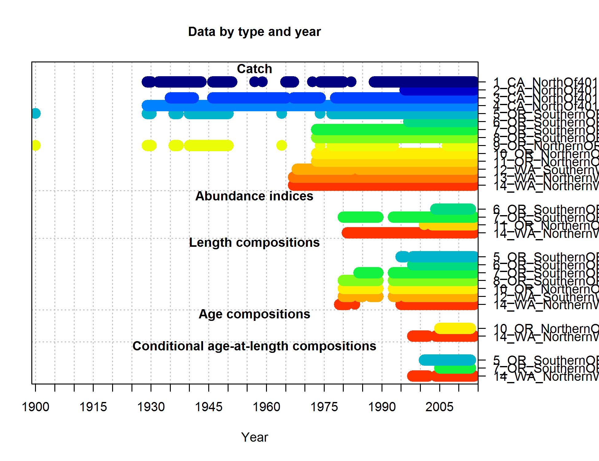

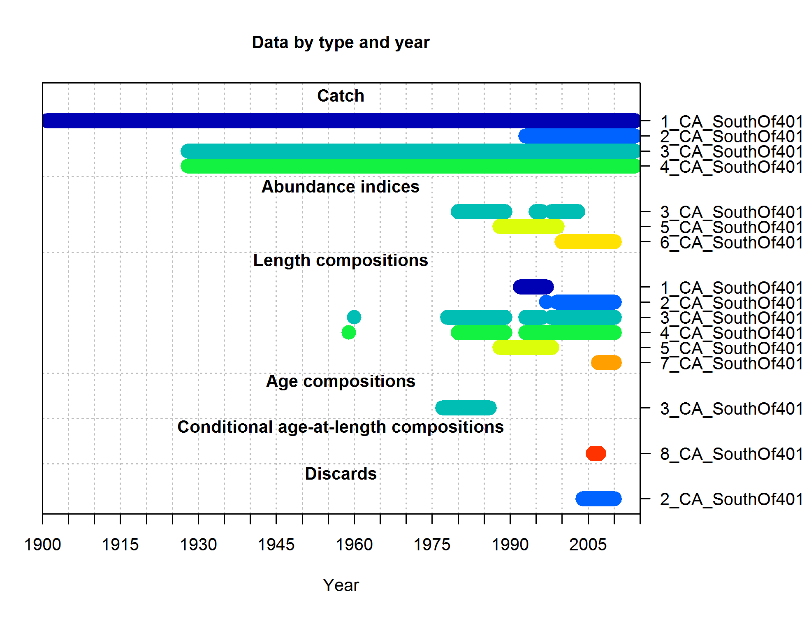


\FloatBarrier

<!-- ******************************************************************************************************************************************** --> 
<!-- ***********************************************************Commercial landings FIGURES*******************************************************--> 
<!-- ******************************************************************************************************************************************** --> 

<!--Oregon comm landings FIGURES--> 


```{r, eval=TRUE, echo=FALSE, message=FALSE, warning=FALSE, include=FALSE}
    OR_comm_remov = OR_comm_removal[,c(1:5)]
    OR_comm_remov1 = melt(OR_comm_remov,id='Year')
    colnames(OR_comm_remov1) = c('Year','Fleet','Removals')
```
```{r,eval=TRUE, echo=FALSE, message=FALSE, warning=FALSE,fig.cap="Removals (mt) from the Oregon commercial fleet, north and south of Florence, OR. \\label{fig:OR_comm_removal}"}
      ggplot(OR_comm_remov1, aes(x=Year, y=Removals,fill=Fleet)) +geom_area(poistion='stack')+ scale_fill_manual(values = c( 'lightsteelblue3','coral',"aquamarine2","mediumpurple"))+scale_x_continuous(breaks=seq(1900,2014,20))+ ylab("Removals (mt)")

```


<!--California comm landings FIGURES--> 
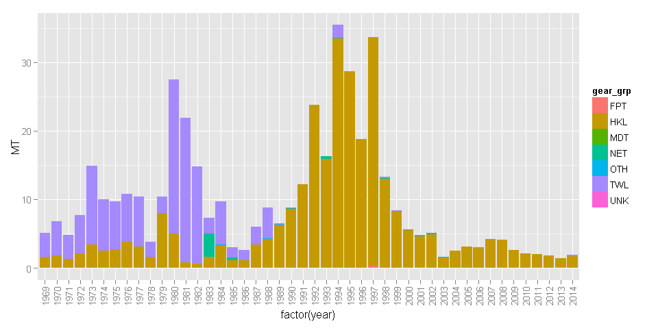


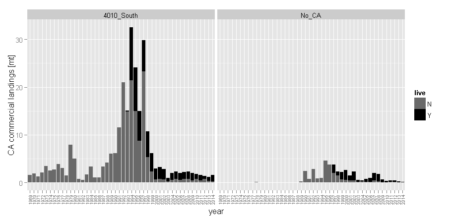

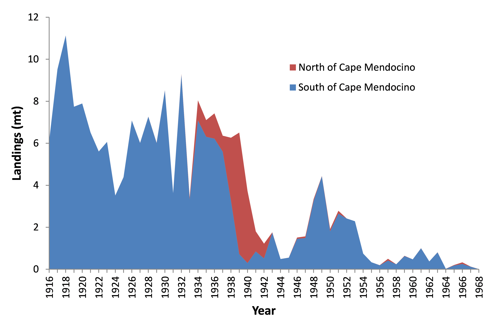


\FloatBarrier
<!-- ******************************************************************************************************************************************** --> 
<!-- ***************************************************************Commercial Discards FIGURES***************************************************--> 
<!-- ******************************************************************************************************************************************** --> 


<!-- ******************************************************************************************************************************************** --> 
<!-- ****************************************************Recreational Landings and Discards FIGURES***********************************************--> 
<!-- ******************************************************************************************************************************************** --> 


<!-- Washington Rec removals FIGURES--> 
```{r, eval=TRUE, echo=FALSE, message=FALSE, warning=FALSE, include=FALSE}
    WA_rec_remov = WA_rec_removal[,1:5]
    WA_rec_remov1 = melt(WA_rec_remov,id='Year')
    colnames(WA_rec_remov1) = c('Year','Fleet','Removals')
```
```{r,eval=TRUE, echo=FALSE, message=FALSE, warning=FALSE,fig.cap="Removals (mt) from the Washington recreational party/charter and private sectors.    Northern WA represents MCAs 3 and 4 and soutern WA represents MCAs 1 and 2. \\label{fig:WA_rec_removal}"}
      ggplot(WA_rec_remov1, aes(x=Year, y=Removals,fill=Fleet)) +geom_area(poistion='stack')+ scale_fill_manual(values = c( 'lightsteelblue3','coral',"aquamarine2","mediumpurple"))+scale_x_continuous(breaks=seq(1967,2014,5))+ ylab("Removals (mt)")

```


<!-- Oregon Rec removals FIGURES-->
```{r, eval=TRUE, echo=FALSE, message=FALSE, warning=FALSE, include=FALSE}
    OR_rec_remov = Or_rec_removal[,1:5]
    OR_rec_remov1 = melt(OR_rec_remov,id='Year')
    colnames(OR_rec_remov1) = c('Year','Fleet','Removals')
```
```{r,eval=TRUE, echo=FALSE, message=FALSE, warning=FALSE,fig.cap="Removals (mt) from the Oregon recreational party/charter and private sectors, north and south of Florence, OR. \\label{fig:OR_rec_removal}"}
      ggplot(OR_rec_remov1, aes(x=Year, y=Removals,fill=Fleet)) +geom_area(poistion='stack')+ scale_fill_manual(values = c( 'lightsteelblue3','coral',"aquamarine2","mediumpurple"))+scale_x_continuous(breaks=seq(1973,2014,5))+ ylab("Removals (mt)")

```


<!-- California Rec removals FIGURES-->

```{r, eval=TRUE, echo=FALSE, message=FALSE, warning=FALSE, include=FALSE}
    CA_rec_remov = CA_rec_removal[,1:5]
    colnames(CA_rec_remov) = c('Year','South PC','South PR','North PC','North PR')
    CA_rec_remov1 = melt(CA_rec_remov,id='Year')
    colnames(CA_rec_remov1) = c('Year','Fleet','Removals')
```
```{r,eval=TRUE, echo=FALSE, message=FALSE, warning=FALSE,fig.cap="Removals (mt) from the California recreational party/charter and private sectors, north and south of $40^\\circ 10^\\prime$. \\label{fig:CA_rec_removal}"}
      ggplot(CA_rec_remov1, aes(x=Year, y=Removals,fill=Fleet)) +geom_area(poistion='stack')+ scale_fill_manual(values = c( 'lightsteelblue3','coral',"aquamarine2","mediumpurple"))+scale_x_continuous(breaks=seq(1928,2014,10))+ ylab("Removals (mt)")

```


\FloatBarrier
<!-- ******************************************************************************************************************************************** --> 
<!-- ****************************************************Oregon commercial logbook FIGURES********************************************************--> 
<!-- ******************************************************************************************************************************************** --> 


\newpage

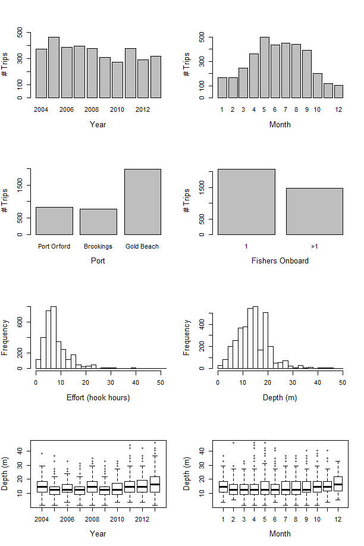


\newpage

```{r,eval=TRUE, echo=FALSE, message=FALSE, warning=FALSE,fig.cap="Index for the Oregon commercial logbook, with 95% lognormal confidence intervals. \\label{fig:OR_commlog}"}
    #OR commercial logbook
      plot(Or_commlog$Year, Or_commlog$Index, xlab="Year",ylab="Index",ylim=c(0,.07),xlim=c(2004,2013),type='b',xaxt='n',lwd=1.5,pch=19)
      arrows(Or_commlog$Year, Or_commlog$lowerCI, Or_commlog$Year, Or_commlog$upperCI, code=3, angle=90,length=0.01)
      axis(1, at=c(2004:2013), cex.axis=.6)
```

\newpage

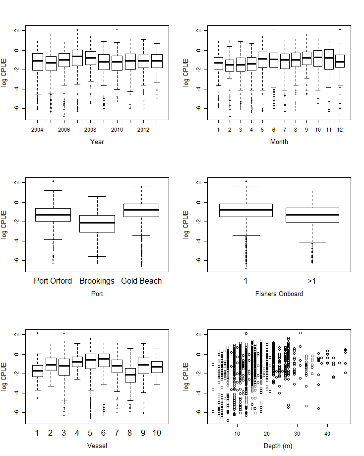


\newpage

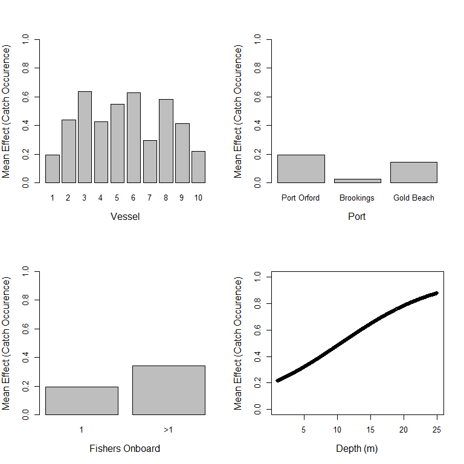

\newpage


\newpage


\FloatBarrier
<!-- ******************************************************************************************************************************************** --> 
<!-- ****************************************************Recreational dockside survey FIGURES****************************************************--> 
<!-- ******************************************************************************************************************************************** --> 

<!-- *****************************************************WASHINGTON dockside figures*************************************************************--> 


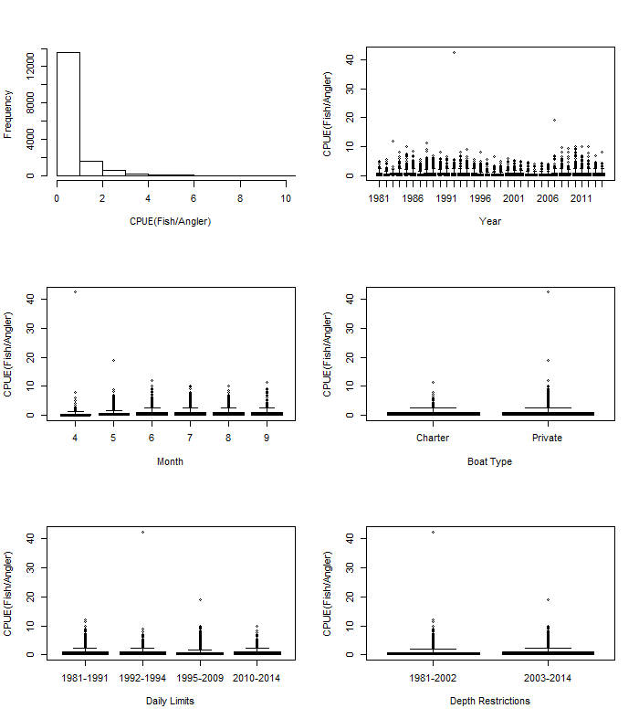


```{r, eval=TRUE, echo=FALSE, message=FALSE, warning=FALSE, include=FALSE}
 #read in data and show plot for all of the WA indices
      WA_dock_final = read.csv("./txt_files/WA_dock_final.csv")
      WA_dock_SM =read.csv("./txt_files/WA_dock_SM.csv")
      WA_dock_noSM =read.csv("./txt_files/WA_dock_noSM.csv")
```
```{r,eval=TRUE, echo=FALSE, message=FALSE, warning=FALSE,fig.cap="Three indices considered for the Washington dockside program, applying the Stephens-MacCall filters and retaining all positive encounters (black),applying the Stephens-MacCall filter and retaining only those trips above the threshold value (red), and the index with no Stephens-MacCall filter applied. \\label{fig:WA_dock_allindex}"}
    #WASHINGTON
      WAdock_final = WA_dock_final[1:34,]
      WAdock_SM    = WA_dock_SM[1:34,]
      WAdock_noSM  = WA_dock_noSM[1:34,]
      plot(WAdock_final$Year, WAdock_final$Index, xlab="Year",ylab="Index",ylim=c(0,1),xlim=c(1981,2014),type='l',xaxt='n',lwd=2,pch=19,col='black')
      lines(WAdock_SM$Year, WAdock_SM$Index,lwd=2,col='red',lty=4)
      lines(WAdock_noSM$Year, WAdock_noSM$Index, lwd=2,col='blue',lty=2)
      axis(1, at=seq(1981,2015,by=2), cex.axis=.8)
      legend(1996,1,c('SM filter & retain pos. encounters','SM filter','no SM filter'),lwd=c(2,2,2),lty=c(1,4,2),col=c('black','red','blue'),cex=.8)
```


```{r,eval=TRUE, echo=FALSE, message=FALSE, warning=FALSE,fig.cap="Index for the Washington dockside program, with 95% lognormal confidence intervals, applying the Stephens-MaCall data filter and retaining all positive observations. \\label{fig:WA_dock_final}"}
    #WASHINGTON
      WAdock_final = WA_dock_final[1:34,]
      plot(WAdock_final$Year, WAdock_final$Index, xlab="Year",ylab="Index",ylim=c(0,1),xlim=c(1981,2014),type='b',xaxt='n',lwd=1.5,pch=19)
      arrows(WAdock_final$Year, WAdock_final$Index-WAdock_final$lowerCI, WAdock_final$Year, WAdock_final$Index+WAdock_final$upperCI, code=3, angle=90,length=0.01)
      axis(1, at=seq(1981,2015,by=2), cex.axis=.8)
```


<!-- *****************************************************CA dockside figures*************************************************************--> 

<!-- MRFSS S--> 


```{r,eval=TRUE, echo=FALSE, message=FALSE, warning=FALSE,fig.cap="Index for the MRFSS data for California south of $40^\\circ 10^\\prime$ N. latitude, with 95% lognormal confidence intervals. \\label{fig:MRFSS_S_index}"}
#ca
  plot(MRFSS_S_index_allyrs$Year, MRFSS_S_index_allyrs$Index, xlab="Year",ylab="Index",ylim=c(0,.2),xlim=c(1980,2003),type='b',xaxt='n',lwd=1.5,pch=19)
  arrows(MRFSS_S_index_allyrs$Year, MRFSS_S_index_allyrs$lowerCI, MRFSS_S_index_allyrs$Year, MRFSS_S_index_allyrs$upperCI, code=3, angle=90,length=0.01)
  axis(1, at=seq(1980,2003,2), cex.axis=.9)
```


<!-- MRFSS N--> 

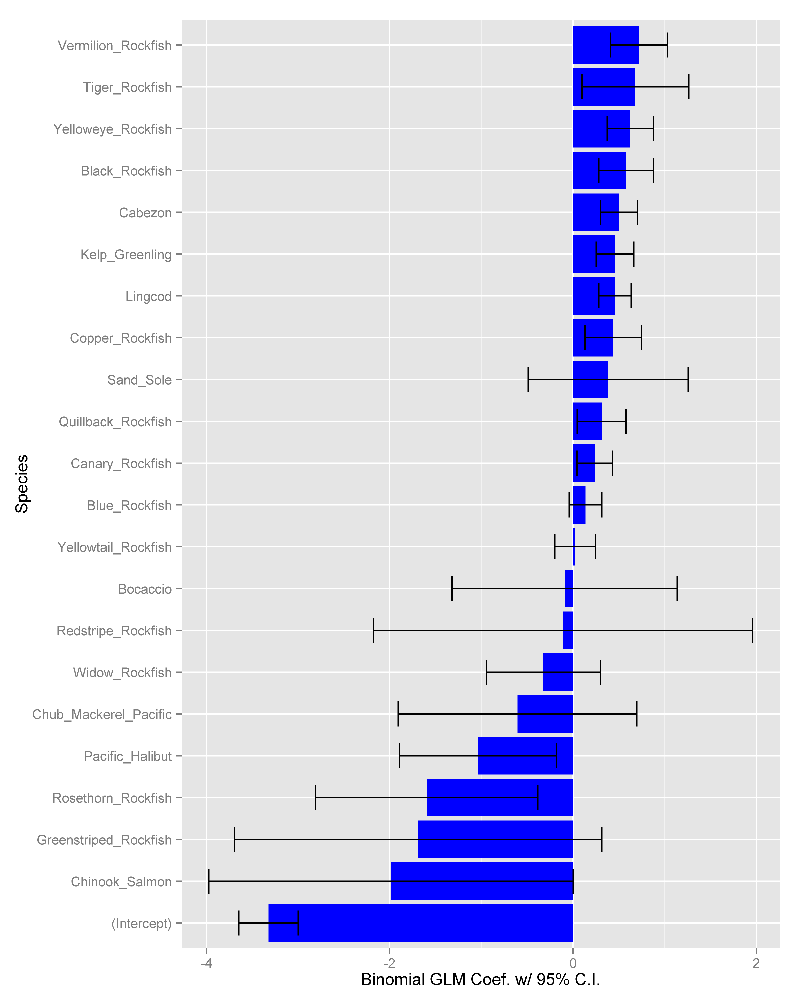


```{r,eval=TRUE, echo=FALSE, message=FALSE, warning=FALSE,fig.cap="Index for the northern Califronia MRFSS dockside program, with 95% lognormal confidence intervals. \\label{fig:MRFSS_N_index}"}
#ca
  plot(MRFSS_N_index_allyrs$Year, MRFSS_N_index_allyrs$Index, xlab="Year",ylab="Index",ylim=c(0,.35),xlim=c(1980,2003),type='b',xaxt='n',lwd=1.5,pch=19)
  arrows(MRFSS_N_index_allyrs$Year, MRFSS_N_index_allyrs$lowerCI, MRFSS_N_index_allyrs$Year, MRFSS_N_index_allyrs$upperCI, code=3, angle=90,length=0.01)
  axis(1, at=seq(1980,2003,2), cex.axis=.9)
```


<!-- *****************************************************Oregon dockside figures*************************************************************--> 

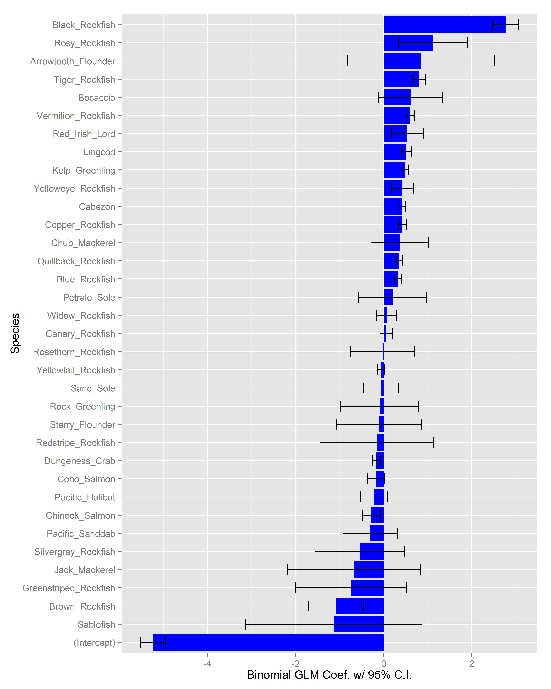


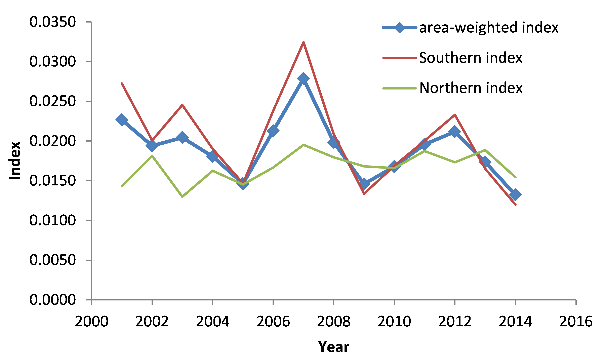


```{r,eval=TRUE, echo=FALSE, message=FALSE, warning=FALSE,fig.cap="Oregon Recreational Boat Survey (ORBS) charter boat  index (area-weighted), with 95% lognormal confidence intervals. \\label{fig:ORBS_index}"}
#or
  plot(ORBS_index$Year, ORBS_index$Index, xlab="Year",ylab="Index",ylim=c(0,.035),xlim=c(2001,2014),type='b',xaxt='n',lwd=1.5,pch=19)
  arrows(ORBS_index$Year, ORBS_index$lowerCI, ORBS_index$Year, ORBS_index$upperCI, code=3, angle=90,length=0.01)
  axis(1, at=seq(2001,2014,2), cex.axis=.9)
```

\FloatBarrier
<!-- ******************************************************************************************************************************************** --> 
<!-- ****************************************************Recreational onboard observer FIGURES****************************************************--> 
<!-- ******************************************************************************************************************************************** --> 

<!-- OR Recreational onboard Oregon FIGURES--> 


```{r,eval=TRUE, echo=FALSE, message=FALSE, warning=FALSE, fig.cap="Index for the Oregon onboard observer program, with 95% lognormal confidence intervals. \\label{fig:OR_onboard}"}
#OR
  plot(OR_onboard$Year, OR_onboard$Index, xlab="Year",ylab="Index",ylim=c(0,.09),xlim=c(2001,2014),type='b',xaxt='n',lwd=1.5,pch=19)
  arrows(OR_onboard$Year, OR_onboard$Index-OR_onboard$lowerCI, OR_onboard$Year, OR_onboard$Index+OR_onboard$upperCI, code=3, angle=90,length=0.01)
  axis(1, at=c(2001:2014), cex.axis=.7)

```

\newpage


<!-- Recreational onboard prehistoric CA FIGURES-->

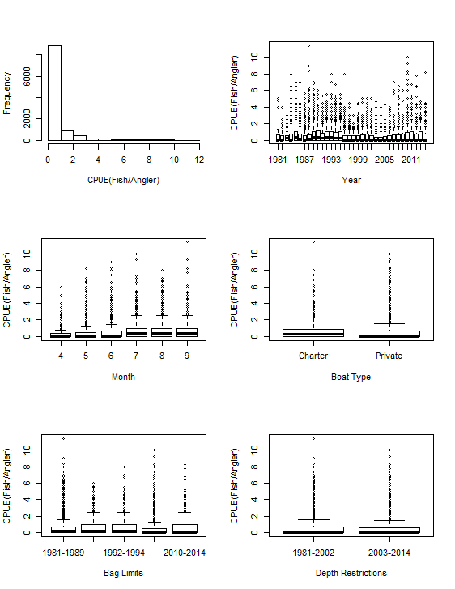

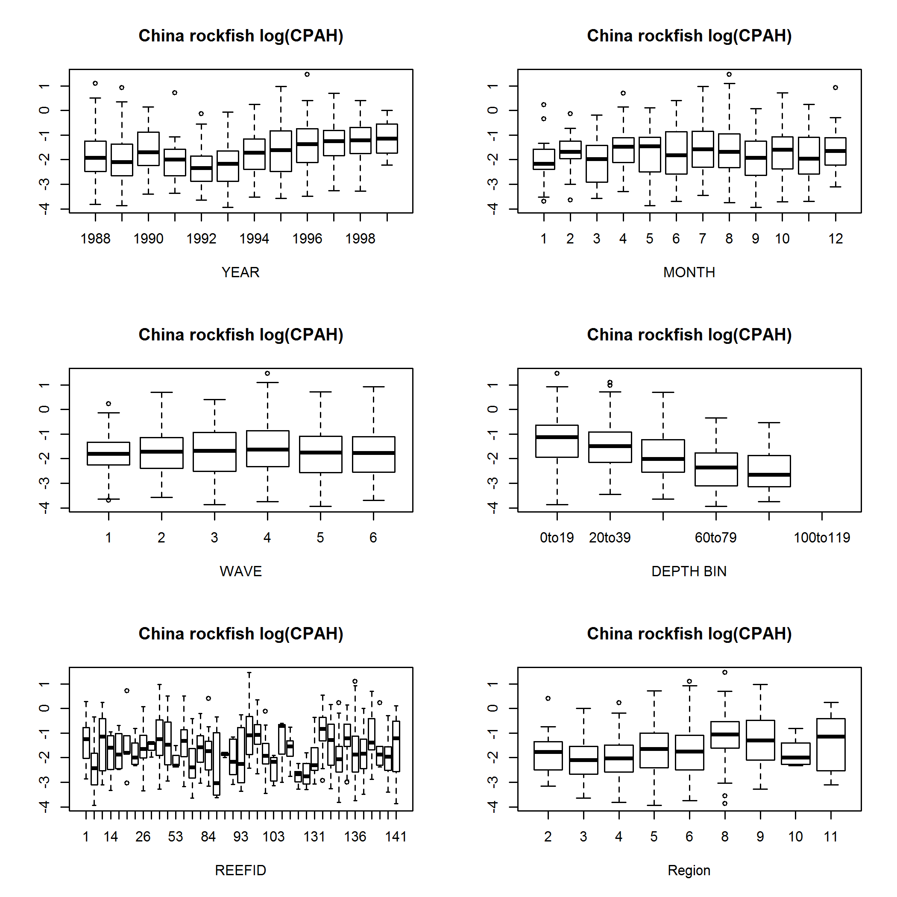

```{r,eval=TRUE, echo=FALSE, message=FALSE, warning=FALSE,fig.cap="Index for the California 1998-1999 onboard observer program, with 95% lognormal confidence intervals.\\label{fig:prehist_onboard}"}
#prehist
  plot(prehist_onboard$Year, prehist_onboard$Index, xlab="Year",ylab="Index",ylim=c(0,.21),xlim=c(1988,1999),type='b',xaxt='n',lwd=1.5,pch=19)
  arrows(prehist_onboard$Year, prehist_onboard$Index-prehist_onboard$lowerCI, prehist_onboard$Year, prehist_onboard$Index+prehist_onboard$upperCI, code=3, angle=90,length=0.01)
  axis(1, at=c(1988:1999), cex.axis=.8)

```

\newpage


<!-- Recreational onboard CA FIGURES-->

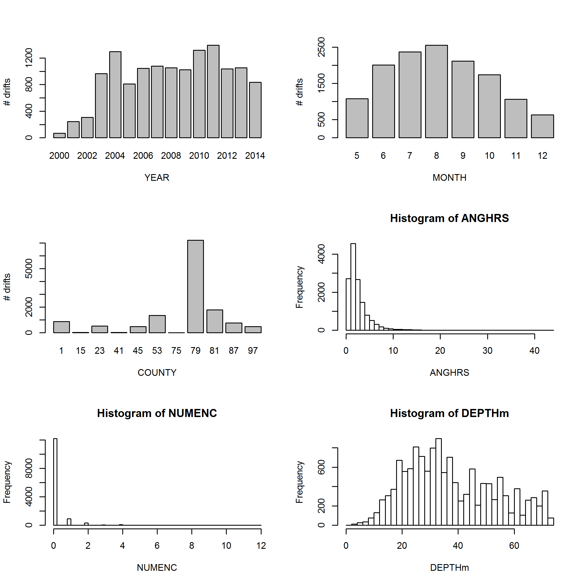


```{r,eval=TRUE, echo=FALSE, message=FALSE, warning=FALSE,fig.cap="Index for the California 2000-2014 onboard observer program, with 95% lognormal confidence intervals.\\label{fig:CA_onboard}"}
#CA
  plot(CA_onboard$Year, CA_onboard$Index, xlab="Year",ylab="Index",ylim=c(0,.2),xlim=c(2000,2014),type='b',xaxt='n',lwd=1.5,pch=19)
  arrows(CA_onboard$Year, CA_onboard$Index-CA_onboard$lowerCI, CA_onboard$Year, CA_onboard$Index+CA_onboard$upperCI, code=3, angle=90, length=0.01)
  axis(1, at=c(2000:2014), cex.axis=.8)

```

\newpage


\FloatBarrier
<!-- ******************************************************************************************************************************************** --> 
<!-- ****************************************************START BIOLOGICAL DATA FIGURES************************************************************--> 
<!-- ******************************************************************************************************************************************** --> 

<!-- ******************************************************************************************************************************************** --> 
<!-- ****************************************************weight-length FIGURES*******************************************************************--> 
<!-- ******************************************************************************************************************************************** --> 

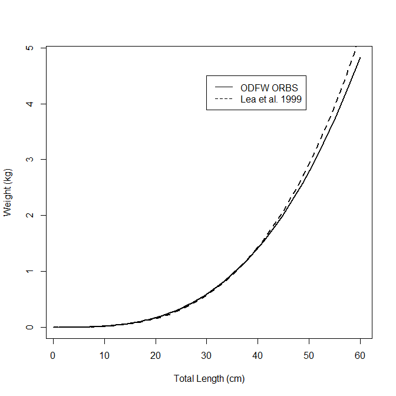

<!-- ******************************************************************************************************************************************** --> 
<!-- ****************************************************maturity and fecundity FIGURES***********************************************************--> 
<!-- ******************************************************************************************************************************************** --> 


<!-- ******************************************************************************************************************************************** --> 
<!-- ****************************************************length at age FIGURES********************************************************************--> 
<!-- ******************************************************************************************************************************************** --> 

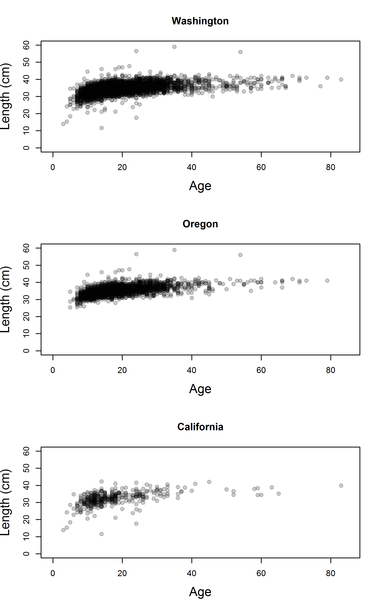


<!-- ******************************************************************************************************************************************** --> 
<!-- ****************************************************aging precision and bias FIGURES*********************************************************--> 
<!-- ******************************************************************************************************************************************** --> 
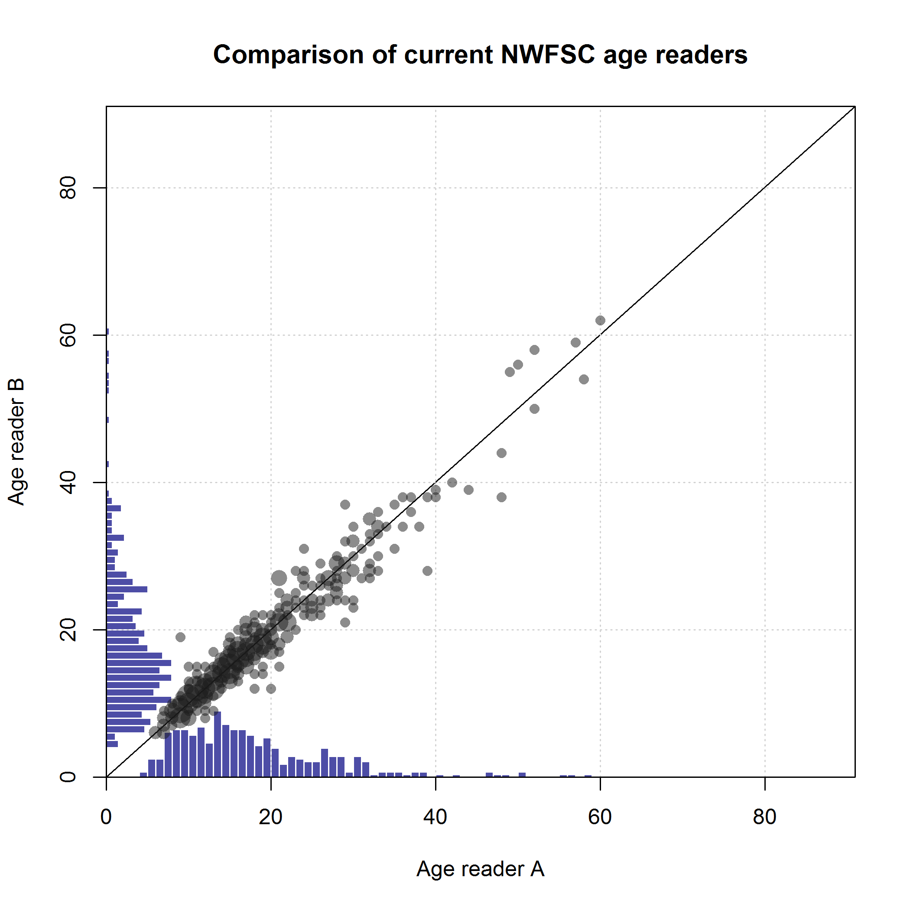
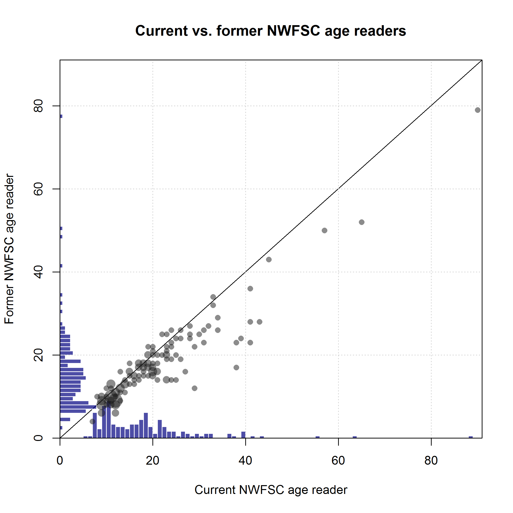
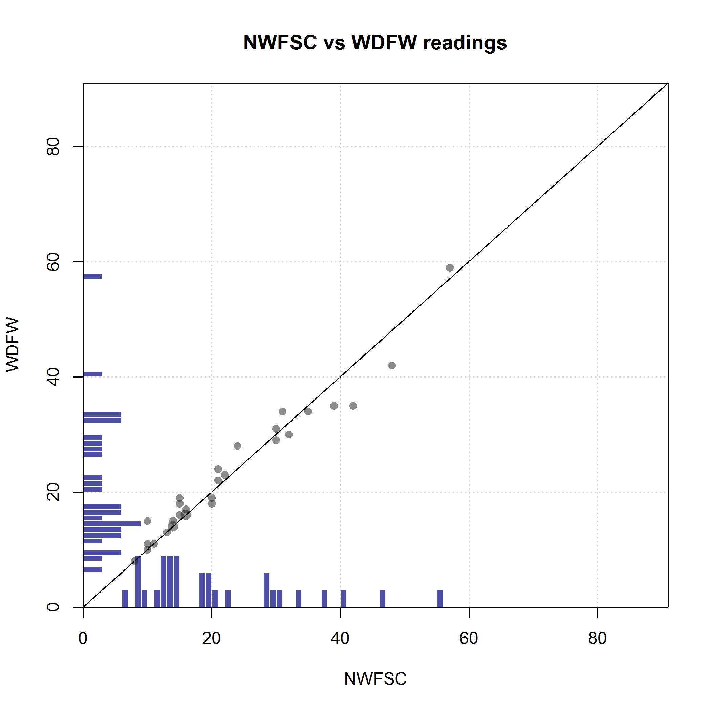

<!-- END BIOLOGICAL DATA FIGURES--> 


<!-- ******************************************************************************************************************************************** --> 
<!-- ************************************************************BEGIN APPENDICES**************************************************************** --> 
<!-- ******************************************************************************************************************************************** --> 

\FloatBarrier
\newpage

#Appendix A. SS data file {-}
\renewcommand{\thepage}{A-\arabic{page}}
\renewcommand{\thefigure}{A\arabic{figure}}
\renewcommand{\thetable}{A\arabic{table}}
\setcounter{page}{1}
\setcounter{figure}{1}
\setcounter{table}{1}

```{r, echo=TRUE, eval=FALSE}
#V3.24u
#C data file for China rockfish North of 4010 (approximate XDB-SRA model)
#_observed data: 
1916 #_styr
2015 #_endyr
1 #_nseas
12 #_months/season
1 #_spawn_seas
1 #_Nfleet
2 #_Nsurveys
1 #_N_areas
FISHERY%REC_DOCKSIDE_OR%REC_ONBOARD_OR
0.5 0.5 0.5 #_surveytiming_in_season -- mid-year, not exactly like XDB-SRA
1 1 1 #_area_assignments_for_each_fishery_and_survey
1 #_units of catch:  1=bio; 2=num
0.01 #_se of log(catch) only used for init_eq_catch and for Fmethod 2 and 3
; use -1 for discard only fleets
1 #_Ngenders
80 #_Nages
0 #_init_equil_catch_for_each_fishery
100 #_N_lines_of_catch_to_read
#_catch_biomass(mtons):_columns_are_fisheries,year,season
0.003537147 1916 1
0.004049956 1917 1
0.005260071 1918 1
0.004028952 1919 1
0.004541761 1920 1
0.00505457 1921 1
0.004870073 1922 1
0.004684913 1923 1
0.005197722 1924 1
0.006407837 1925 1
0.006571331 1926 1
0.008364176 1927 1
0.014387704 1928 1
0.084141805 1929 1
0.129300115 1930 1
0.06871721 1931 1
0.039561564 1932 1
0.099945285 1933 1
0.772562632 1934 1
0.635771199 1935 1
1.016844596 1936 1
0.816311173 1937 1
2.570666076 1938 1
4.747396839 1939 1
3.008292015 1940 1
1.002343093 1941 1
0.845053033 1942 1
0.400399617 1943 1
0.436650003 1944 1
0.486383371 1945 1
0.581318449 1946 1
0.25928813 1947 1
0.458369102 1948 1
0.428698364 1949 1
0.283498319 1950 1
0.269917858 1951 1
0.307082862 1952 1
0.141091987 1953 1
0.130032478 1954 1
0.241152913 1955 1
0.177947495 1956 1
0.350992697 1957 1
0.127860112 1958 1
0.140393138 1959 1
0.118507122 1960 1
0.286478157 1961 1
0.309905866 1962 1
0.476014701 1963 1
0.523559724 1964 1
0.945103229 1965 1
0.945290986 1966 1
1.428535724 1967 1
1.528694887 1968 1
2.497964768 1969 1
2.045470778 1970 1
2.969876721 1971 1
3.526160267 1972 1
4.508260278 1973 1
5.745163691 1974 1
4.152199954 1975 1
4.960942417 1976 1
5.231387733 1977 1
7.159802871 1978 1
9.907603763 1979 1
10.66116018 1980 1
10.41077224 1981 1
10.60517175 1982 1
9.062772355 1983 1
8.858473715 1984 1
6.859460364 1985 1
7.316764027 1986 1
8.653620026 1987 1
7.937295879 1988 1
11.88072615 1989 1
17.61144259 1990 1
10.37352716 1991 1
15.62259613 1992 1
12.63444973 1993 1
17.52440515 1994 1
18.00669928 1995 1
15.77429755 1996 1
22.04370274 1997 1
27.33395164 1998 1
35.5278592 1999 1
22.04424541 2000 1
28.00979108 2001 1
29.01883505 2002 1
16.48431983 2003 1
11.98279861 2004 1
9.421869752 2005 1
11.06880557 2006 1
15.38938456 2007 1
16.26800277 2008 1
15.08235746 2009 1
11.82043292 2010 1
16.37238391 2011 1
17.32864877 2012 1
15.17382187 2013 1
15.17382187 2014 1
6.21 2015 1
#
32 #_N_cpue_and_surveyabundance_observations
#_Units:  0=numbers; 1=biomass; 2=F
#_Errtype:  -1=normal; 0=lognormal; >0=T
#_Fleet Units Errtype
1 1 0 # FISHERY
2 1 0 # REC_DOCKSIDE_OR -- units in biomass, similar to XDB-SRA
3 1 0 # REC_ONBOARD_OR -- units in biomass, similar to XDB-SRA
#_year seas index obs err
1980 1 2 0.1014 0.515 # SURVEY1
1981 1 2 0.059 0.263 # SURVEY1
1982 1 2 0.0441 0.642 # SURVEY1
1983 1 2 0.0193 0.65 # SURVEY1
1984 1 2 0.0192 0.366 # SURVEY1
1985 1 2 0.06 0.373 # SURVEY1
1986 1 2 0.0242 0.533 # SURVEY1
1987 1 2 0.0684 0.47 # SURVEY1
1988 1 2 0.0407 0.29 # SURVEY1
1989 1 2 0.031 0.358 # SURVEY1
1993 1 2 0.0437 0.3  # SURVEY1
1994 1 2 0.0404 0.257 # SURVEY1
1995 1 2 0.0252 0.291 # SURVEY1
1996 1 2 0.0244 0.332 # SURVEY1
1997 1 2 0.0374 0.245 # SURVEY1
1998 1 2 0.0277 0.222 # SURVEY1
1999 1 2 0.0423 0.179 # SURVEY1
2000 1 2 0.0431 0.272 # SURVEY1
2001 1 2 0.0138 0.464 # SURVEY1
2002 1 2 0.0156 0.34 # SURVEY1
2003 1 2 0.0271 0.472 # SURVEY1
2001 1 3 0.0299 0.268 # SURVEY2
2003 1 3 0.0298 0.239 # SURVEY2
2004 1 3 0.019 0.335 # SURVEY2
2005 1 3 0.0135 0.35 # SURVEY2
2006 1 3 0.0177 0.291 # SURVEY2
2007 1 3 0.0346 0.212 # SURVEY2
2008 1 3 0.0176 0.275 # SURVEY2
2009 1 3 0.0287 0.248 # SURVEY2
2010 1 3 0.007 0.508 # SURVEY2
2011 1 3 0.0217 0.444 # SURVEY2
2012 1 3 0.0335 0.269 # SURVEY2

0 #_N_fleets_with_discard
#_discard_units (1=same_as_catchunits(bio/num); 2=fraction; 3=numbers)
#_discard_errtype:  >0 for DF of T-dist(read CV below); 0 for normal with C
V; -1 for normal with se; -2 for lognormal
#Fleet Disc_units err_type
0 #N discard obs
#_year seas index obs err
#
0 #_N_meanbodywt_obs
30 #_DF_for_meanbodywt_T-distribution_like

1 # length bin method: 1=use databins; 2=generate from binwidth,min,max bel
ow; 3=read vector
#2 # binwidth for population size comp 
#4 # minimum size in the population (lower edge of first bin and size at ag
e 0.00) 
#50 # maximum size in the population (lower edge of last bin)

-0.0001 #_comp_tail_compression
1e-007 #_add_to_comp
0 #_combine males into females at or below this bin number
22 #_N_LengthBins
8 10 12 14 16 18 20 22 24 26 28 30 32 34 36 38 40 42 44 46 48 50
 
0 #_N_Length_obs
#Yr Seas Flt/Svy Gender Part Nsamp datavector(female-male)
# 1971 1 1 3 0 125 0 0 0 0 0 0 0 0 0 4 1 1 2 4 1 5 6 2 3 11 8 4 5 0 0 0 0 0
 0 0 0 0 0 1 0 1 3 0 3 4 2 4 5 9 17 8 3 8 0 0

80 #_N_age_bins
1 2 3 4 5 6 7 8 9 10 11 12 13 14 15 16 17 18 19 20 21 22 23 24 25 26 27 28 
29 30 31 32 33 34 35 36 37 38 39 40 41 42 43 44 45 46 47 48 49 50 51 52 53 
54 55 56 57 58 59 60 61 62 63 64 65 66 67 68 69 70 71 72 73 74 75 76 77 78 
79 80
0 #_N_ageerror_definitions
# 0.5 1.5 2.5 3.5 4.5 5.5 6.5 7.5 8.5 9.5 10.5 11.5 12.5 13.5 14.5 15.5 16.
5 17.5 18.5 19.5 20.5 21.5 22.5 23.5 24.5 25.5 26.5 27.5 28.5 29.5 30.5 31.
5 32.5 33.5 34.5 35.5 36.5 37.5 38.5 39.5 40.5
# 0.001 0.001 0.001 0.001 0.001 0.001 0.001 0.001 0.001 0.001 0.001 0.001 0
.001 0.001 0.001 0.001 0.001 0.001 0.001 0.001 0.001 0.001 0.001 0.001 0.00
1 0.001 0.001 0.001 0.001 0.001 0.001 0.001 0.001 0.001 0.001 0.001 0.001 0
.001 0.001 0.001 0.001
# 0.5 1.5 2.5 3.5 4.5 5.5 6.5 7.5 8.5 9.5 10.5 11.5 12.5 13.5 14.5 15.5 16.
5 17.5 18.5 19.5 20.5 21.5 22.5 23.5 24.5 25.5 26.5 27.5 28.5 29.5 30.5 31.
5 32.5 33.5 34.5 35.5 36.5 37.5 38.5 39.5 40.5
# 0.5 0.65 0.67 0.7 0.73 0.76 0.8 0.84 0.88 0.92 0.97 1.03 1.09 1.16 1.23 1
.32 1.41 1.51 1.62 1.75 1.89 2.05 2.23 2.45 2.71 3 3 3 3 3 3 3 3 3 3 3 3 3 
3 3 3
0 #_N_Agecomp_obs
1 #_Lbin_method: 1=poplenbins; 2=datalenbins; 3=lengths
1 #_combine males into females at or below this bin number
#Yr Seas Flt/Svy Gender Part Ageerr Lbin_lo Lbin_hi Nsamp datavector(female
-male)
# 1971 1 1 3 0 2 1 -1 75 0 0 0 0 3 1 1 4 2 1 0 1 2 2 13 2 3 0 0 4 2 1 1 2 1
 2 2 1 2 1 2 6 5 8

0 #_N_MeanSize-at-Age_obs
#Yr Seas Flt/Svy Gender Part Ageerr Ignore datavector(female-male)
#                                          samplesize(female-male)
# 1971 1 1 3 0 1 2 29.8931 40.6872 44.7411 50.027 52.5794 56.1489 57.1033 6
1.1728 61.7417 63.368 64.4088 65.6889 67.616 68.5972 69.9177 71.0443 72.360
9 32.8188 39.5964 43.988 50.1693 53.1729 54.9822 55.3463 60.3509 60.7439 62
.3432 64.3224 65.1032 64.1965 66.7452 67.5154 70.8749 71.2768 20 20 20 20 2
0 20 20 20 20 20 20 20 20 20 20 20 20 20 20 20 20 20 20 20 20 20 20 20 20 2
0 20 20 20 20

0 #_N_environ_variables
0 #_N_environ_obs
0 # N sizefreq methods to read 

0 # no tag data 

0 # no morphcomp data 

999


```


\newpage

#Appendix B. SS control file{-}
\renewcommand{\thepage}{B-\arabic{page}}
\renewcommand{\thefigure}{B\arabic{figure}}
\renewcommand{\thetable}{B\arabic{table}}
\setcounter{page}{1}
\setcounter{figure}{1}
\setcounter{table}{1}


```{r, echo=TRUE, eval=FALSE}
#V3.24u
#C China rockfish bridge to XDB-SRA model
1 #_N_Growth_Patterns
1 #_N_Morphs_Within_GrowthPattern 
#_Cond 1 #_Morph_between/within_stdev_ratio (no read if N_morphs=1)
#_Cond  1 #vector_Morphdist_(-1_in_first_val_gives_normal_approx)
#
#_Cond 0  #  N recruitment designs goes here if N_GP*nseas*area>1
#_Cond 0  #  placeholder for recruitment interaction request
#_Cond 1 1 1  # example recruitment design element for GP=1, seas=1, area=1
#
#_Cond 0 # N_movement_definitions goes here if N_areas > 1
#_Cond 1.0 # first age that moves (real age at begin of season, not integer
) also cond on do_migration>0
#_Cond 1 1 1 2 4 10 # example move definition for seas=1, morph=1, source=1
 dest=2, age1=4, age2=10
#
0 #_Nblock_Patterns
#_Cond 0 #_blocks_per_pattern 
# begin and end years of blocks
#
0.5 #_fracfemale
0 #_natM_type:_0=1Parm; 1=N_breakpoints;_2=Lorenzen;_3=agespecific;_4=agesp
ec_withseasinterpolate
  #_no additional input for selected M option; read 1P per morph
1 # GrowthModel: 1=vonBert with L1&L2; 2=Richards with L1&L2; 3=age_speciif
ic_K; 4=not implemented
7 #_Growth_Age_for_L1
40 #_Growth_Age_for_L2 (999 to use as Linf)
0 #_SD_add_to_LAA (set to 0.1 for SS2 V1.x compatibility)
0 #_CV_Growth_Pattern:  0 CV=f(LAA); 1 CV=F(A); 2 SD=F(LAA); 3 SD=F(A); 4 l
ogSD=F(A)
3 #_maturity_option:  1=length logistic; 2=age logistic; 3=read age-maturit
y matrix by growth_pattern; 4=read age-fecundity; 5=read fec and wt from wt
atage.ss
0 0 0 0 1 1 1 1 1 1 1 1 1 1 1 1 1 1 1 1 1 1 1 1 1 1 1 1 1 1 1 1 1 1 1 1 1 1
 1 1 1 1 1 1 1 1 1 1 1 1 1 1 1 1 1 1 1 1 1 1 1 1 1 1 1 1 1 1 1 1 1 1 1 1 1 
1 1 1 1 1 1
#_placeholder for empirical age-maturity by growth pattern
5 #_First_Mature_Age
1 #_fecundity option:(1)eggs=Wt*(a+b*Wt);(2)eggs=a*L^b;(3)eggs=a*Wt^b; (4)e
ggs=a+b*L; (5)eggs=a+b*W
0 #_hermaphroditism option:  0=none; 1=age-specific fxn
1 #_parameter_offset_approach (1=none, 2= M, G, CV_G as offset from female-
GP1, 3=like SS2 V1.x)
2 #_env/block/dev_adjust_method (1=standard; 2=logistic transform keeps in 
base parm bounds; 3=standard w/ no bound check)
#
#_growth_parms ### LENGTH AT AGE APPROXIMATES QUILLBACK GROWTH, CV ARBITRAR
ILY SET AT 0.1 ###
#_LO HI INIT PRIOR PR_type SD PHASE env-var use_dev dev_minyr dev_maxyr dev
_stddev Block Block_Fxn
 0.01 0.15 0.06 0.06 -1 0.8 -3 0 0 0 0 0 0 0 # NatM_p_1_Fem_GP_1
 -10 45 26 26 0 10 -2 0 0 0 0 0 0 0 # L_at_Amin_Fem_GP_1
 20 50 39.5 39.5 0 10 -4 0 0 0 0 0 0 0 # L_at_Amax_Fem_GP_1
 0.05 0.25 0.1 0.1 0 0.8 -4 0 0 0 0 0 0 0 # VonBert_K_Fem_GP_1
 0.05 0.25 0.1 0.1 -1 0.8 -3 0 0 0 0 0 0 0 # CV_young_Fem_GP_1
 0.05 0.25 0.1 0.1 -1 0.8 -3 0 0 0 0 0 0 0 # CV_old_Fem_GP_1
 0 1 1.170797e-005 1.17e-005 -1 0.8 -3 0 0 0 0 0 0 0 # Wtlen_1_Fem # conver
ted to (cm,kg) from Lea et al. 1999
 2 4 3.177 3 -1 0.8 -3 0 0 0 0 0 0 0 # Wtlen_2_Fem # from Lea et al. 1999
 1 100 28.5 28.5 -1 0.8 -3 0 0 0 0 0 0 0 # Mat50%_Fem
 -15 15 -0.25 0 -1 0.8 -3 0 0 0 0 0 0 0 # Mat_slope_Fem
 -3 3 1 1 -1 0.8 -3 0 0 0 0 0 0 0 # Eggs/kg_inter_Fem
 -3 3 0 0 -1 0.8 -3 0 0 0 0 0 0 0 # Eggs/kg_slope_wt_Fem
 0 0 0 0 -1 0 -4 0 0 0 0 0 0 0 # RecrDist_GP_1
 0 0 0 0 -1 0 -4 0 0 0 0 0 0 0 # RecrDist_Area_1
 0 0 0 0 -1 0 -4 0 0 0 0 0 0 0 # RecrDist_Seas_1
 0 0 0 0 -1 0 -4 0 0 0 0 0 0 0 # CohortGrowDev
#
#_Cond 0  #custom_MG-env_setup (0/1)
#_Cond -2 2 0 0 -1 99 -2 #_placeholder when no MG-environ parameters
#
#_Cond 0  #custom_MG-block_setup (0/1)
#_Cond -2 2 0 0 -1 99 -2 #_placeholder when no MG-block parameters
#_Cond No MG parm trends 
#
#_seasonal_effects_on_biology_parms
 0 0 0 0 0 0 0 0 0 0 #_femwtlen1,femwtlen2,mat1,mat2,fec1,fec2,Malewtlen1,m
alewtlen2,L1,K
#_Cond -2 2 0 0 -1 99 -2 #_placeholder when no seasonal MG parameters
#
#_Cond -4 #_MGparm_Dev_Phase
#
#_Spawner-Recruitment
3 #_SR_function: 2=Ricker; 3=std_B-H; 4=SCAA; 5=Hockey; 6=B-H_flattop; 7=su
rvival_3Parm
#_LO HI INIT PRIOR PR_type SD PHASE
 3 31 7 7 -1 10 1 # SR_LN(R0)
 0.2 1 0.773 0.773 2 0.147 3 # SR_BH_steep
 0 2 0.5 0.5 -1 0.8 -3 # SR_sigmaR
 -5 5 0.1 0 -1 1 -3 # SR_envlink
 -5 5 0 0 -1 1 -4 # SR_R1_offset
 0 0 0 0 -1 0 -99 # SR_autocorr
0 #_SR_env_link
0 #_SR_env_target_0=none;1=devs;_2=R0;_3=steepness
0 #do_recdev:  0=none; 1=devvector; 2=simple deviations
1971 # first year of main recr_devs; early devs can preceed this era
2001 # last year of main recr_devs; forecast devs start in following year
-2 #_recdev phase 
0 # (0/1) to read 13 advanced options
# 0 #_recdev_early_start (0=none; neg value makes relative to recdev_start)
# -4 #_recdev_early_phase
# 0 #_forecast_recruitment phase (incl. late recr) (0 value resets to maxph
ase+1)
# 1 #_lambda for Fcast_recr_like occurring before endyr+1
# 1900 #_last_early_yr_nobias_adj_in_MPD
# 1900 #_first_yr_fullbias_adj_in_MPD
# 2001 #_last_yr_fullbias_adj_in_MPD
# 2002 #_first_recent_yr_nobias_adj_in_MPD
# 1 #_max_bias_adj_in_MPD (-1 to override ramp and set biasadj=1.0 for all 
estimated recdevs)
# 0 #_period of cycles in recruitment (N parms read below)
# -5 #min rec_dev
# 5 #max rec_dev
# 0 #_read_recdevs
#_end of advanced SR options
#
#_placeholder for full parameter lines for recruitment cycles
# read specified recr devs
#_Yr Input_value
#
# all recruitment deviations
#DisplayOnly 0.127812 # Main_RecrDev_1971
#DisplayOnly -0.0629072 # Main_RecrDev_1972
#DisplayOnly 0.0999946 # Main_RecrDev_1973
#DisplayOnly -0.173914 # Main_RecrDev_1974
#DisplayOnly 0.0306907 # Main_RecrDev_1975
#DisplayOnly 0.714754 # Main_RecrDev_1976
#DisplayOnly -0.0229372 # Main_RecrDev_1977
#DisplayOnly 0.00347081 # Main_RecrDev_1978
#DisplayOnly 0.260891 # Main_RecrDev_1979
#DisplayOnly 0.173281 # Main_RecrDev_1980
#DisplayOnly 0.0891999 # Main_RecrDev_1981
#DisplayOnly -0.227374 # Main_RecrDev_1982
#DisplayOnly -0.440643 # Main_RecrDev_1983
#DisplayOnly -0.312905 # Main_RecrDev_1984
#DisplayOnly 0.391936 # Main_RecrDev_1985
#DisplayOnly 0.551136 # Main_RecrDev_1986
#DisplayOnly 0.218287 # Main_RecrDev_1987
#DisplayOnly 0.15476 # Main_RecrDev_1988
#DisplayOnly -0.384699 # Main_RecrDev_1989
#DisplayOnly 0.596713 # Main_RecrDev_1990
#DisplayOnly -0.68218 # Main_RecrDev_1991
#DisplayOnly -0.273103 # Main_RecrDev_1992
#DisplayOnly -0.829262 # Main_RecrDev_1993
#DisplayOnly 0.365425 # Main_RecrDev_1994
#DisplayOnly -0.604348 # Main_RecrDev_1995
#DisplayOnly 0.455566 # Main_RecrDev_1996
#DisplayOnly 1.11144 # Main_RecrDev_1997
#DisplayOnly -0.545922 # Main_RecrDev_1998
#DisplayOnly -0.65609 # Main_RecrDev_1999
#DisplayOnly 0.172111 # Main_RecrDev_2000
#DisplayOnly -0.301188 # Main_RecrDev_2001
#DisplayOnly 0 # ForeRecr_2002
#DisplayOnly 0 # ForeRecr_2003
#DisplayOnly 0 # ForeRecr_2004
#DisplayOnly 0 # ForeRecr_2005
#DisplayOnly 0 # ForeRecr_2006
#DisplayOnly 0 # ForeRecr_2007
#DisplayOnly 0 # ForeRecr_2008
#DisplayOnly 0 # ForeRecr_2009
#DisplayOnly 0 # ForeRecr_2010
#DisplayOnly 0 # ForeRecr_2011
#DisplayOnly 0 # Impl_err_2002
#DisplayOnly 0 # Impl_err_2003
#DisplayOnly 0 # Impl_err_2004
#DisplayOnly 0 # Impl_err_2005
#DisplayOnly 0 # Impl_err_2006
#DisplayOnly 0 # Impl_err_2007
#DisplayOnly 0 # Impl_err_2008
#DisplayOnly 0 # Impl_err_2009
#DisplayOnly 0 # Impl_err_2010
#DisplayOnly 0 # Impl_err_2011
#
#Fishing Mortality info 
0.3 # F ballpark for tuning early phases
-2001 # F ballpark year (neg value to disable)
3 # F_Method:  1=Pope; 2=instan. F; 3=hybrid (hybrid is recommended)
2.9 # max F or harvest rate, depends on F_Method
# no additional F input needed for Fmethod 1
# if Fmethod=2; read overall start F value; overall phase; N detailed input
s to read
# if Fmethod=3; read N iterations for tuning for Fmethod 3
5  # N iterations for tuning F in hybrid method (recommend 3 to 7)
#
#_initial_F_parms
#_LO HI INIT PRIOR PR_type SD PHASE
 0 1 0 0.01 0 99 -1 # InitF_1FISHERY1
#
#_Q_setup
 # Q_type options:  <0=mirror, 0=float_nobiasadj, 1=float_biasadj, 2=parm_n
obiasadj, 3=parm_w_random_dev, 4=parm_w_randwalk, 5=mean_unbiased_float_ass
ign_to_parm
#_for_env-var:_enter_index_of_the_env-var_to_be_linked
#_Den-dep  env-var  extra_se  Q_type
 0 0 0 0 # 1 FISHERY1
 0 0 1 1 # 2 SURVEY1
 0 0 1 1 # 3 SURVEY2
#
#_LO HI INIT PRIOR PR_type SD PHASE
 0 10 5 5 -1 99 1 # extra sd survey 1
 0 10 5 5 -1 99 1 # extra sd survey 2

 #_Cond 0 #_If q has random component, then 0=read one parm for each fleet 
with random q; 1=read a parm for each year of index
#_Q_parms(if_any)
# LO HI INIT PRIOR PR_type SD PHASE
#
#_size_selex_types
#discard_options:_0=none;_1=define_retention;_2=retention&mortality;_3=all_
discarded_dead
#_Pattern Discard Male Special
 0 0 0 0 # 1 FISHERY1
 0 0 0 0 # 2 SURVEY1
 0 0 0 0 # 3 SURVEY2
#
#_age_selex_types
#_Pattern ___ Male Special
 11 0 0 0 # 1 FISHERY1
 15 0 0 1 # 2 SURVEY1
 15 0 0 1 # 3 SURVEY2
#_LO HI INIT PRIOR PR_type SD PHASE env-var use_dev dev_minyr dev_maxyr dev
_stddev Block Block_Fxn
 0 80 5 5 -1 99 -1 0 0 0 0 0 0 0 # AgeSel_1P_1_FISHERY1
 0 80 80 80 -1 99 -1 0 0 0 0 0 0 0 # AgeSel_1P_2_FISHERY1
#_Cond 0 #_custom_sel-env_setup (0/1) 
#_Cond -2 2 0 0 -1 99 -2 #_placeholder when no enviro fxns
#_Cond 0 #_custom_sel-blk_setup (0/1) 
#_Cond -2 2 0 0 -1 99 -2 #_placeholder when no block usage
#_Cond No selex parm trends 
#_Cond -4 # placeholder for selparm_Dev_Phase
#_Cond 0 #_env/block/dev_adjust_method (1=standard; 2=logistic trans to kee
p in base parm bounds; 3=standard w/ no bound check)
#
# Tag loss and Tag reporting parameters go next
0  # TG_custom:  0=no read; 1=read if tags exist
#_Cond -6 6 1 1 2 0.01 -4 0 0 0 0 0 0 0  #_placeholder if no parameters
#
1 #_Variance_adjustments_to_input_values
#_fleet: 1 2 3 
  0 0 0 #_add_to_survey_CV
  0 0 0 #_add_to_discard_stddev
  0 0 0 #_add_to_bodywt_CV
  1 1 1 #_mult_by_lencomp_N
  1 1 1 #_mult_by_agecomp_N
  1 1 1 #_mult_by_size-at-age_N
#
4 #_maxlambdaphase
1 #_sd_offset
#
0 # number of changes to make to default Lambdas (default value is 1.0)
# Like_comp codes:  1=surv; 2=disc; 3=mnwt; 4=length; 5=age; 6=SizeFreq; 7=
sizeage; 8=catch; 
# 9=init_equ_catch; 10=recrdev; 11=parm_prior; 12=parm_dev; 13=CrashPen; 14
=Morphcomp; 15=Tag-comp; 16=Tag-negbin
#like_comp fleet/survey  phase  value  sizefreq_method
# 1 2 2 1 1
# 4 2 2 1 1
# 4 2 3 1 1
#
# lambdas (for info only; columns are phases)
#  0 0 0 0 #_CPUE/survey:_1
#  1 1 1 1 #_CPUE/survey:_2
#  1 1 1 1 #_CPUE/survey:_3
#  1 1 1 1 #_lencomp:_1
#  1 1 1 1 #_lencomp:_2
#  0 0 0 0 #_lencomp:_3
#  1 1 1 1 #_agecomp:_1
#  1 1 1 1 #_agecomp:_2
#  0 0 0 0 #_agecomp:_3
#  1 1 1 1 #_size-age:_1
#  1 1 1 1 #_size-age:_2
#  0 0 0 0 #_size-age:_3
#  1 1 1 1 #_init_equ_catch
#  1 1 1 1 #_recruitments
#  1 1 1 1 #_parameter-priors
#  1 1 1 1 #_parameter-dev-vectors
#  1 1 1 1 #_crashPenLambda
0 # (0/1) read specs for more stddev reporting 
# 1 1 -1 5 1 5 1 -1 5 # selex type, len/age, year, N selex bins, Growth pat
tern, N growth ages, NatAge_area(-1 for all), NatAge_yr, N Natages
# 5 15 25 35 43 # vector with selex std bin picks (-1 in first bin to self-
generate)
# 1 2 14 26 40 # vector with growth std bin picks (-1 in first bin to self-
generate)
# 1 2 14 26 40 # vector with NatAge std bin picks (-1 in first bin to self-
generate)
999


```

\newpage


#Appendix C. SS starter file{-}
\renewcommand{\thepage}{C-\arabic{page}}
\renewcommand{\thefigure}{C\arabic{figure}}
\renewcommand{\thetable}{C\arabic{table}}
\setcounter{page}{1}
\setcounter{figure}{1}
\setcounter{table}{1}


```{r, echo=TRUE, eval=FALSE,size='tiny'}
#V3.24u
#C starter comment here
china_bridge_XDBSRA_North.dat
china_bridge_XDBSRA_North.ctl
0 # 0=use init values in control file; 1=use ss3.par
1 # run display detail (0,1,2)
1 # detailed age-structured reports in REPORT.SSO (0,1) 
0 # write detailed checkup.sso file (0,1) 
0 # write parm values to ParmTrace.sso (0=no,1=good,active; 2=good,all; 3=e
very_iter,all_parms; 4=every,active)
1 # write to cumreport.sso (0=no,1=like&timeseries; 2=add survey fits)
1 # Include prior_like for non-estimated parameters (0,1) 
1 # Use Soft Boundaries to aid convergence (0,1) (recommended)
2 # Number of datafiles to produce: 1st is input, 2nd is estimates, 3rd and
 higher are bootstrap
10 # Turn off estimation for parameters entering after this phase
0 # MCeval burn interval
1 # MCeval thin interval
0 # jitter initial parm value by this fraction
-1 # min yr for sdreport outputs (-1 for styr)
-1 # max yr for sdreport outputs (-1 for endyr; -2 for endyr+Nforecastyrs)
0 # N individual STD years
#vector of year values

1.0e-05 # final convergence criteria (e.g. 1.0e-04) 
-4 # retrospective year relative to end year (e.g. -4)
5 # min age for calc of summary biomass
1 # Depletion basis:  denom is: 0=skip; 1=rel X*B0; 2=rel X*Bmsy; 3=rel X*B
_styr
0.4 # Fraction (X) for Depletion denominator (e.g. 0.4)
1 # SPR_report_basis:  0=skip; 1=(1-SPR)/(1-SPR_tgt); 2=(1-SPR)/(1-SPR_MSY)
; 3=(1-SPR)/(1-SPR_Btarget); 4=rawSPR
1 # F_report_units: 0=skip; 1=exploitation(Bio); 2=exploitation(Num); 3=sum
(Frates); 4=true F for range of ages
#5 80 #_min and max age over which average F will be calculated
1 # F_report_basis: 0=raw; 1=F/Fspr; 2=F/Fmsy ; 3=F/Fbtgt
999 # check value for end of file

```


\newpage

#Appendix D. SS forecast file{-}
\renewcommand{\thepage}{D-\arabic{page}}
\renewcommand{\thefigure}{D\arabic{figure}}
\renewcommand{\thetable}{D\arabic{table}}
\setcounter{page}{1}
\setcounter{figure}{1}
\setcounter{table}{1}


\newpage

#Appendix E. Observed Angler Prediction{-}
\label{sec:AppendixE}
\renewcommand{\thepage}{E-\arabic{page}}
\renewcommand{\thefigure}{E\arabic{figure}}
\renewcommand{\thetable}{E\arabic{table}}
\setcounter{page}{1}
\setcounter{figure}{0}
\setcounter{table}{0}


The 1987-1998 CDFW onboard observer program did not record the number of anglers at a fishing stop from 4/22/87 until 7/9/92. 
The goal of this analysis is to impute the number of observed anglers in the initial period of the sampling program from the number of observed anglers and onboard anglers from the later years of the program.

<!>
<!>

The number of observed anglers at a fishing stop is a subset of the number of total 
number of anglers; a quantity which is consistently recorded throughout the entire dataset. 
This suggests that a simple binomial regression model could be used to predict 
the mean number of observed anglers from the number of total anglers, in the 
initial period of the data. Binomial regression models of this general form were 
considered in this analysis, as well as a sensitivity analysis among the other 
potential covariates available in the dataset. Among the potential predictor 
variables in this study, effects related to the interviewer, and trip date 
were considered for inclusion in 
the final model by pairwise comparison of fitted model AIC values as well as 
analysis of parameter significance.

<!>
<!>

Effects related to interviewer were found to be very significant, although due 
to the high turn-over rate of the interviewers in these data, interviewer 
specific effects are not useful for prediction here. However, the total number 
of interviewers onboard the vessel (one or two interviewers) was found to be strongly 
significant and was included in the final models as a categorical effect.

<!>
<!>

For imputing the observed number of observed anglers for the early period of the 
dataset it is important to motivate an assumption of stationarity in the number 
of observed anglers through time. Thus trip date was considered for inclusion in 
the model to check for any possibility significance through time. Firstly, date 
was considered for inclusion in the model as a discrete time variable; secondly, 
a separate model was tested using only year as categorical variable to consider 
any temporal patterns. Given the number of total anglers, neither of the models 
considering temporal effects were able demonstrate that the number of observed 
anglers varied significantly through time. All models which included temporal 
effects produced higher overall AIC values, thus supporting the assumption of 
stationarity in time.


<!>
<!>

Log Model:
\begin{equation}
y_{ij} \sim \beta_{0j} + \beta_{1j} \log(x_{ij}) + \epsilon_{ij} ~~~ \epsilon_{ij} \sim N( 0, \sigma_j )
\end{equation}


<!>
<!>

Binomial Log Model:
\begin{equation}
y_{ij} \sim B\Big( ~N_{ij}, ~\text{logit}\big(\beta_{0j} + \beta_{1j} \log(x_{ij})\big)~ \Big)
\end{equation}


\newpage


|       | \verb|totAng| | \verb|totAng + intNum| | \verb|log(totAng) + intNum| | 
|:-----:|:-------------:|:----------------------:|:---------------------------:|
Normal  |  67387.29     |  65317.02              |  64636.72 		       |
Binomial|  66099.40     |  63753.06              |  62498.83  		       |

<!>
<!>

The log model considers a typical normal linear model for each interviewer 
level, except it uses the log of the number of total anglers as a predictor 
rather than the raw numbers of total anglers. The log model has several nice 
features for prediction in this case. Firstly by regressing on the log of the 
total anglers it improves the correlation and relative homoscedasticity of the 
joint data and improves the accuracy of sensitivity analysis by improving the 
standard error estimates for each parameter. Secondly the log transformation 
introduces the expected mean prediction shape, by emphasizing order of magnitude 
differences in the total number of anglers. The binomial log model considers the 
observed angler counts as independent draws from a binomial given the know 
number of total anglers. The log transformation in the binomial case is 
justified over the traditional binomial glm for similar reasons as the normal 
log model, as well as simple AIC support of the transformation. All models and 
model selection criterion were computed using the standard \verb|glm| function 
in the R software environment for statistical computing [@rBase].

<!>
<!>

The binomial log model was chosen for its low AIC value and reasonable mean 
predictions. Untransformed binomial models were considered, however they produce 
unreasonable observed angler predictions associated with the high numbers of 
total anglers. The log transformed Normal model provides mostly reasonable 
predictions, but is not supported by AIC when compared to the binomial models. 
Additionally transforms of Normal likelihood models have no distributional way 
of producing observed angler predictions which do not exceed the total number of 
anglers. If a Normal likelihood model were to gather AIC support, predictions 
may require truncation. These data contain considerable noise, likely due to the 
high interviewer turnover rate, which would most effectively be modeled by 
including appropriate additional predictors to control for these effects. At 
this point no additional predictors from this dataset were considered to be 
both sensitive and appropriate for use with prediction in this case.

\newpage

#Appendix F. Reef Delineation and Drift Selection Methodologies{-}
\label{sec:AppendixF}
\renewcommand{\thepage}{F-\arabic{page}}
\renewcommand\thesection{F-\arabic{section}}
\renewcommand{\thefigure}{F\arabic{figure}}
\renewcommand{\thetable}{F\arabic{table}}
\setcounter{page}{1}
\setcounter{figure}{0}
\setcounter{table}{0}
\setcounter{section}{1}

**Reef Delineation**
We identified reefs as potential habitat for China Rockfish in California, Oregon and Washington using a variety of newly available spatial data sources, including 2, 3 and 5 m bathymetry, substrate, lithology and Habitat Suitability geodatabases.  Available data sources varied by latitude. To delineate reefs from Point Conception to the Oregon border we used a 2 m binary raster layer (3 m for Cordell Bank) for substrate, where 1 = rough, and 0 = smooth habitat (California Seafloor Mapping Project, data available from: http://seafloor.otterlabs.org/index.html).  Rough and smooth substrate was identified by CSMP using 2 rugosity indices based upon bathymetric data, surface:planar area (SA:PA), and vector ruggedness measure (VRM).  We considered areas identified as ‘rough’ as reef habitat.  For reefs named Asilomar, Cypress Point, Portuguese Ledge, and Point Joe only a portion of the reefs were mapped at the 2 m resolution, therefore to identify the remaining reef, we used either a 5 m resolution VRM dataset, where the VRM cutoff was greater than 0.001 [@Young2010].  For all reefs derived from either 2 m, 3 m or 5 m resolution, we applied a 5 m buffer around each reef habitat for potential error in positional accuracy and all reefs with an area greater than or equal to 100 m\textsuperscript{2} were included. We identified seven reefs outside of the 2 m layer that contained a significant number of CPFV points, which we decided to include in the indices.  Big Reef, Blunts Reef, Isle of St. James, Point Sur Deep, Sandhill Ledge,   portions of San Gregario  and Soap Bank reefs were located just outside of 2 m, 3 m and 5 m ‘footprint’, therefore for these reefs we used the 2005 Habitat Suitability Probability (HSP) geodatabase for China Rockfish [@NMFS2005]. The HSP is a modeled output from Essential Fish Habitat geodatabase and is based upon habitat data, depth, and location, where input data are NMFS trawl datasets. In order to identify reef habitats from the Oregon border to Washington, we used a lithology shapefile [@Goldfinger2014] that was based upon multiple seafloor mapping surveys including multibeam and sidescan sonar, sediment grab and core samples, and images. Seafloor types were classified according to established classification schemes [@Greene1999].  We considered the following lithology types as ‘reef habitat:’ Boulder, cobble, cobble mix, hard, rock, and rock mix.  All spatial data was projected to NAD 1983 UTM Zone 10.


Reef systems were grouped and stratified by depth at a spatial scale biologically meaningful to China rockfish.  China rockfish are typically sedentary and have high site fidelity, therefore we grouped reefs in consideration of how a China rockfish would experience its surroundings.  Lea [-@Lea1999] recaptured China rockfish in the same general location as where they were released, however a few individuals of other rockfish species (copper (\textit{Sebastes caurinus}), gopher (\textit{Sebastes carnatus}), olive (\textit{Sebastes serranoides}) and yellowtail (\textit{Sebastes flavidus})) demonstrated movement up to 1.5 nautical miles (about 2,700 m), but all were captured within the same reef system.  In the Puget Sound copper, brown and quillback were found to have a home range less than 30m\textsuperscript{2} in high relief rocky areas [@Matthews1990].  In other rockfish movement studies, China rockfish were tagged but never recaptured, or there was a sample size of 1 [@Hannah2011], Hannah 2012).  Using this limited information, we considered that China rockfish would swim no more than 200 m over smooth, sand, or muddy habitat to a neighboring reef, therefore if a reef was greater than ~200 m from rocky reef habitat it was considered a different reef system.  If a reef system has contiguous habitat (no channels greater than 200 m) it remained intact, no matter how large the reef (Fig. \cite{MHM_careefs]},\cite{MHM_oreefs}).  A small number of reefs were merged into ‘super reefs’ to accommodate 1980s-1990s CDFW location codes that overlapped multiple reefs [.  Reef areas were calculated using the zonal stats tool in ArcGIS, stratified by the depth bins 0-19 m, 20-39 m, 40-59 m, 60-79 m, 80-99 m and greater than 100 m using the CSMP depth raster (2 m, 3 m or 5 m resolution).  To get depths for those reefs outside the CSMP ‘footprint’ we used the NOAA Coastal Relief Model raster dataset (90 m) for California, and 100 m digital elevation model (DEM) bathymetry from the Active Tectonics and Seafloor Mapping Lab for Oregon.


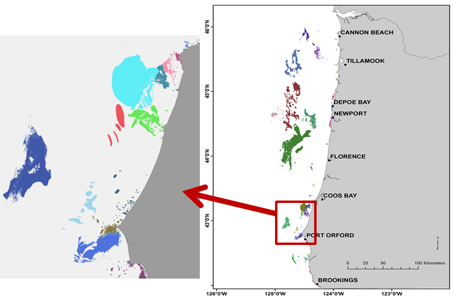


\newpage
Regions were designated to gain appropriate sample sizes needed for modelling.  For Oregon, region differences north and south of Florence were explored.  In California, 12 regions north of Pt. Conception were defined as follows:

Region 1: Pt. Conception to Pt. Arguello  
Region 2: Purisima Point to Pt. Sal  
Region 3: San Luis Obispo Bay to Mill Creek ($39.959^\circ$ N)  
Region 4: Lopez Point to Monterey Peninsula  
Region 5: Moss Landing to San Francisco Bay  
Region 6: Farallon Islands  
Region 7: Point Bonita to Drakes Bay  
Region 8: Point Reyes to Point Arena  
Region 9: Point Arena to south of Ten Mile River  
Region 10: north of Ten Mile River to Cape Mendocino ($40.16667^\circ$ N)   
Region 11: Cape Mendocino to Eel River  
Region 12: Trinidad Head to CA/OR border  


**CPFV drift selection**
During the 1987-1998 CDFW onboard observer program, fishing location was recorded as one of 459 location codes.  When available, the observer also recorded coordinates, either latitude/longitude or Loran.  The SWFSC converted all Loran coordinates to latitude/longitude.  Using the fishing stops with available coordinates, we assigned a fishing location code to a reef.  A handful of fishing location codes were obviously not associated with a reef, or a reef as identified in the above methods, and were not selected in the final dataset.  If the coordinates spanned two reefs and we were unable to tell which reef was consistently fished for a given location code, we created aggregated the reefs.  This most commonly occurred around the Monterey Bay peninsula.  This was necessary as two-thirds of the fishing stops encountering China rockfish had no recorded coordinates and allowed us to retain all fishing location data.  Therefore, for the 1987-1998 CDFW data,  any fishing location that was assigned to a reef was included in the analyses as one of the filters applied to the data.


For each CPFV location in the California 1999-2014 and Oregon 2001-2014 data we calculated depth, nearest reef, distance from reef, nearest MPA, distance from MPA using ArcGIS.  Geoprocessing steps used were ‘near’ and ‘extract values to points.’ For consistency across databases, we used the starting location of the drift to determine if the drift was targeting fish associated with a reef.  Drifts that had a distance of 0 m, i.e., were fishing directly on the reef, were included in analyses.  Recognizing that some drifts begin adjacent to a reef with the intention of drifting on to the reef, as well as the fact that the starting location may not be recorded at the very start of a drift, we devised a method for including drifts within a certain distance of a reef.  
We compiled a list of rockfish species that are strictly reef associated (black and yellow rockfish (\textit{Sebastes chrysomelas}), canary rockfish  (\textit{Sebastes pinniger}), China rockfish (\textit{Sebastes nebulosus}), cowcod (\textit{Sebastes levis}), flag rockfish  (\textit{Sebastes rubrivinctus}), gopher rockfish (\textit{Sebastes carnatus}), grass rockfish (\textit{Sebastes rastrelliger}), greenblotched rockfish (\textit{Sebastes rosenblatti}), kelp rockfish (\textit{Sebastes atrovirens}), quillback rockfish (\textit{Sebastes maliger}), rosy rockfish (\textit{Sebastes rosaceus}), starry rockfish (\textit{Sebastes constellatus}), Treefish (\textit{Sebastes serriceps}), vermilion rockfish (\textit{Sebastes miniatus}), yelloweye rockfish (\textit{Sebastes ruberrimus})) (personal communication John Field and Tom Laidig, NMFS SWFSC).  Using drifts that were greater than 0m from a reef and encountered one at least one of the fifteen species listed above, we calculated the depth for which 75\% of the drifts were included.  For Oregon this was 83 m, and for California it was 34 m for drifts within the ‘footprint’ and 141 m for drifts outside the ‘footprint.’  Any drift (with or without catch) greater than 83 m from a reef was excluded from the analyses.


\newpage

#Appendix G. Commercial Regulations Histories{-}
\label{sec:AppendixG}
\renewcommand{\thepage}{G-\arabic{page}}
\renewcommand\thesection{G-\arabic{section}}
\renewcommand{\thefigure}{G\arabic{figure}}
\renewcommand{\thetable}{G\arabic{table}}
\setcounter{page}{1}
\setcounter{figure}{0}
\setcounter{table}{0}
\setcounter{section}{1}


**Federal waters**

For a list of the commercial regulations in federal waters see the [Commercial Regulations Home Page](http://calcomfish.ucsc.edu/Regulation_Main.asp), which is housed in the CALCOM database.

**Washington**

The following commercial regulations pertain to China rockfish species in Washington and were provided by the Washington Department of Fish and Wildlife.

\begin{description}
    \item[2008] \hfill\\
        The groundfish trawl fishery was closed in Washington from the seaward RCA boundary to the shore north of $48^\circ 10^\prime$ N latitude to address increased encounters with yelloweye and canary rockfish
        
    \item[2002] \hfill\\
        Non-Trawl RCA closed from shore to 100 fm north of $46^\circ 16^\prime$ N latitude
        
    \item[1995] \hfill\\
         Commercial hook and line fishing in state waters (0-3 miles) was closed to preserve recreational fishing opportunities and avoid localized depletion; trawlers included in 1999
         
    \item[1992] \hfill\\
        Commercial hook and line limits reduced to 100 lbs north of Cape Alava and from Destruction Island to Leadbetter Pt. 

   \end{description}


**Oregon**

The following commercial regulations pertain to China rockfish in Oregon and were provided by the Oregon Department of Fish and Wildlife.

China rockfish are managed in the Other Nearshore Rockfish complex

\textbf{Harvest cap}: Total amount in regulation allowed to be impacted in a fishery (for a given season) including both discard mortality and landed catch mortality.  Prior to 2007 this term was synonymous with “landing cap.”

\textbf{Landing cap}: Total amount in regulation allowed to be landed in a fishery (for a given season).  Includes only landed catch mortality (known as a harvest cap before 2007).  

**Incidental Catch Limits in Other Fisheries (established in 2004)**

\textbf{Non-permitted vessels}: 15 lbs per day of black rockfish, blue rockfish, and nearshore fish, combined, for no more than one landing per day.  These species must make-up 25% or less of landed poundage, and must be taken with gear legal in the permitted fishery.

\textbf{Groundfish trawl fishery}: Vessels may land no more than 1,000 lbs of dead black rockfish, blue rockfish, and nearshore fish combined per calendar year if these species make-up 25% or less of landing.

\textbf{Non-profit aquaria or vessels contracted by non-profit aquaria} may land black rockfish, blue rockfish, and nearshore fish for purposes of display or for conducting research on these species.

**Regulations History**

A minimum size limit of 12 inches (measured from the tip of the snout to the extreme end of the tail) was implemented for China rockfish in 2000.  A sorting requirement for China rockfish was implemented in 2003.

\begin{description}
  \item[2014] \hfill\\
          Other Nearshore Rockfish landing cap: 14.3 mt
        
          Other Nearshore Rockfish Period Limits:All Periods 700 lbs
        
          Rockfish Conservation Area: fishing restricted to inside 30 fm

  
  \item[2013] \hfill\\ 
          Other Nearshore Rockfish landing cap: 14.3 mt (excluding tiger and vermillion rockfishes)
        
        Other Nearshore Rockfish Period Limits:All Periods 700 lbs
        
        
        Legal Gear Types: Hook and line (including pole and line, troll, longline, and stick gear) and pot gear (max 35 pots) if a Developmental Fisheries permit for Nearshore species using pot gear was issued in 2003
        
        Rockfish Conservation Area: fishing restricted to inside 30 fm 

  \item[2012] \hfill\\
          Other Nearshore Rockfish landing cap: 14.3 mt (excluding tiger and vermillion rockfishes)
          
          Other Nearshore Rockfish Period Limits: All Periods 700 lbs
          
          Rockfish Conservation Area: fishing restricted to inside 30 fm north of $43^\circ$ N, restricted to inside 20 fm from $42^\circ - 43^\circ $ N
  
  \item[2011] \hfill\\
         Other Nearshore Rockfish landing cap: 14.3 mt (excluding tiger and vermillion rockfishes)

         Other Nearshore Rockfish Period Limits: All Periods 700 lbs
 
         Rockfish Conservation Area: fishing restricted to inside 30 fm north of $43^\circ$ N, restricted to inside 20 fm from $42^\circ - 43^\circ$ N
  \item[2010] \hfill\\
        Other Nearshore Rockfish landing cap: 14.3 mt (excluding tiger and vermillion rockfishes)
      
        Other Nearshore Rockfish Period Limits: All Periods 700 lbs
      
        Rockfish Conservation Area: fishing restricted to inside 30 fm north of $43^\circ$ N, restricted to inside 20 fm from $42^\circ - 43^\circ$ N

  \item[2009] \hfill\\
        Other Nearshore Rockfish landing cap: 14.3 mt (excluding tiger and vermillion rockfishes)
        
        Other Nearshore Rockfish Period Limits: All Periods 700 lbs
        
        Legal Gear Types: Hook and line (including pole and line, troll, longline, and stick gear) and pot gear (max 35 pots) if a Developmental Fisheries permit for Nearshore species using pot gear was issued in 2003
        
        Rockfish Conservation Area: fishing restricted to inside 30 fm north of $43^\circ$ N, restricted to inside 20 fm from $42^\circ - 43^\circ$ N

  
  \item[2008] \hfill\\
        Other Nearshore Rockfish landing cap: 12.0 mt (excluding tiger and vermillion rockfishes)
      
       Other Nearshore Rockfish Period Limits:All Periods 700 lbs
      
       Sorting Requirement for All Nearshore Rockfish to Species: first year of all nearshore rockfish recorded to species on commercial fish tickets
            
       Rockfish Conservation Area: fishing restricted to inside 30 fm 

  \item[2007] \hfill\\
      First year of commercial landing caps (formerly known as harvest caps)
    
      Other Nearshore Rockfish landing cap: 12.0 mt (excluding tiger and vermillion rockfishes)
    
     Other Nearshore Rockfish Period Limits: All Periods 600 lbs
      
     Rockfish Conservation Area: fishing restricted to inside 30 fm
      
    9/1: Other Nearshore Rockfish changes: Period 5 increase to 700 lbs; Period 6 increase to 700 lbs
    
    11/28: Other Nearshore Rockfish change: Period 6 closed

  
  \item[2006] \hfill\\
        First and only year with 1-month trip limits
      
        Other Nearshore Rockfish harvest cap: 13.5 mt (including tiger and vermillion rockfishes)
      
       Other Nearshore Rockfish 1-month Period Limits: All Periods 200 lbs per month
      
       Rockfish Conservation Area: fishing restricted to inside 30 fm
      
      7/1: Other Nearshore Rockfish change: July increase to 300 lbs
      
      8/11: Other Nearshore Rockfish changes: increase to 350 lbs per month for all remaining months

  
  \item[2005] \hfill\\
      Other Nearshore Rockfish harvest cap: 12.0 mt 16.0 mt (excluding tiger and vermillion rockfishes, 13.5 mt including these fish) 
    
      Other Nearshore Rockfish Period Limits (Sub-limit from Black and blue Rockfish trip limits):
     (includes tiger and vermillion rockfishes, sublimit of Black and blue Rockfish limit): All Periods: 450 lbs
      
      Rockfish Conservation Area: fishing restricted to inside 30 fm

     5/1: Other Nearshore Rockfish changes: Periods 3 thru 5 decrease to 325 lbs

    10/11: Other Nearshore Rockfish changes: Period 5 and 6 increase to 400 lbs

  \item[2004] \hfill\\
        Permit required for vessels to land Black and blue rockfishes and other nearshore fish identified in House Bill 3108
       
       Nearshore logbook required for all vessels participating in the fishery

        ODFW allowed to prescribe legal gear under this permit except:
            1.  Diving gear may not be used
            2.	Pots may not be used unless a vessel was previously issued a pot endorsement in the Interim Nearshore Fisheries Plan through the Developmental Fisheries Program during 2003

      Other Nearshore Rockfish harvest cap: 16.0  mt (including tiger and vermillion rockfishes) 

      Other Nearshore Rockfish 1-month Period Limits (Sub-limit from Black and blue Rockfish trip limits): (includes tiger and vermillion Rockfish), All Periods: 450 lbs

      Rockfish Conservation Area: fishing restricted to inside 30 fm

      9/28: Other Nearshore Rockfish change: Period 5 decrease to 100 lbs
      
      11/1: Other Nearshore Rockfish change: Period 6 closed

  \item[2003] \hfill\\
        Commercial Nearshore Fishery (21 nearshore species) placed in the Developmental Fisheries Program

        House Bill 3108 establishes formal management of the commercial nearshore fishery, comprised of landings of species on the ‘nearshore fish’ list beginning, January 1, 2004
        
        Oregon Fish and Wildlife Commission first establishes harvest caps for nearshore species: Other Nearshore Rockfish harvest cap: 21.3 mt

         Bi-monthly trip limits first put into place mid-season (July 16th) in 2003
      
         Other Nearshore Rockfish (Sub-limit from Black and blue Rockfish): All periods 300 lbs 

      Rockfish Conservation Area: fishing restricted to inside 27 fm from January – October
  \item[2002] \hfill\\
      In October, the Pacific Fishery Management Council adopted conservative harvest limits for 2003 equal to landings from 2000
        
      Oregon Fish and Wildlife Commission directs the Marine Resources Program to evaluate a harvest reduction equal to or greater than 20% of 2000 harvest 
       
      Interim commercial harvest management plan implemented place a cap on fishery participants and reduced the nearshore fleet by 50%
             
      National Marine Fishery Service begins collecting fishery-dependent data at-sea from vessels participating in the fishery
       
      


  \item[2000] \hfill\\
          Pacific City Open Access Minor Nearshore Rockfish Limit (including Black and blue Rockfish here): May 1 - September 30 limit 2,200 lbs per month of which no more than 700 lbs         can be rockfish other than Black and blue rockfishes
  \item[1997] \hfill\\
        New live fish markets in California accelerate growth of the Commercial Nearshore Fishery
  \item[1994] \hfill\\
  \item[Early to mid 1990s] \hfill\\
       Commercial Nearshore Fishery develops as an open access fishery  
  \end{description}

\vspace{1cm}

**California**

The following commercial regulations pertain to China rockfish species in California and were provided by the California Department of Fish and Wildlife.  There has been a 12 inch minimum size limit on China rockfish since 2001.

**Gear Restrictions** 

\begin{description}
    \item[2001] \hfill\\
        Hook and line limited to 150 hooks with 15 hooks per line within 1 mile of shore
        
    \item[1996] \hfill\\
        Finfish trap permit required
        
    \item[1994] \hfill\\
         Proposition 132 implemented to prohibit gill nets within state waters
         
    \item[1953] \hfill\\
        Legislation prohibits trawl within 3 miles of shore
   \end{description}

**Trip Limits and Depth Restrictions**

 Trips limits now vary according to constraints from bycatch of canary and yelloweye rockfishes
\begin{description}
    \item[2003] \hfill\\
        A shallow nearshore is needed with permits in 4 management regions
        
        Trip limits for restricted access fishery, with differential trip limits north and south of $40^\circ 10^\prime$ N 
        
        Subject to depth restrictions consistent with the shoreward non-trawl RCA
    
    \item[2002] \hfill\\
        Closed all waters January and February south of $34^\circ 27^\prime$ N
   
        Closed all waters March and April between $40^\circ 10^\prime$ N and $34^\circ 27^\prime$ N March-April
    \item[2001] \hfill\\
          Closed January and February outside of 20 fm south of $34^\circ 27^\prime$ N
        
          Closed March and April all waters between $40^\circ 10^\prime$ N and $34^\circ 27^\prime$ N
    \item[2000] \hfill\\
          Closed January and February south of $36^\circ$ N
          
          Closed March and April between $40^\circ 10^\prime$ N and $36^\circ$ N
    \item[1999] \hfill\\
        Nearshore fishery permit required
        
    \item[1994] \hfill\\
         Limited entry permits and open access fishery established for Sebastes complex
         
         Limited entry and open access trip limits on the Sebastes complex
        
   \end{description}


**Nearshore Fishery Bycatch Permit**
This special non-transferable permit is issued as of 2003 to those qualifying individuals who use either trawl or entangling nets (gill nets).  It allows a minimal bycatch of minor nearshore species (which includes China rockfish) as per the following:

   
   South Central Coast Region 25 pounds of nearshore fish stocks may be taken per trip

   South Coast Region – 50 pounds of nearshore fish stocks may be taken per trip
 
   No permits are issued for either the North Coast or North-Central Coast Regions.


\newpage

#Appendix H. Recreational Regulations Histories{-}
\label{sec:AppendixH}
\renewcommand{\thepage}{H-\arabic{page}}
\renewcommand{\thefigure}{H\arabic{figure}}
\renewcommand{\thetable}{H\arabic{table}}
\setcounter{page}{1}
\setcounter{figure}{1}
\setcounter{table}{1}

\vspace{1cm}

**Washington**

The following recreational regulations pertain to nearshore rockfish species in Washington and were provided by the Washington Department of Fish and Wildlife.  The sport regulations run from 1 May to 30 April the following year.  Depth restrictions were implemented late in the summer of 2005 by emergency rule and became permanent in 2006.  

**North Coast (MCA 3 and 4)**
 
 \begin{description}
    \item[2014-2013] \hfill\\
        May 1 - Sept 30: Groundfish retention is prohibited seaward of 20 fathoms except lingcod; Pacific cod and sablefish on days open to halibut fishing
        
    \item[2012-2011] \hfill\\
        June 1 - Sept 30: Groundfish retention is prohibited seaward of 20 fathoms, except on days open to halibut fishing
        
    \item[2010-2009] \hfill\\
         May 21 - Sept 30: Groundfish retention is prohibited seaward of 20 fathoms except on days open to halibut fishing

    \item[2008-2007] \hfill\\
         May 21 - Sept 30: Groundfish retention is prohibited seaward of 20 fathoms

    \item[2006] \hfill\\
        May 21 - Sept 30: Rockfish and lingcod retention is prohibited seaward of 20 fathoms
   \end{description}
   
**South Coast (MCA 2)**
 
  \begin{description}
    \item[2014-2013] \hfill\\
        March 18 - June 15: Groundfish retention is prohibited seaward of 30 fathoms except rockfish; Pacific cod and sablefish allowed May 1 June 15; lingcod allowed on days open to halibut
        
    \item[2012-2011] \hfill\\
        March 18 - June 15: Groundfish retention is prohibited seaward of 30 fathoms except rockfish; Pacific cod and sablefish allowed May 1 June 15; lingcod allowed on days open to halibut

        
    \item[2010-2009] \hfill\\
         March 18 - June 15: Groundfish retention is prohibited seaward of 30 fathoms; Pacific cod and sablefish allowed May 1 June 15

    \item[2008-2007] \hfill\\
        March 18 - June 15: Groundfish retention is prohibited seaward of 30 fathoms; Pacific cod and sablefish allowed May 1 June 15

    \item[2006] \hfill\\
        March 18 - June 15: Rockfish and lingcod retention is prohibited seaward of 30 fathoms
   \end{description}
  
**Columbia River (MCA 1)**
  This area has no depth restriction.
  \begin{description}
    \item[2014-2006] \hfill\\
        Year-round: No groundfish except Pacific cod and sablefish allowed with halibut on board
   \end{description}

**Daily Groundfish and Rockfish Limits**

Groundfish includes: rockfish, Pacific cod, flatfish (except halibut), lingcod, ratfish, sablefish, cabezon, greenling, sculpins, sharks, skates, and surfperch excluding shiner perch.  There are sub-bag limits for lingcod (2) coastwide  and cabezon (1) in Marine Area 4.  The groundfish daily bag limit in Marine Area 4B was reduced to 10 in 2011.  

Groundfish Daily Limits

\textbf{2015-2011}: 12 fish
        
\textbf{2010-1961}: 15 fish
   
\textbf{1960-1938}: 20 lbs/day

   
Rockfish Daily Limits   

There is no minimum size limit for rockfish.  Marine Area 4B bag limit allows retention of 6 blue and black rockfish only (2010-2015).
   
\textbf{2015-1995}: 10 fish 
        
\textbf{1994-1992}: 12 fish
   
\textbf{1991-1961}: 15 fish

\textbf{1960-1954}: 20 lb/day
         


\vspace{1cm}

**Oregon**

The following regulations pertain to nearshore rockfish species in Oregon and were provided by the Oregon Department of Fish and Wildlife. There were no bag limits prior to 1976.  Gear restrictions have remained the same for all years, i.e., three hooks.

\begin{description}
  \item[2015] \hfill\\
  All rockfish, greenlings, Cabezon, skates, and other marine fish species not listed in the 2015 Oregon Sport Fishing Regulations in the Marine Zone: 7-fish daily bag limit in aggregate, of which no more than three may be blue Rockfish and no more than one may be a Cabezon (when Cabezon is open), and no more than one may be a canary rockfish. \\
  
  Retention of Yelloweye, Canary, China, Copper and Quillback rockfish is prohibited.
  
  \item[2014 - 2013] \hfill\\ 
   Same a 2012
  
  \item[2012] \hfill\\
  Rockfish, Cabezon, greenlings (10" min.), and other marine species not listed under Marine Zone in the Oregon Sport Fishing Regulations: 7 daily in aggregate of which no more than 1 may be a Cabezon April 1 – Sept. 30. 
  
  30-fathom curve:  Seaward closed April 1-Sept. 30 [for groundfish group].
  
  \item[2011] \hfill\\
  Rockfish, Cabezon, greenling (10" min.), and other marine species not listed under Marine Zone in the Oregon Sport Fishing Regulations:  7 daily in aggregate of which no more than 1 may be a Cabezon April 1 – Sept. 30
  
  40-fm curve:  Seaward closed April 1-Sept. 30
  
  7/21:   Offshore of 20-fm line closed due to Yelloweye Rockfish impacts
  
  8/13:   Groundfish retention with nearshore halibut (central coast) prohibited
  
  10/1: All depths reopened for groundfish (Yelloweye Rockfish impacts sufficiently slowed); Groundfish retention with nearshore halibut allowed again
  
  \item[2010] \hfill\\
  Same as 2009 including "rockfish" et al bag limit: 7 (misprinted in regulations booklet as 6)
  
  Definition of "groundfish group" added
  
  7/24: Offshore of 20-fm line closed through Dec. 31 due to Yelloweye Rockfish impacts
  
  \item[2009] \hfill\\
  Same as 2008 through April 30 (adopted late), then increase in "marine fish" bag limit
  
  Rockfish, Cabezon, greenling (10" min.), and other marine species not listed: 6
  
  40-fm curve:  Seaward closed April 1-Sept. 30
  
  5/1: "Rockfish" et al bag limit increased to 7 (in permanent rule)
  
  \item[2008] \hfill\\
  Same as 2007
  
  7/7:   "Rockfish" et al bag limit reduced from 6 to 5 and closed outside 20-fm line through Dec. 31 [sic – see 9/7 change] and flatfish closed outside 40-fm line through Dec. 31 [sic]
  
  9/7: 	Return to preseason regs., i.e., "rockfish" et al  bag limit back to 6 and waters closed offshore of 40-fm line only through Sept. 30 (open offshore Oct-Dec)
  
  \item[2007] \hfill\\
  Rockfish, Cabezon, greenling (10" min.), and other marine species not listed: 6 
  
  40-fm curve:  Seaward closed April 1-Sept. 30
  
  \item[2006] \hfill\\
  Rockfish, Cabezon, greenling (10" min.), flounder, sole and other marine species not listed:  6 
  
  40-fm curve:  Seaward closed June 1-Sept. 30
  
  \item[2005] \hfill\\
  Rockfish, Cabezon, greenling (10" min.), flounder, sole and other marine species not listed:  8 
  
  40-fm curve:  Seaward closed June 1-Sept. 30
  
  7/16: Rockfish et al bag limit reduced to 5
  
  10/18: Black RF prohibited for boats, Groundfish closed seaward of 40 fm
  
  \item[2004] \hfill\\
  Rockfish, Cabezon, greenling (10" min.), flounder, sole and other marine species not listed:  10, no more than 1 P. Halibut 
  
  Retention of yelloweye rockfish and canary rockfish prohibited
  
  40-fm curve:  Seaward closed June 1-Sept. 30
  
  9/3: Rockfish, lingcod and greenling prohibited
  
  \item[2003] \hfill\\
  Rockfish, Cabezon, greenling, flounder, sole and other marine species not listed:  10, no more than 1 Canary RF, 1 Yelloweye RF and 1 P. Halibut 
  
  11/21: ocean closed to GF outside 27-fm line
  
  \item[2002] \hfill\\
  Rockfish:  10, no more than 1 Canary RF and 1 Yelloweye RF
  
  \item[2001] \hfill\\
  Rockfish:  10, no more than 1 Canary RF 
  
  \item[2000] \hfill\\
  Rockfish:  10, no more than 3 Canary RF 
  
  \item[1999-1994] \hfill\\
  Rockfish:  15, no more than 10 Black Rockfish 
  
  \item[1993-1986] \hfill\\
  Rockfish, Cabezon and greenling:  15 
  
  \item[1985-1979] \hfill\\
  Other fish:  25, no more than 3 lingcod, 2 halibut and 15 rockfish/Cabezon/greenling
  
  \item[1978] \hfill\\
  Other fish:  10
  Then effective 4/1 = - other fish:  25, no more than  3 lingcod, 2 halibut and 15 rockfish/Cabezon/greenling
  
  \item[1977] \hfill\\
  Other fish:  25, no more than 5 lingcod and 2 halibut
  
  \item[1976] \hfill\\
  Other fish:  25
\end{description}


\newpage


\thispagestyle{empty}

#References{-}
