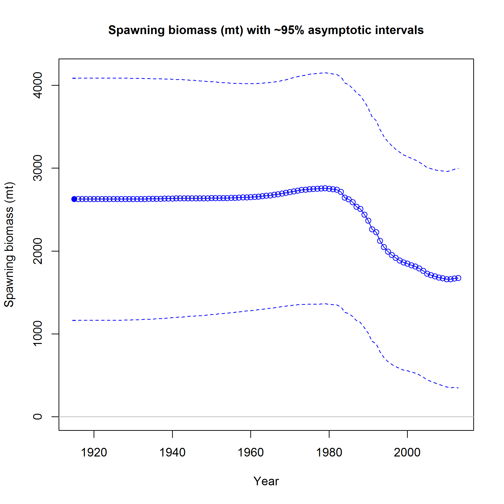

```{r, echo=FALSE, message=FALSE, warning=FALSE}
     ##read in necessary libraries
           library(r4ss)
           library(xtable)
             options(xtable.comment = FALSE)  #turns off xtable comments
##############################################################################################################
#### loads workspace image of the BASE MODEL from SS_output in r4ss    
     load("Aurora2013.RData")
##############################################################################################################
```

\pagebreak
\pagenumbering{arabic}
\setcounter{page}{1}

#Executive summary{-}
adfadfaf

##Stock{-}

Blah blah Milton says China rockfish live to at least 79 years [@Love2002rockfishes].

##Catches{-}
Trends and current levels-include table for last ten years and graph with long term data

<!-- BEGIN: CREATE SPAWNING BIOMASS TABLE -->
```{r, eval=TRUE, echo=FALSE, message=FALSE, warning=FALSE, include=FALSE}
      
      SpawningB = myreplist$derived_quants[grep("SPB",myreplist$derived_quants$LABEL),]
      SpawningB = SpawningB[c(-1,-2),]
#########################################################################
#CHANGE ME
      minYR=2004  # minimum year for the Spawning biomass table
      maxYR=2013  # maximum year for the Spawning biomass table
#########################################################################

    #pull the spawning biomass and std.dev data, calculate lower and upper 95% CI                 
     SpawningByrs = SpawningB[SpawningB$LABEL>=paste("SPB_",minYR,sep='') &  
                           SpawningB$LABEL<=paste("SPB_",maxYR,sep=''),]     
     SpawningByrs$YEAR = seq(minYR,maxYR)
     SpawningByrs$lowerCI = round(SpawningByrs$Value +qnorm(0.025)*SpawningByrs$StdDev, digits=0)
     SpawningByrs$upperCI = round(SpawningByrs$Value -qnorm(0.025)*SpawningByrs$StdDev, digits=0)
     SpawningByrs$CI = paste("(",SpawningByrs$lowerCI,"-",SpawningByrs$upperCI,")",sep="")
     SpawningBtab=subset(SpawningByrs,select=c('YEAR','Value','CI'))
       colnames(SpawningBtab) = c('Year','Spawning Biomass (mt)','~ 95% confidence interval')
```

```{r, eval=TRUE, echo=FALSE, results='asis', message=FALSE}
  #create the Spawning biomass table
  SpawningB.table = xtable(SpawningBtab, caption=c("Recent trend in beginning of the year biomass and depletion"),
               label='SpawningB',digits=0)  #digits=0 rounds the numbers
    #xtable requires a placeholder for rownames, hence 4 values    
    align(SpawningB.table) = c('l','l','>{\\centering}p{1in}','>{\\centering}p{1.2in}')  
    print(SpawningB.table, include.rownames=FALSE, caption.placement="top",tabular.environment="tabularx",
          width="\\textwidth")
```
<!-- END: CREATE SPAWNING BIOMASS TABLE -->


##Data and assessment{-}
date of last assessment, type of assessment model, data available, new information, and information lacking

##Stock biomass{-}
trends and current levels relative to virgin or historic levels, description of uncertainty-include table for last 10 years and graph with long term estimates



This is a test to see if I can reference Figure \ref{spawningB}. 


##Recruitment{-}
trends and current levels relative to virgin or historic levels-include table for last 10 years and graph with long term estimates


##Exploitation status{-}
exploitation rates, i.e., total catch divided by exploitable biomass, or the annual SPR harvest rate - include a table with the last 10 years of data and a graph showing the trend in fishing mortality relative to the target (y-axis) plotted against the trend in biomass relative to the target (x-axis).

##Ecosystem considerations{-}

##Reference points (groundfish)/harvest control rules (CPS){-}
management targets and definition of overfishing, including the harvest rate that brings the stock to equilibrium at B40% (the BMSY proxy) and the equilibrium stock size that results from fishing at the default harvest rate (the FMSY proxy). Include a summary table that compares estimated reference points for SSB, SPR, Exploitation Rate and Yield based on SSBproxy for MSY, SPRproxy for MSY, and estimated MSY values (table i. on page 35 of attached Canary rockfish executive summary).

##Management performance{-}
catches in comparison to OFL, ABC and OY/ACL values for the most recent 10 years (when available), overfishing levels, actual catch and discard. Include OFL(encountered), OFL(retained) and OFL(dead) if different due to discard and discard mortality.


##Unresolved problem and major uncertainties{-}
any special issues that complicate scientific assessment, questions about the best model scenario, etc.

##Decision table (groundfish only)\*{-}
projected yields (OFL, ABC and ACL), spawning biomass, and stock depletion levels for each year.* (Not required in draft assessments undergoing review.)

##Research and data needs{-}
identify information gaps that seriously impede the stock assessment.

##Rebuilding projections{-}
reference to the principal results from rebuilding analysis if the stock is overfished.* This section should be included in the Final/SAFE version assessment document but is not required for draft assessments undergoing review. See Rebuilding Analysis terms of reference for detailed information on rebuilding analysis requirements.


#Introduction

##Basic Information
Scientific name, distribution, the basis of the choice of stock structure, including regional differences in life history or other biological characteristics that should form the basis of management units.

##Map
A map showing the scope of the assessment and depicting boundaries for fisheries or data collection strata.

##Life History
Important features of life history that affect management (e.g., migration, sexual dimorphism, bathymetric demography).

##Ecosysem Considerations
Ecosystem considerations (e.g., ecosystem role and trophic relationships of the species, habitat requirements/preferences, relevant data on ecosystem processes that may affect stock or parameters used in the stock assessment, and/or cross-FMP interactions with other fisheries). This section should note if environmental correlations or food web interactions were incorporated into the assessment model. The length and depth of this section would depend on availability of data and reports from the IEA, expertise of the STAT, and whether ecosystem factors are informational to contribute quantitative information to the assessment.


##Fishery Information
Important features of current fishery and relevant history of fishery.

##Summary of Management History
Summary of management history (e.g., changes in mesh sizes, trip limits, or other management actions that may have significantly altered selection, catch rates, or discards).


##Managament Performance
Management performance, including a table or tables comparing Overfishing Limit (OFL), Annual Catch Limit (ACL), Harvest Guideline (HG) [CPS only], landings, and catch (i.e., landings plus discard) for each area and year


##Fisheries off Canada, Alaska, and/or Mexico
Description of fisheries for this species off Canada, Alaska and/or Mexico, including references to any recent assessments of those stocks.

#Assessment

##Data

###Title
Landings by year and fishery, historical catch estimates, discards (generally specified as a percentage of total catch in weight and in units of mt), catch-at-age, weight-at-age, abundance indices (typically survey and CPUE data), data used to estimate biological parameters (e.g., growth rates, maturity schedules, and natural mortality) with coefficients of variation (CVs) or variances if available.  Include complete tables and figures and date of extraction.


###Title
Sample size information for length and age composition data by area, year, gear, market category, etc., including both the number of trips and fish sampled.

###Title
All data sources that include the species being assessed, which are used in the assessment, and provide the rationale for data sources that are excluded.


###Title
Clear description of environmental or ecosystem data if included in the assessment.


##History of Modeling Approaches Used for this Stock

###Title
Response to STAR panel recommendations from the most recent previous assessment.

###Title
Report of consultations with AP and MT representatives regarding the use of various data sources in the stock assessment.

###Title
If environmental or ecosystem data are incorporated, report of consultations with technical teams that evaluated ecosystem data or methodologies used in the assessment.

##Model Description

###Title
Complete description of any new modeling approaches.

###Title
Definitions of fleets and areas.

###Title
Assessment program with last revision date (i.e., date executable program file was compiled).


###Title
List and description of all likelihood components in the model

###Title
Constraints on parameters, selectivity assumptions, natural mortality, treatment of age reading bias and/or imprecision, and other fixed parameters.

###Title
Description of stock-recruitment constraints or components.


###Title
Description of how the first year that is included in the model was selected and how the population state at the time is defined (e.g., B0, stable age structure, etc.).


###Title
Critical assumptions and consequences of assumption failures.

##Model Selection and Evaluation

###Title
Evidence of search for balance between model realism and parsimony.

###Title
Comparison of key model assumptions, include comparisons based on nested models (e.g., asymptotic vs. domed selectivities, constant vs. time-varying selectivities).  

###Title
Summary of alternate model configurations that were tried but rejected.

###Title
Likelihood profile for the base-run (or proposed base-run model for a draft assessment undergoing review) configuration over one or more key parameters (e.g., M, h, Q) to show consistency among input data sources.

###Title
Residual analysis for the base-run configuration (or proposed base-run model in a draft assessment undergoing review) e.g., residual plots, time series plots of observed and predicted values, or other approaches.  Note that model diagnostics are required in draft assessments undergoing review.

###Title
Convergence status and convergence criteria for the base-run model (or proposed base run). 

###Title
Randomization run results or other evidence of search for global best estimates.

###Title
Evaluation of model parameters.  Do they make sense?  Are they credible?

###Title
Are model results consistent with assessments of the same species in Canada and Alaska?  Are parameter estimates (e.g., survey catchability) consistent with estimates for related stocks?

##Response to STAR Panel Recommendations
Point-by-point response to the STAR panel recommendations

##Base-Model(s) Results

###Title
Table listing all explicit parameters in the stock assessment model used for base model, their purpose (e.g., recruitment parameter, selectivity parameter) and whether or not the parameter was actually estimated in the stock assessment model.

###Title
Population numbers at age × year × sex (if sex-specific M, growth, or selectivity) (May be provided as a text or spreadsheet file).\* Not required in draft assessment undergoing review.

###Title
Time-series of total, 1+ (if age 1s are in the model), summary, and spawning biomass (and/or spawning output), depletion relative to B0, recruitment and fishing mortality or exploitation rate estimates (table and figures).

###Title
Selectivity estimates (if not included elsewhere).

###Title
Stock-recruitment relationship.

###Title
OFL, ABC and ACL (and/or ABC and OY or HG) for recent years.

###Title
Clear description of units for all outputs.

###Title
Clear description of how discard is included in yield estimates.

###Title
Clear description of environmental or ecosystem data if included in the assessment.


##Uncertainty and Sensitivity Analyses
\label{sec:uncertainty}
The best approach for describing uncertainty and the range of probable biomass estimates in groundfish  assessments may depend on the situation.  
Important factors to consider include:

###Title
Parameter uncertainty (variance estimation conditioned on a given model, estimation framework, data set choice, and weighting scheme), including likelihood profiles for important assessment parameters (e.g., natural mortality).  This also includes expressing uncertainty in derived outputs of the model and estimating CVs using appropriate methods (e.g., bootstrap, asymptotic methods, Bayesian approaches, such as MCMC). Include the CV of spawning biomass in the first year for which an OFL has not been specified (typically end year +1 or +2).

###Title
Sensitivity to assumptions about model structure, i.e., model specification uncertainty

###Title
Sensitivity to data set choice and weighting schemes (e.g., emphasis factors), which may also include a consideration of recent patterns in recruitment.

###Title
Retrospective analysis, where the model is fitted to a series of shortened input data sets, with the most recent years of input data being dropped.

###Title
Historical analysis (plot of actual estimates from current and previous assessments).

###Title
Subjective appraisal of the magnitude and sources of uncertainty.

###Title
If a range of model runs is used to characterize uncertainty it is important to provide some qualitative or quantitative information about relative probability of each. If no statements about relative probability can be made, then it is important to state that all scenarios (or all scenarios between the bounds depicted by the runs) are equally likely

###Title
\label{sec:uncertaintylast}
If possible, ranges depicting uncertainty should include at least three runs: (a) one judged most probable; (b) at least one that depicts the range of uncertainty in the direction of lower current biomass levels; and (c) one that depicts the range of uncertainty in the direction of higher current biomass levels.  The entire range of uncertainty should be carried through stock projections and decision table analyses.

#Harvest Control Rules (CPS Only)

#Reference Points (Groundfish Only)
1.  Unfished spawning stock biomass, summary age biomass, and recruitment, along with unfished spawning stock output.
2. 	Reference points based on B\textsubscript{40\%} for rockfish and roundfish and on B\textsubscript{25\%} for flatfish (spawning biomass and/or output, SPR, exploitation rate, equilibrium yield).
3.	Reference points based on default SPR proxy (spawning biomass and/or output, SPR, exploitation rate, equilibrium yield).
4.	Reference points based on MSY (if estimated) (spawning biomass and/or output, SPR, exploitation rate, equilibrium yield).
5.	Equilibrium yield curve showing various BMSY proxies. 

#Harvest Projections and Decision Tables (Groundfish Only)
*Not required in draft assessment undergoing review.

1.  Harvest projections and decision tables (i.e., a matrix of alternative models (states of nature) versus management actions) should cover the plausible range of uncertainty about current stock biomass and a set of candidate fishing mortality targets used for the stock.  See section “\textit{Uncertainty and Decision Tables in Groundfish Stock Assessment}” (this document, pp. \pageref{sec:uncertainty}\-\pageref{sec:uncertaintylast}) on how to define alternative states of nature.  Management decisions in most cases represent the sequence of catches including estimate of OFL based on FMSY (or its proxy) and those obtained by applying the Council 40\-10 harvest policy to each state of nature; however other alternatives may be suggested by the GMT as being more relevant to Council decision making.  OFL calculations should be based on the assumption that future catches equal ABCs and not OFLs.

2.  Information presented should include biomass, stock depletion, and yield projections of OFL, ABC and ACL for ten years into the future, beginning with the first year for which management action could be based upon the assessment.


#Regional Management Considerations
1. For stocks where current practice is to allocate harvests by management area, a recommended method of allocating harvests based on the distribution of biomass should be provided.  The MT advisor should be consulted on the appropriate management areas for each stock.

2. Discuss whether a regional management approach makes sense for the species from a biological perspective.

3. If there are insufficient data to analyze a regional management approach, what are the research and data needs to answer this question?

#Research Needs

#Acknowledgments
Include STAR panel members and affiliations as well as names and affiliations of persons who contributed data, advice or information but were not part of the assessment team. \textbf{* Not required in draft assessment undergoing review.}


#Tables

#Figures

\newpage

#Appendix A. SS data file {-}
\renewcommand{\thepage}{A-\arabic{page}}
\renewcommand{\thefigure}{A\arabic{figure}}
\renewcommand{\thetable}{A\arabic{table}}
\setcounter{page}{1}
\setcounter{figure}{1}
\setcounter{table}{1}


Just writing something in here in reference to a fig \ref{appendfig}


\newpage 

##Appendix A1. Sub-headings in Appendix{-}
\renewcommand{\thepage}{A1-\arabic{page}}
\renewcommand{\thefigure}{A1.\arabic{figure}}
\renewcommand{\thetable}{A1.\arabic{table}}
\setcounter{page}{1}
\setcounter{figure}{1}
\setcounter{table}{1}


\newpage

#Appendix B. SS control file{-}
\renewcommand{\thepage}{B-\arabic{page}}
\renewcommand{\thefigure}{B\arabic{figure}}
\renewcommand{\thetable}{B\arabic{table}}
\setcounter{page}{1}
\setcounter{figure}{1}
\setcounter{table}{1}


\newpage


#Appendix C. SS starter file{-}
\renewcommand{\thepage}{C-\arabic{page}}
\renewcommand{\thefigure}{C\arabic{figure}}
\renewcommand{\thetable}{C\arabic{table}}
\setcounter{page}{1}
\setcounter{figure}{1}
\setcounter{table}{1}


\newpage

#Appendix D. SS forecast file{-}
\renewcommand{\thepage}{D-\arabic{page}}
\renewcommand{\thefigure}{D\arabic{figure}}
\renewcommand{\thetable}{D\arabic{table}}
\setcounter{page}{1}
\setcounter{figure}{1}
\setcounter{table}{1}


\newpage

#Appendix E. Observed Angler Prediction{-}
\renewcommand{\thepage}{E-\arabic{page}}
\renewcommand{\thefigure}{E\arabic{figure}}
\renewcommand{\thetable}{E\arabic{table}}
\setcounter{page}{1}
\setcounter{figure}{1}
\setcounter{table}{1}


Beginning in 1992 Calrec Historic began tracking the number of observed anglers in its database, however the full data-set spans from 4/22/87 until 12/31/98. 
The goal of this analysis is to impute the number of observed anglers in the 
initial period of the dataset, from 4/22/87 until 7/9/92, when the observed 
number of active anglers was not yet being recorded.

<!>
<!>

The number of observed anglers is necessarily a subset of the number of total 
anglers; a quantity which is consistently recorded throughout the entire dataset. 
This suggests that a simple binomial regression model could be used to predict 
the mean number of observed anglers from the number of total anglers, in the 
initial period of the data. Binomial regression models of this general form were 
considered in this analysis, as well as a sensitivity analysis among the other 
potential covariates available in the dataset. Among the potential predictor 
variables in this study, effects related to the interviewer, trip date, and the 
trip's identification number (trip ID) number were considered for inclusion in 
the final model by pairwise comparison of fitted model AIC values as well as 
analysis of parameter significance.

<!>
<!>

Effects related to interviewer were found to be very significant, although due 
to the high turn-over rate of the interviewers in these data, interviewer 
specific effects are not useful for prediction here. However, the total number 
of present interviewers (one or two interviewers) was found to be strongly 
significant and was included in the final models as a categorical effect.

<!>
<!>

For imputing the observed number of active anglers for the early period of the 
dataset it is important to motivate an assumption of stationarity in the number 
of observed anglers through time. Thus trip date was considered for inclusion in 
the model to check for any possibility significance through time. Firstly, date 
was considered for inclusion in the model as a discrete time variable; secondly, 
a separate model was tested using only year as categorical variable to consider 
any temporal patterns. Given the number of total anglers, neither of the models 
considering temporal effects were able demonstrate that the number of observed 
anglers varied significantly through time. All models which included temporal 
effects produced higher overall AIC values, thus supporting the assumption of 
stationarity in time.

<!>
<!>

Trip ID was found to contribute a significant effect toward overall inference. 
Upon further investigation, trip ID was found to encode information about the 
number of consecutive outings for each interviewer followed by a decimal point 
and a unique numeric code for each interviewer. This suggests that by ignoring 
the numbers after the decimal point one could represent a measure of the generic 
interviewer experience. Inclusion of this variable was tested and is supported 
by the fitted AIC and parameter significance as a discrete experience variable. 
Although this variable was supported by the chosen model selection criteria, it 
was ultimately left out of the final models for further investigation of 
accuracy of the coding scheme.

<!>
<!>

Log Model:
\begin{equation}
y_{ij} \sim \beta_{0j} + \beta_{1j} \log(x_{ij}) + \epsilon_{ij} ~~~ \epsilon_{ij} \sim N( 0, \sigma_j )
\end{equation}


<!>
<!>

Binomial Log Model:
\begin{equation}
y_{ij} \sim B\Big( ~N_{ij}, ~\text{logit}\big(\beta_{0j} + \beta_{1j} \log(x_{ij})\big)~ \Big)
\end{equation}


|       | \verb|totAng| | \verb|totAng + intNum| | \verb|log(totAng) + intNum| | 
|:-----:|:-------------:|:----------------------:|:---------------------------:|
Normal  |  67387.29     |  65317.02              |  64636.72 		       |
Binomial|  66099.40     |  63753.06              |  62498.83  		       |

<!>
<!>

The log model considers a typical normal linear model for each interviewer 
level, except it uses the log of the number of total anglers as a predictor 
rather than the raw numbers of total anglers. The log model has several nice 
features for prediction in this case. Firstly by regressing on the log of the 
total anglers it improves the correlation and relative homoscedasticity of the 
joint data and improves the accuracy of sensitivity analysis by improving the 
standard error estimates for each parameter. Secondly the log transformation 
introduces the expected mean prediction shape, by emphasizing order of magnitude 
differences in the total number of anglers. The binomial log model considers the 
observed angler counts as independent draws from a binomial given the know 
number of total anglers. The log transformation in the binomial case is 
justified over the traditional binomial glm for similar reasons as the normal 
log model, as well as simple AIC support of the transformation. All models and 
model selection criterion were computed using the standard \verb|glm| function 
in the R software environment for statistical computing \cite{rBase}.

<!>
<!>

The binomial log model was chosen for its low AIC value and reasonable mean 
predictions. Untransformed binomial models were considered, however they produce 
unreasonable observed angler predictions associated with the high numbers of 
total anglers. The log transformed Normal model provides mostly reasonable 
predictions, but is not supported by AIC when compared to the binomial models. 
Additionally transforms of Normal likelihood models have no distributional way 
of producing observed angler predictions which do not exceed the total number of 
anglers. If a Normal likelihood model were to gather AIC support, predictions 
may require truncation. These data contain considerable noise, likely due to the 
high interviewer turnover rate, which would most effectively be modeled by 
including appropriate additional predictors to control for these effects. At 
this point no additional predictors from this dataset were considered to be 
both sensitive and appropriate for use with prediction in this case.

\newpage

\thispagestyle{empty}

#References{-}
